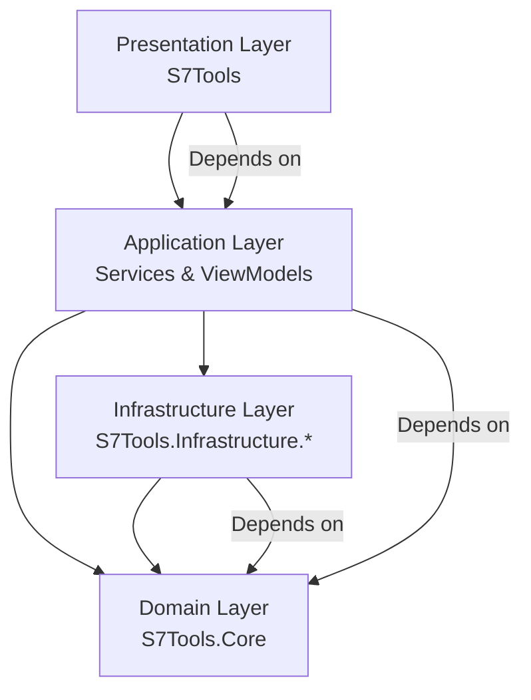
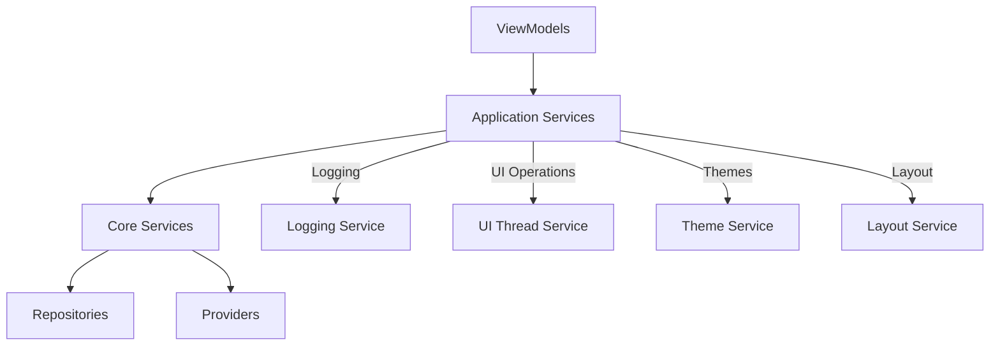

# System Patterns: S7Tools

**Last Updated**: Current Session  
**Context Type**: Architecture and Design Patterns  

## System Architecture

### **Overall Architecture Pattern: Clean Architecture**



### **Dependency Flow Rules**
1. **All dependencies flow inward** toward the Domain (S7Tools.Core)
2. **Domain layer has no external dependencies** - pure business logic
3. **Infrastructure depends only on Domain** - no direct UI dependencies
4. **Application layer orchestrates** between UI, Domain, and Infrastructure

### **Project Structure and Responsibilities**

#### **S7Tools (Presentation Layer)**
- **Purpose**: UI, ViewModels, and presentation logic
- **Dependencies**: References Core and Infrastructure projects
- **Key Components**:
  - Views (XAML) and ViewModels (MVVM pattern)
  - Value Converters for data binding
  - Application Services (UI-specific logic)
  - Dependency Injection configuration

#### **S7Tools.Core (Domain Layer)**
- **Purpose**: Business entities and service contracts
- **Dependencies**: None (pure domain layer)
- **Key Components**:
  - Domain models (Tag, ConnectionProfile, etc.)
  - Service interfaces (ITagRepository, IS7ConnectionProvider)
  - Business logic and domain rules

#### **S7Tools.Infrastructure.Logging (Infrastructure Layer)**
- **Purpose**: Logging infrastructure and external integrations
- **Dependencies**: Only S7Tools.Core and Microsoft.Extensions.Logging
- **Key Components**:
  - Custom logging providers and storage
  - External service integrations
  - Data persistence implementations

## Key Technical Decisions

### **1. MVVM Pattern with ReactiveUI**

**Decision**: Use ReactiveUI for reactive MVVM implementation  
**Rationale**: Provides excellent reactive programming support and integrates well with Avalonia  
**Implementation**:

```csharp
// ViewModels inherit from ReactiveObject
public class MainWindowViewModel : ReactiveObject
{
    private string _selectedItem;
    public string SelectedItem
    {
        get => _selectedItem;
        set => this.RaiseAndSetIfChanged(ref _selectedItem, value);
    }
    
    // Commands use ReactiveCommand
    public ReactiveCommand<Unit, Unit> RefreshCommand { get; }
}
```

### **2. Dependency Injection with Microsoft.Extensions.DependencyInjection**

**Decision**: Use Microsoft's DI container throughout the application  
**Rationale**: Standard .NET approach with excellent tooling and documentation  
**Implementation**:

```csharp
// Service registration in ServiceCollectionExtensions.cs
public static class ServiceCollectionExtensions
{
    public static IServiceCollection AddApplicationServices(this IServiceCollection services)
    {
        services.AddSingleton<IActivityBarService, ActivityBarService>();
        services.AddSingleton<ILayoutService, LayoutService>();
        services.AddTransient<IDialogService, DialogService>();
        return services;
    }
}
```

### **3. Custom Logging Infrastructure**

**Decision**: Build custom logging infrastructure with Microsoft.Extensions.Logging integration  
**Rationale**: Need real-time UI display with high performance and circular buffer storage  
**Implementation**:

```csharp
// Custom DataStore provider for UI integration
public class DataStoreLoggerProvider : ILoggerProvider
{
    private readonly ILogDataStore _dataStore;
    
    public ILogger CreateLogger(string categoryName)
    {
        return new DataStoreLogger(categoryName, _dataStore);
    }
}
```

### **4. Service-Oriented Architecture**

**Decision**: Organize functionality into focused services with clear interfaces  
**Rationale**: Promotes testability, maintainability, and separation of concerns  
**Pattern**:

```csharp
// Interface definition in Core project
public interface IActivityBarService
{
    IReadOnlyList<ActivityBarItem> Items { get; }
    ActivityBarItem? SelectedItem { get; set; }
    event EventHandler<ActivityBarSelectionChangedEventArgs> SelectionChanged;
    void SelectItem(string itemId);
}

// Implementation in main project
public class ActivityBarService : IActivityBarService
{
    // Implementation details...
}
```

## Design Patterns in Use

### **1. Repository Pattern**

**Usage**: Data access abstraction for PLC communication  
**Implementation**:

```csharp
public interface ITagRepository
{
    Task<Tag> ReadTagAsync(string address);
    Task WriteTagAsync(string address, object value);
    Task<IEnumerable<Tag>> ReadMultipleTagsAsync(IEnumerable<string> addresses);
}
```

### **2. Provider Pattern**

**Usage**: Logging system with pluggable providers  
**Implementation**:

```csharp
// Multiple providers can be registered
services.AddLogging(builder =>
{
    builder.AddDataStore(options => { /* configuration */ });
    builder.AddConsole();
    builder.AddDebug();
});
```

### **3. Observer Pattern**

**Usage**: Real-time updates for logging and data changes  
**Implementation**:

```csharp
// INotifyPropertyChanged for ViewModels
// INotifyCollectionChanged for collections
// Custom events for service notifications
public event EventHandler<ActivityBarSelectionChangedEventArgs> SelectionChanged;
```

### **4. Command Pattern**

**Usage**: UI actions and operations  
**Implementation**:

```csharp
// ReactiveCommand for all UI operations
public ReactiveCommand<Unit, Unit> ConnectCommand { get; }
public ReactiveCommand<string, Unit> SelectActivityBarItemCommand { get; }
```

### **5. Factory Pattern**

**Usage**: ViewLocator for View-ViewModel mapping  
**Implementation**:

```csharp
public class ViewLocator : IDataTemplate
{
    public Control Build(object? data)
    {
        // Factory logic to create appropriate View for ViewModel
    }
}
```

## Component Relationships

### **Service Layer Architecture**



### **Data Flow Patterns**

#### **User Input Flow**
1. **User Action** → View (XAML)
2. **Data Binding** → ViewModel Property/Command
3. **Business Logic** → Application Service
4. **Domain Logic** → Core Service/Repository
5. **External Integration** → Infrastructure Service

#### **Data Update Flow**
1. **External Data** → Infrastructure Service
2. **Domain Processing** → Core Service
3. **Application Logic** → Application Service
4. **UI Update** → ViewModel Property Change
5. **Visual Update** → View (Data Binding)

### **Error Handling Strategy**

```csharp
// Consistent error handling pattern
public async Task<Result<T>> PerformOperationAsync<T>()
{
    try
    {
        var result = await SomeOperationAsync();
        _logger.LogInformation("Operation completed successfully");
        return Result.Success(result);
    }
    catch (Exception ex)
    {
        _logger.LogError(ex, "Operation failed: {Operation}", nameof(PerformOperationAsync));
        return Result.Failure<T>(ex.Message);
    }
}
```

## Threading and Concurrency Patterns

### **UI Thread Management**

**Pattern**: All UI updates must occur on the UI thread  
**Implementation**:

```csharp
public interface IUIThreadService
{
    Task InvokeAsync(Action action);
    Task<T> InvokeAsync<T>(Func<T> function);
    bool IsOnUIThread { get; }
}

// Usage in services
await _uiThreadService.InvokeAsync(() =>
{
    // UI updates here
});
```

### **Async/Await Patterns**

**Standard**: All I/O operations use async/await with ConfigureAwait(false)  
**Implementation**:

```csharp
public async Task<Tag> ReadTagAsync(string address)
{
    // Use ConfigureAwait(false) for library code
    var result = await SomeAsyncOperation().ConfigureAwait(false);
    return result;
}
```

### **Thread-Safe Collections**

**Pattern**: Use thread-safe collections for shared data  
**Implementation**:

```csharp
// Circular buffer with thread safety
private readonly ConcurrentQueue<LogModel> _logEntries = new();
private readonly SemaphoreSlim _semaphore = new(1, 1);
```

## Performance Patterns

### **Memory Management**

#### **Circular Buffer for Logging**
```csharp
public class LogDataStore : ILogDataStore
{
    private readonly ConcurrentQueue<LogModel> _entries;
    private readonly int _maxEntries;
    
    public void AddEntry(LogModel entry)
    {
        _entries.Enqueue(entry);
        
        // Maintain circular buffer size
        while (_entries.Count > _maxEntries)
        {
            _entries.TryDequeue(out _);
        }
    }
}
```

#### **Lazy Loading and Virtualization**
- UI virtualization for large data sets
- Lazy loading of expensive resources
- Proper disposal patterns for all resources

### **Reactive Programming Optimization**

```csharp
// Throttle rapid updates to prevent UI flooding
this.WhenAnyValue(x => x.SearchText)
    .Throttle(TimeSpan.FromMilliseconds(300))
    .ObserveOn(RxApp.MainThreadScheduler)
    .Subscribe(text => PerformSearch(text));
```

## Configuration and Settings Patterns

### **Strongly-Typed Configuration**

```csharp
public class ApplicationSettings
{
    public LoggingSettings Logging { get; set; } = new();
    public ConnectionSettings Connection { get; set; } = new();
    public UISettings UI { get; set; } = new();
}

// Registration
services.Configure<ApplicationSettings>(configuration.GetSection("Application"));
```

### **Options Pattern**

```csharp
public class SomeService
{
    private readonly ApplicationSettings _settings;
    
    public SomeService(IOptions<ApplicationSettings> options)
    {
        _settings = options.Value;
    }
}
```

## Testing Patterns

### **Testable Architecture**

- All services depend on interfaces
- Dependency injection enables easy mocking
- ViewModels are testable without UI dependencies
- Repository pattern abstracts data access

### **Recommended Test Structure**

```csharp
// Unit test example
public class ActivityBarServiceTests
{
    private readonly Mock<ILogger<ActivityBarService>> _mockLogger;
    private readonly ActivityBarService _service;
    
    public ActivityBarServiceTests()
    {
        _mockLogger = new Mock<ILogger<ActivityBarService>>();
        _service = new ActivityBarService(_mockLogger.Object);
    }
    
    [Fact]
    public void SelectItem_ValidId_UpdatesSelectedItem()
    {
        // Arrange, Act, Assert
    }
}
```

---

**Document Status**: Living document reflecting current architecture  
**Next Review**: After major architectural changes  
**Owner**: Architecture Team