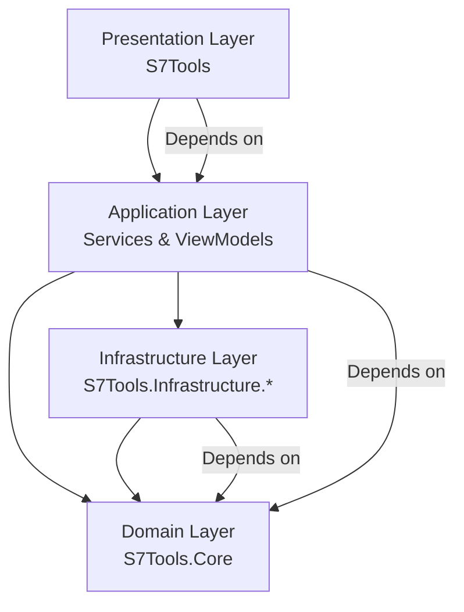
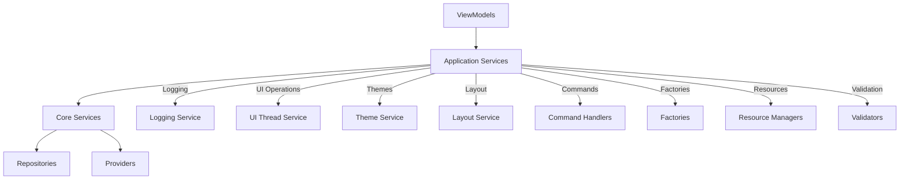

# System Patterns: S7Tools — Consolidated Architecture Guide (v2.0)

Last Updated: 2025-10-15
Scope: Architecture, patterns, rules, critical fixes, logging/debugging, localization, do/don’t, memory bank usage, task workflow, templates, and testing standards.

This living guide consolidates the current rules and lessons for S7Tools. It supersedes previous scattered notes and removes deprecated or duplicate content.

---

## External Code Review Response Protocol (MANDATORY)

All external code reviews must follow this protocol:

1. **Systematic Validation**: Verify each finding against the actual codebase.
2. **Priority Classification**: Distinguish critical bugs from quality improvements.
3. **Risk Assessment**: Analyze impact for each proposed change.
4. **Strategic Implementation**: Apply safe fixes immediately; defer risky changes.
5. **Task Creation**: Document deferred improvements as tasks with implementation plans.
6. **Blocking Strategy**: Prevent interference with high-priority feature development.

### Critical Bug Patterns to Avoid

- **Never swallow exceptions without logging**. Always log and rethrow or return a failure result.
- **Avoid inefficient bulk UI notifications**. Use batch operations (e.g., `AddRange`) to minimize UI updates.

#### Example: Exception Handling
```csharp
// BAD: Exception swallowing
try { /* ... */ } catch (Exception) { /* silent */ }
// GOOD: Log and rethrow
try { /* ... */ } catch (Exception ex) { _logger.LogError(ex, "Operation failed"); throw; }

#### Example: Batch UI Notification
```csharp
// BAD: Triggers UI update for each item
```


### 4.4 Dialog Success → Refresh-and-Reselect Pattern (MANDATORY)

When Create/Edit/Duplicate dialogs complete successfully:

- Close the dialog only after SaveAsync succeeds; report errors via the ViewModel's StatusMessage.
- Refresh the list by reloading from the manager and replacing the entire ObservableCollection instance.
- Reselect the relevant profile after refresh (by Id when editing, by name when creating/duplicating) to preserve user context.
- For Delete/Set Default, follow the same refresh pattern and adjust selection sensibly (next/previous or first item).

Rationale: Avalonia DataGrid reliably updates when the collection instance changes; replacing the collection avoids stale bindings and ensures immediate UI sync.
### Deferred Improvements Rule

Never implement high-risk, broad refactors (e.g., file-scoped namespaces, Result pattern overhaul, DI simplification) during active feature development. Instead, document as tasks and defer until the current feature is stable.

---

---

## 1) Architecture Foundation

- Pattern: Clean Architecture with MVVM (Avalonia + ReactiveUI) and Microsoft.Extensions.* stack
- Projects:
  - S7Tools (UI, ViewModels, Application services)
  - S7Tools.Core (Domain models and interfaces; no external deps)
  - S7Tools.Infrastructure.Logging (Logging infrastructure only depends on Core + MEL)
  - S7Tools.Diagnostics (Developer tooling)
- Dependency flow: UI → Application → Domain; Infrastructure → Domain. Domain has no outward dependencies.
- DDD/SOLID: Interfaces in Core; implementations in UI/Infrastructure; DI across the app; single responsibility everywhere.

See also: `Project_Folders_Structure_Blueprint.md` for a visual folder blueprint and placement rules.

---

## 2) Critical Lessons Learned (MUST READ)

### 2.1 Semaphore Deadlocks — Internal Method Pattern

Deadlock pattern: A method acquires a semaphore and calls another method that tries to acquire the same semaphore.

#### Rule

- Public APIs acquire/release the semaphore
- Internal helpers assume the semaphore is already held (no acquisition)

Example:

```csharp
// Public API (acquires semaphore)
public async Task<bool> IsPortInUseAsync(int port, CancellationToken ct = default)
{
    await _semaphore.WaitAsync(ct).ConfigureAwait(false);
    try { return await IsPortInUseInternalAsync(port, ct).ConfigureAwait(false); }
    finally { _semaphore.Release(); }
}

// Internal (NO semaphore acquisition)
private Task<bool> IsPortInUseInternalAsync(int port, CancellationToken ct)
{
    // ... check logic here, assumes lock already held
    return Task.FromResult(false);
}
```

Debug logging pattern (essential during lock usage):

```csharp
_logger.LogInformation("🔒 Waiting for semaphore...");
await _semaphore.WaitAsync(ct).ConfigureAwait(false);
_logger.LogInformation("🔓 Semaphore acquired");
try { /* work */ }
finally { _logger.LogInformation("🔓 Releasing semaphore..."); _semaphore.Release(); }
```

Files referencing this lesson: `SEMAPHORE_DEADLOCK_FIXES_COMPLETE.md`, `SOCAT_SEMAPHORE_DEADLOCK_FIX_2025-10-15.md`, `threading-and-synchronization-patterns.md`.

### 2.2 ReactiveUI Constraints — Avoid Large WhenAnyValue Tuples

- Limit: Max 12 properties per `WhenAnyValue` call; large tuples are costly.
- Pattern: Prefer individual subscriptions (Skip(1) to avoid initial triggers) and dispose them properly.

```csharp
this.WhenAnyValue(x => x.Property1).Skip(1).Subscribe(_ => OnPropertyChanged()).DisposeWith(_disposables);
```

### 2.3 Async/Await in Library Code — Use ConfigureAwait(false)

Use `.ConfigureAwait(false)` in non-UI code to avoid deadlocks and context capture. UI thread marshaling should be explicit via `IUIThreadService`.

### 2.4 Proper Dispose Pattern

Classes that own resources must implement `Dispose(bool)` and call `GC.SuppressFinalize(this)` in `Dispose()`.

---

## 3) MVVM (ReactiveUI) Implementation Standards

### 3.1 ViewModels

- Single Responsibility: One cohesive feature per ViewModel.
- Reactive properties: Use `RaiseAndSetIfChanged`.
- Commands: Use `ReactiveCommand.CreateFromTask` for async and validation integration.

```csharp
private string _defaultLogPath = string.Empty;
public string DefaultLogPath
{
    get => _defaultLogPath;
    set => this.RaiseAndSetIfChanged(ref _defaultLogPath, value);
}
```

### 3.2 Binding and Navigation

- Always specify binding modes explicitly in XAML.
- Standard view resolution via ViewLocator; DataTemplates for context-specific rendering.

### 3.3 Property Change Monitoring

- Avoid “mega” `WhenAnyValue` calls; use individual subscriptions or `Observable.Merge` for small groups.
- Always `Skip(1)` and `DisposeWith(_disposables)`.

### 3.4 Cross-Platform Ops

Use `OperatingSystem.IsWindows/Linux/MacOS` and wrap blocking operations in `Task.Run` to keep UI responsive.

---

## 4) Unified Profile Management Architecture

### 4.1 Core Contracts

```csharp
public interface IProfileBase
{
    int Id { get; set; }
    string Name { get; set; }
    string Description { get; set; }
    string Options { get; set; }
    string Flags { get; set; }
    DateTime CreatedAt { get; set; }
    DateTime ModifiedAt { get; set; }
    bool IsDefault { get; set; }
    bool IsReadOnly { get; set; }
    bool CanModify();
    bool CanDelete();
    string GetSummary();
    IProfileBase Clone();
}

public interface IProfileManager<T> where T : class, IProfileBase
{
    Task<T> CreateAsync(T profile, CancellationToken ct = default);
    Task<T> UpdateAsync(T profile, CancellationToken ct = default);
    Task<bool> DeleteAsync(int profileId, CancellationToken ct = default);
    Task<T> DuplicateAsync(int sourceProfileId, string newName, CancellationToken ct = default);
    // ... additional standardized operations
}
```

### 4.2 Template Method in ViewModels

All profile ViewModels inherit from a `ProfileManagementViewModelBase<TProfile>` and implement seven abstract members for type-specific behavior (manager access, defaults, dialogs, etc.).

### 4.3 UI Standards

- CRUD order: Create → Edit → Duplicate → Default → Delete → Refresh
- Dialog-only for Create/Edit/Duplicate; no inline editing
- DataGrid: ID first, metadata columns (Options, Flags, Created, Modified)

See: `PROFILE_MANAGEMENT_FIXES_SUMMARY.md` for recent fixes (e.g., Edit dialog now loads existing data into VM via LoadProfile()).

### 4.4 Task Manager and Jobs UI Patterns (TASK017 Phase 4)

#### TaskManagerViewModel Pattern
Real-time task monitoring with state-based reactive collections:

```csharp
// State-based reactive collections for task organization
public ObservableCollection<TaskExecution> ActiveTasks { get; }
public ObservableCollection<TaskExecution> ScheduledTasks { get; }
public ObservableCollection<TaskExecution> FinishedTasks { get; }

// Auto-refresh with configurable intervals
private readonly Timer _refreshTimer;
public TimeSpan AutoRefreshInterval { get; set; } = TimeSpan.FromSeconds(2);

// Reactive commands with proper CanExecute validation
public ReactiveCommand<TaskExecution, Unit> StartTaskCommand { get; }
public ReactiveCommand<TaskExecution, Unit> PauseTaskCommand { get; }
```

#### JobsManagementViewModel Pattern
Extends ProfileManagementViewModelBase with job-specific operations:

```csharp
// Job-specific collections for UI organization
public ObservableCollection<JobProfile> AllJobs { get; }
public ObservableCollection<JobProfile> JobTemplates { get; }
public ObservableCollection<JobProfile> UserJobs { get; }

// Template management commands
public ReactiveCommand<Unit, Unit> CreateFromTemplateCommand { get; }
public ReactiveCommand<Unit, Unit> SaveAsTemplateCommand { get; }

// Job-to-task integration
public ReactiveCommand<Unit, Unit> CreateTaskFromJobCommand { get; }
```

#### VSCode-Style Activity Bar Integration
Activity enhancement pattern for new activities:

```csharp
// In ActivityBarService, add new activities
activities.Add(new ActivityBarItem
{
    Id = "taskmanager",
    Label = "Task Manager",
    Icon = "TaskManagerIcon",
    IsVisible = true
});

// In NavigationViewModel, add navigation cases
case "taskmanager":
    Content = new TaskManagerViewModel(_serviceProvider);
    break;
case "jobs":
    Content = new JobsManagementViewModel(_serviceProvider);
    break;
```

#### Multi-Tab Interface Pattern (TaskManagerView)
Avalonia XAML pattern for state-based tab organization:

```xml
<TabControl Grid.Row="1">
  <TabItem Header="Active">
    <DataGrid ItemsSource="{Binding ActiveTasks}">
      <!-- Task columns with progress indicators -->
    </DataGrid>
  </TabItem>
  <TabItem Header="Scheduled">
    <DataGrid ItemsSource="{Binding ScheduledTasks}">
      <!-- Scheduled task columns -->
    </DataGrid>
  </TabItem>
</TabControl>
```

#### Expandable Details Pattern (JobsManagementView)
DataGrid with expandable details for complex data:

```xml
<DataGrid ItemsSource="{Binding AllJobs}">
  <DataGrid.RowDetailsTemplate>
    <DataTemplate>
      <StackPanel Margin="20,10">
        <!-- Job details: memory regions, timing, profiles -->
      </StackPanel>
    </DataTemplate>
  </DataGrid.RowDetailsTemplate>
</DataGrid>
```

#### Avalonia StringFormat Standards
Correct StringFormat syntax for Avalonia (escape braces):

```xml
<!-- Correct: Use {} to escape literal braces -->
<TextBlock Text="{Binding Progress, StringFormat='{}{0:F1}%'}" />
<TextBlock Text="{Binding Count, StringFormat='{}{0} items'}" />

<!-- Incorrect: Direct braces cause parsing errors -->
<TextBlock Text="{Binding Progress, StringFormat='{0:F1}%'}" />
```

---

## 5) Services, DI, and Error Handling

- Register all services in a central extension (e.g., `ServiceCollectionExtensions`).
- Depend on abstractions from Core; avoid concrete coupling.
- Job profiles persistence path (current): `src/resources/JobProfiles/profiles.json` via options pattern.
- PLC Client: a temporary `PlcClientStub` is registered; factory resolves it until the real client is provided.
- Scheduling semantics: Scheduler uses Local timezone for task scheduling; due scheduled tasks are promoted to queue automatically.
- Centralized error handling pattern:

```csharp
try { /* work */ }
catch (Exception ex)
{
    _logger.LogError(ex, "Operation failed: {Operation}", operationName);
    // Map to user-friendly message when appropriate
}
```

---

## 6) Logging & Debugging

### 6.1 Infrastructure

- Microsoft.Extensions.Logging with custom DataStore provider (circular buffer, high performance, real-time UI).

### 6.2 Patterns

- Emoji-marked logs are encouraged for async flow/timeline clarity.
- For semaphore work, always log: waiting → acquired → releasing.
- For commands, log: initiated → steps → completed/errors with durations.

---

## 7) Resource & Localization (UIStrings and IResourceManager)

- Use `S7Tools.Resources.UIStrings` for strongly-typed UI text with safe defaults.
- DI registers an `IResourceManager` abstraction. In dev, defaults to `InMemoryResourceManager`; production uses compiled ResX (UIStrings.resx).
- Action item: consider renaming `S7Tools.Resources.ResourceManager` class to avoid confusion with `System.Resources.ResourceManager` (see CRITICAL_ISSUES_QUICK_REFERENCE.md).

Guidelines:

- Keep resource keys consistent; avoid mixing underscores and camel case across systems.
- Favor strongly-typed access; provide fallbacks for missing keys.

---

## 8) UI Standards (Avalonia)

- VSCode-like layout: Activity bar, Sidebar, Main content, Bottom panel (Logs), Status bar.
- DataGrid best practices: explicit columns, binding modes, IsReadOnly where appropriate, virtualization for large datasets.
- Focus and feedback: preserve focus where needed; provide status messages and progress indicators for long-running tasks.

---

## 9) Testing Standards

- Structure: tests per project — `S7Tools.Tests`, `S7Tools.Core.Tests`, `S7Tools.Infrastructure.Logging.Tests`.
- Current status: 178 passing tests (100%). Keep coverage high; add tests when behavior changes.
- Patterns: AAA (Arrange–Act–Assert), include edge/concurrency cases. ViewModels should be testable without UI.
- Async tests: Use `async Task` for test methods, avoid blocking (`.Wait()`, `.Result`, `Task.WaitAll(...)`); prefer `await` and `Task.WhenAll(...)` to satisfy analyzers (xUnit1031) and prevent deadlocks.

---

## 10) Code Quality Standards

- EditorConfig enforced (format before commit).
- Nullable reference types enabled; validate inputs early.
- Use `.ConfigureAwait(false)` in library code; marshal UI explicitly.
- Dispose pattern correctness (no suppressed finalizer without finalizer; dispose managed resources in `disposing == true`).
- Avoid naming collisions with BCL types (e.g., `ResourceManager`).

Quick checklist:

- [ ] ConfigureAwait(false) on awaits in library code
- [ ] Proper Dispose pattern if owning resources
- [ ] Locks/semaphores released in finally
- [ ] No nested semaphore acquisitions
- [ ] Public APIs documented

---

## 11) What To Do / What NOT To Do

Do:

- Use DI for all services; depend on interfaces from Core
- Keep ViewModels focused; use Reactive properties and commands
- Use internal helpers (no semaphore acquisition) when already within a locked section
- Log with context; track command lifecycles
- Marshal UI updates via `IUIThreadService`

Don’t:

- Don’t call a semaphore-acquiring method from inside a semaphore lock
- Don’t use large `WhenAnyValue` property lists; avoid tuple-heavy patterns
- Don’t block the UI thread with I/O or process calls
- Don’t inline-edit profile rows; use dialogs per standard

---

## 12) Memory Bank Usage & Task Management

Memory Bank (per `.github/instructions/memory-bank.instructions.md`):

- Always review core files (projectbrief, productContext, activeContext, systemPatterns, techContext, progress, tasks/).
- Update after significant changes; for “update memory bank” requests, review every file — particularly `activeContext.md`, `progress.md`, and `tasks/_index.md`.

Task Workflow:

- New task: create `tasks/TASKID-taskname.md`; add entry to `tasks/_index.md`.
- Progress updates: adjust overall status, update subtask table, add log with date, sync index.

Agent Workspace:

- Temporary working folder for agents is `.github/agents/workspace/`.
- Use for session-specific notes and planning; consolidate findings into Memory Bank; clean up afterward.

---

## Documentation Consolidation & Session Continuity Patterns

**Documentation Consolidation:**
- All scattered tracking files and plans are now consolidated into the Memory Bank structure:
    - `.copilot-tracking/details/` → `memory-bank/systemPatterns.md`
    - `.copilot-tracking/plans/`   → `memory-bank/progress.md`
    - Various tracking files        → `memory-bank/activeContext.md`

**Session Continuity:**
- At the start of every session, always review:
    1. `activeContext.md` (current work focus)
    2. `progress.md` (implementation status)
    3. `tasks/_index.md` (priority tasks and blockers)
    4. `instructions.md` (project-specific patterns)

---

## Pre-Commit Critical Checklist

Before any code commit, always verify:

- [ ] All .csproj files have `<ImplicitUsings>enable</ImplicitUsings>`
- [ ] All .csproj files have `<TreatWarningsAsErrors>false</TreatWarningsAsErrors>`
- [ ] .editorconfig contains memory optimization rules
- [ ] `dotnet build` succeeds with warnings only (no errors)
- [ ] All projects referenced in solution file
- [ ] No `ConfigureAwait(false)` on Avalonia Dispatcher calls
- [ ] Use `is null` and `is not null` for null checks
- [ ] Circular buffer limits implemented for collections
- [ ] Proper disposal patterns for all resources

Failure to follow this checklist will result in compilation errors and project delays.

---

## 13) Templates & Examples (Snippets)

### 13.1 Reactive Command with Validation

```csharp
var canExecute = this.WhenAnyValue(x => x.IsValid, x => x.HasChanges)
    .Select(t => t.Item1 && t.Item2);

SaveCommand = ReactiveCommand.CreateFromTask(SaveAsync, canExecute);
```

### 13.2 Service Registration

```csharp
public static class ServiceCollectionExtensions
{
    public static IServiceCollection AddApplicationServices(this IServiceCollection services)
    {
        services.AddSingleton<IActivityBarService, ActivityBarService>();
        services.AddSingleton<ILayoutService, LayoutService>();
        services.AddTransient<IDialogService, DialogService>();
        return services;
    }
}
```

### 13.3 Dispose Pattern

```csharp
public sealed class MyResourceOwner : IDisposable
{
    private bool _disposed;

    public void Dispose()
    {
        Dispose(true);
        GC.SuppressFinalize(this);
    }

    private void Dispose(bool disposing)
    {
        if (_disposed) return;
        if (disposing)
        {
            // dispose managed resources
        }
        _disposed = true;
    }
}
```

### 13.4 UIStrings Access

```csharp
// Strongly-typed access with safe fallback
var title = S7Tools.Resources.UIStrings.ApplicationTitle; // e.g., fallback "S7Tools"
```

### 13.5 Internal Method Pattern (Semaphore)

```csharp
// Public
public async Task<Result> DoWorkAsync(CancellationToken ct = default)
{
    await _semaphore.WaitAsync(ct).ConfigureAwait(false);
    try { return await DoWorkInternalAsync(ct).ConfigureAwait(false); }
    finally { _semaphore.Release(); }
}

// Internal (no WaitAsync)
private Task<Result> DoWorkInternalAsync(CancellationToken ct) { /* ... */ }
```

---

## 14) References

- `SEMAPHORE_DEADLOCK_FIXES_COMPLETE.md`
- `SOCAT_SEMAPHORE_DEADLOCK_FIX_2025-10-15.md`
- `CRITICAL_ISSUES_QUICK_REFERENCE.md`
- `LOCALIZATION_GUIDE.md`
- `COMMAND_HANDLER_PATTERN_GUIDE.md`
- `Project_Folders_Structure_Blueprint.md`
- `mvvm-lessons-learned.md`
- `profile-migration-lessons.md`
- `unified-profile-patterns.md`

---

Document Status: Authoritative consolidated edition (v2.0). Review after major architectural changes or when critical patterns evolve.

## Appendix: System Patterns (Legacy)

**Last Updated**: Current Session
**Context Type**: Architecture and Design Patterns

## System Architecture

### **Overall Architecture Pattern: Clean Architecture**



### **Dependency Flow Rules**

1. **All dependencies flow inward** toward the Domain (S7Tools.Core)
2. **Domain layer has no external dependencies** - pure business logic
3. **Infrastructure depends only on Domain** - no direct UI dependencies
4. **Application layer orchestrates** between UI, Domain, and Infrastructure

### **Project Structure and Responsibilities**

#### **S7Tools (Presentation Layer)**

- **Purpose**: UI, ViewModels, and presentation logic
- **Dependencies**: References Core and Infrastructure projects
- **Key Components**:
  - Views (XAML) and ViewModels (MVVM pattern)
  - Value Converters for data binding
  - Application Services (UI-specific logic)
  - Dependency Injection configuration

#### **S7Tools.Core (Domain Layer)**

- **Purpose**: Business entities and service contracts
- **Dependencies**: None (pure domain layer)
- **Key Components**:
  - Domain models (Tag, ConnectionProfile, etc.)
  - Service interfaces (ITagRepository, IS7ConnectionProvider)
  - Business logic and domain rules
  - Command, Factory, Resource, and Validation patterns

#### **S7Tools.Infrastructure.Logging (Infrastructure Layer)**

- **Purpose**: Logging infrastructure and external integrations
- **Dependencies**: Only S7Tools.Core and Microsoft.Extensions.Logging
- **Key Components**:
  - Custom logging providers and storage
  - External service integrations
  - Data persistence implementations

---

## Advanced Patterns Implementation (Octubre 2025)

### **Arquitectura Mejorada S7Tools**

La arquitectura de S7Tools evoluciona hacia una implementación avanzada de Clean Architecture, integrando patrones Command, Factory, Resource, validación centralizada y pruebas exhaustivas. El objetivo es maximizar la mantenibilidad, extensibilidad y robustez, alineando el desarrollo con estándares empresariales .NET.

### **Capas y Patrones Clave**

- **Dominio (S7Tools.Core):**
  - Entidades, Value Objects, lógica de negocio pura
  - Interfaces para servicios, comandos y validadores
  - Command Pattern interfaces y base classes
  - Factory Pattern interfaces y implementations
  - Resource Pattern contracts
  - Validation framework

- **Aplicación (S7Tools):**
  - ViewModels (MVVM, ReactiveUI)
  - Servicios de aplicación, comandos, validadores
  - Integración de patrones Command y Factory
  - Resource managers y localization

- **Infraestructura:**
  - Implementaciones de servicios, acceso a datos, logging, exportación
  - Fábricas y proveedores concretos
  - External resource providers

### **Flujo de Comandos (Command Pattern)**

1. ViewModel crea y configura un comando (Command/CommandHandler)
2. El comando es validado (Validator)
3. El handler ejecuta la lógica (servicio, exportación, etc.)
4. El resultado se comunica al usuario (UI, logs, mensajes)

### **Fábricas (Factory Pattern)**

- Fábricas centralizan la creación de servicios complejos/configurables
- Integración con DI para resolución flexible
- Support for keyed factories and parameterized creation

### **Recursos (Resource Pattern)**

- Mensajes y textos accedidos mediante claves fuertemente tipadas
- Soporte multi-idioma y localización
- Centralized resource management

### **Validación y Manejo de Errores**

- Validación previa a la ejecución de comandos y servicios
- Logging estructurado de errores y excepciones
- Comprehensive error handling strategies

---

## Key Technical Decisions

### **1. MVVM Pattern with ReactiveUI**

**Decision**: Use ReactiveUI for reactive MVVM implementation
**Rationale**: Provides excellent reactive programming support and integrates well with Avalonia
**Implementation**:

```csharp
// ViewModels inherit from ReactiveObject
public class MainWindowViewModel : ReactiveObject
{
    private string _selectedItem;
    public string SelectedItem
    {
        get => _selectedItem;
        set => this.RaiseAndSetIfChanged(ref _selectedItem, value);
    }

    // Commands use ReactiveCommand
    public ReactiveCommand<Unit, Unit> RefreshCommand { get; }
}
```

### **2. Dependency Injection with Microsoft.Extensions.DependencyInjection**

**Decision**: Use Microsoft's DI container throughout the application
**Rationale**: Standard .NET approach with excellent tooling and documentation
**Implementation**:

```csharp
// Service registration in ServiceCollectionExtensions.cs
public static class ServiceCollectionExtensions
{
    public static IServiceCollection AddApplicationServices(this IServiceCollection services)
    {
        services.AddSingleton<IActivityBarService, ActivityBarService>();
        services.AddSingleton<ILayoutService, LayoutService>();
        services.AddTransient<IDialogService, DialogService>();
        return services;
    }
}
```

### **3. Custom Logging Infrastructure**

**Decision**: Build custom logging infrastructure with Microsoft.Extensions.Logging integration
**Rationale**: Need real-time UI display with high performance and circular buffer storage
**Implementation**:

```csharp
// Custom DataStore provider for UI integration
public class DataStoreLoggerProvider : ILoggerProvider
{
    private readonly ILogDataStore _dataStore;

    public ILogger CreateLogger(string categoryName)
    {
        return new DataStoreLogger(categoryName, _dataStore);
    }
}
```

---

## Design Patterns in Use

### **1. Command Pattern (Advanced Implementation)**

**Usage**: Decoupled command execution with validation and error handling
**Implementation**:

```csharp
public interface ICommand<TOptions, TResult>
{
    TOptions Options { get; }
}

public interface ICommandHandler<TCommand, TResult>
    where TCommand : ICommand<TOptions, TResult>
{
    Task<TResult> HandleAsync(TCommand command, CancellationToken ct = default);
}

public class ExportLogsCommand : ICommand<ExportLogsOptions, ExportResult>
{
    public ExportLogsOptions Options { get; set; }
}

public class ExportLogsCommandHandler : ICommandHandler<ExportLogsCommand, ExportResult>
{
    public async Task<ExportResult> HandleAsync(ExportLogsCommand command, CancellationToken ct = default)
    {
        // Implementation with validation, logging, and error handling
    }
}
```

### **2. Factory Pattern (Enhanced)**

**Usage**: Centralized creation of complex/configurable services
**Implementation**:

```csharp
public interface IServiceFactory<TService>
{
    TService Create(params object[] args);
}

public interface IKeyedFactory<TKey, TBase>
{
    TBase Create(TKey key);
}

public class LogExportServiceFactory : IServiceFactory<ILogExportService>
{
    public ILogExportService Create(params object[] args)
    {
        // Factory logic with configuration
    }
}
```

### **3. Resource Pattern**

**Usage**: Centralized resource management with localization support
**Implementation**:

```csharp
public interface IResourceManager
{
    string GetString(string key);
    string GetString(string key, CultureInfo culture);
}

// .resx file: LogMessages.resx
// Access:
var message = _resourceManager.GetString("ExportSuccess");
```

### **4. Repository Pattern**

**Usage**: Data access abstraction for PLC communication
**Implementation**:

```csharp
public interface ITagRepository
{
    Task<Tag> ReadTagAsync(string address);
    Task WriteTagAsync(string address, object value);
    Task<IEnumerable<Tag>> ReadMultipleTagsAsync(IEnumerable<string> addresses);
}
```

### **5. Provider Pattern**

**Usage**: Logging system with pluggable providers
**Implementation**:

```csharp
// Multiple providers can be registered
services.AddLogging(builder =>
{
    builder.AddDataStore(options => { /* configuration */ });
    builder.AddConsole();
    builder.AddDebug();
});
```

### **6. Observer Pattern**

**Usage**: Real-time updates for logging and data changes
**Implementation**:

```csharp
// INotifyPropertyChanged for ViewModels
// INotifyCollectionChanged for collections
// Custom events for service notifications
public event EventHandler<ActivityBarSelectionChangedEventArgs> SelectionChanged;
```

### **7. Validation Pattern (Centralized)**

**Usage**: Comprehensive input validation with rule composition
**Implementation**:

```csharp
public class ExportLogsOptions
{
    [Required]
    [StringLength(100)]
    public string FileName { get; set; }
}

public class ExportLogsOptionsValidator : AbstractValidator<ExportLogsOptions>
{
    public ExportLogsOptionsValidator()
    {
        RuleFor(x => x.FileName).NotEmpty().MaximumLength(100);
    }
}
```

---

## Templates de Implementación

### **1. Command Pattern Template**

```csharp
public interface ICommand<TOptions, TResult> { TOptions Options { get; } }
public interface ICommandHandler<TCommand, TResult>
    where TCommand : ICommand<TOptions, TResult>
{
    Task<TResult> HandleAsync(TCommand command, CancellationToken ct = default);
}

public class ExportLogsCommand : ICommand<ExportLogsOptions, ExportResult> { /* ... */ }
public class ExportLogsCommandHandler : ICommandHandler<ExportLogsCommand, ExportResult> { /* ... */ }
```

### **2. Factory Pattern Template**

```csharp
public interface IServiceFactory<TService>
{
    TService Create(params object[] args);
}

public class LogExportServiceFactory : IServiceFactory<ILogExportService> { /* ... */ }
```

### **3. Resource Pattern Template**

```csharp
// .resx file: LogMessages.resx
// Access:
var message = LogMessages.ResourceManager.GetString("ExportSuccess");
```

### **4. Validación Centralizada Template**

```csharp
public class ExportLogsOptions
{
    [Required]
    [StringLength(100)]
    public string FileName { get; set; }
}

public class ExportLogsOptionsValidator : AbstractValidator<ExportLogsOptions>
{
    public ExportLogsOptionsValidator()
    {
        RuleFor(x => x.FileName).NotEmpty().MaximumLength(100);
    }
}
```

### **5. Test Unitario AAA Template**

```csharp
[Fact]
public void ExportLogsCommandHandler_ShouldExportSuccessfully()
{
    // Arrange
    var handler = new ExportLogsCommandHandler(...);
    var command = new ExportLogsCommand(...);

    // Act
    var result = handler.HandleAsync(command);

    // Assert
    result.Should().NotBeNull();
    result.Success.Should().BeTrue();
}
```

---

## Component Relationships

### **Service Layer Architecture**



### **Data Flow Patterns**

#### **User Input Flow**

1. **User Action** → View (XAML)
2. **Data Binding** → ViewModel Property/Command
3. **Command Creation** → Command Pattern
4. **Validation** → Validation Pattern
5. **Business Logic** → Application Service
6. **Domain Logic** → Core Service/Repository
7. **External Integration** → Infrastructure Service

#### **Data Update Flow**

1. **External Data** → Infrastructure Service
2. **Domain Processing** → Core Service
3. **Application Logic** → Application Service
4. **UI Update** → ViewModel Property Change
5. **Visual Update** → View (Data Binding)

### **Error Handling Strategy**

```csharp
// Consistent error handling pattern
public async Task<Result<T>> PerformOperationAsync<T>()
{
    try
    {
        var result = await SomeOperationAsync();
        _logger.LogInformation("Operation completed successfully");
        return Result.Success(result);
    }
    catch (Exception ex)
    {
        _logger.LogError(ex, "Operation failed: {Operation}", nameof(PerformOperationAsync));
        return Result.Failure<T>(ex.Message);
    }
}
```

### **Custom Domain Exceptions Pattern (October 2025)**

**Decision**: Use domain-specific exceptions instead of generic exceptions
**Rationale**: Better error semantics, improved debugging, and exception filtering
**Location**: `S7Tools.Core/Exceptions/`

#### Exception Hierarchy

```csharp
// Base exception for all S7Tools domain errors
S7ToolsException (base)
├── ProfileException (profile-related errors)
│   ├── ProfileNotFoundException
│   ├── DuplicateProfileNameException
│   ├── DefaultProfileDeletionException
│   └── ReadOnlyProfileModificationException
├── ConnectionException (connection errors)
├── ValidationException (validation errors)
└── ConfigurationException (configuration errors)
```

#### Implementation Pattern

```csharp
// Base exception
public class S7ToolsException : Exception
{
    public S7ToolsException(string message) : base(message) { }
    public S7ToolsException(string message, Exception inner) : base(message, inner) { }
}

// Profile exception with context
public class ProfileException : S7ToolsException
{
    public int? ProfileId { get; init; }
    public string? ProfileName { get; init; }

    public ProfileException(string message, int profileId, string profileName)
        : base(message)
    {
        ProfileId = profileId;
        ProfileName = profileName;
    }
}

// Specific exception
public class ProfileNotFoundException : ProfileException
{
    public ProfileNotFoundException(int profileId)
        : base($"Profile with ID {profileId} was not found.", profileId, null)
    {
    }
}
```

#### Usage in Services

```csharp
// ✅ GOOD: Use domain-specific exceptions
public async Task<T> UpdateAsync(T profile, CancellationToken ct = default)
{
    T? existingProfile = _profiles.FirstOrDefault(p => p.Id == profile.Id);
    if (existingProfile == null)
    {
        throw new ProfileNotFoundException(profile.Id);
    }

    if (!existingProfile.CanModify())
    {
        throw new ReadOnlyProfileModificationException(existingProfile.Id, existingProfile.Name);
    }

    if (string.IsNullOrWhiteSpace(profile.Name))
    {
        throw new ValidationException("Name", "Profile name cannot be empty.");
    }

    // ... rest of implementation
}

// ❌ BAD: Generic exceptions
public async Task<T> UpdateAsync(T profile, CancellationToken ct = default)
{
    if (existingProfile == null)
    {
        throw new ArgumentException($"Profile with ID {profile.Id} not found.");
    }
}
```

#### Exception Handling in ViewModels

```csharp
// Catch specific exceptions for targeted handling
try
{
    await _profileManager.UpdateAsync(profile);
}
catch (ProfileNotFoundException ex)
{
    StatusMessage = $"Profile not found: {ex.ProfileId}";
}
catch (DuplicateProfileNameException ex)
{
    StatusMessage = $"A profile named '{ex.DuplicateName}' already exists.";
}
catch (ReadOnlyProfileModificationException ex)
{
    StatusMessage = $"Cannot modify read-only profile '{ex.ProfileName}'.";
}
catch (ValidationException ex)
{
    StatusMessage = $"Validation failed: {string.Join(", ", ex.ValidationErrors)}";
}
catch (S7ToolsException ex)
{
    // Catch-all for other domain exceptions
    StatusMessage = $"Operation failed: {ex.Message}";
}
```

#### Benefits

- **Better Error Semantics**: Exceptions clearly indicate what went wrong
- **Improved Debugging**: Context properties (ProfileId, ProfileName) provide detailed information
- **Exception Filtering**: ViewModels can catch specific exception types for targeted handling
- **Clean Architecture**: Exceptions defined in Core layer, available to all layers
- **Type Safety**: Compile-time checking of exception handling

#### Testing Pattern

```csharp
[Fact]
public async Task UpdateAsync_ProfileNotFound_ThrowsProfileNotFoundException()
{
    // Arrange
    var manager = new ProfileManager();
    var profile = new Profile { Id = 999, Name = "Test" };

    // Act & Assert
    var exception = await Assert.ThrowsAsync<ProfileNotFoundException>(
        () => manager.UpdateAsync(profile)
    );
    Assert.Equal(999, exception.ProfileId);
}
```

---

## Threading and Concurrency Patterns

### **UI Thread Management**

**Pattern**: All UI updates must occur on the UI thread
**Implementation**:

```csharp
public interface IUIThreadService
{
    Task InvokeAsync(Action action);
    Task<T> InvokeAsync<T>(Func<T> function);
    bool IsOnUIThread { get; }
}

// Usage in services
await _uiThreadService.InvokeAsync(() =>
{
    // UI updates here
});
```

### **Async/Await Patterns**

**Standard**: All I/O operations use async/await with ConfigureAwait(false)
**Implementation**:

```csharp
public async Task<Tag> ReadTagAsync(string address)
{
    // Use ConfigureAwait(false) for library code
    var result = await SomeAsyncOperation().ConfigureAwait(false);
    return result;
}
```

### **Thread-Safe Collections**

**Pattern**: Use thread-safe collections for shared data
**Implementation**:

```csharp
// Circular buffer with thread safety
private readonly ConcurrentQueue<LogModel> _logEntries = new();
private readonly SemaphoreSlim _semaphore = new(1, 1);
```

---

## Performance Patterns

### **Memory Management**

#### **Circular Buffer for Logging**

```csharp
public class LogDataStore : ILogDataStore
{
    private readonly ConcurrentQueue<LogModel> _entries;
    private readonly int _maxEntries;

    public void AddEntry(LogModel entry)
    {
        _entries.Enqueue(entry);

        // Maintain circular buffer size
        while (_entries.Count > _maxEntries)
        {
            _entries.TryDequeue(out _);
        }
    }
}
```

#### **Lazy Loading and Virtualization**

- UI virtualization for large data sets
- Lazy loading of expensive resources
- Proper disposal patterns for all resources

### **Reactive Programming Optimization**

```csharp
// Throttle rapid updates to prevent UI flooding and marshal to UI thread via service
this.WhenAnyValue(x => x.SearchText)
    .Throttle(TimeSpan.FromMilliseconds(300))
    .Skip(1)
    .Subscribe(text => _ = _uiThreadService.InvokeAsync(() => PerformSearch(text)));
```

---

## Configuration and Settings Patterns

### **Strongly-Typed Configuration**

```csharp
public class ApplicationSettings
{
    public LoggingSettings Logging { get; set; } = new();
    public ConnectionSettings Connection { get; set; } = new();
    public UISettings UI { get; set; } = new();
}

// Registration
services.Configure<ApplicationSettings>(configuration.GetSection("Application"));
```

### **Options Pattern**

```csharp
public class SomeService
{
    private readonly ApplicationSettings _settings;

    public SomeService(IOptions<ApplicationSettings> options)
    {
        _settings = options.Value;
    }
}
```

---

## Testing Patterns

### **Testable Architecture**

- All services depend on interfaces
- Dependency injection enables easy mocking
- ViewModels are testable without UI dependencies
- Repository pattern abstracts data access

### **Recommended Test Structure**

```csharp
// Unit test example
[Test]
public async Task ShouldCreateValidProfile()
{
    // Arrange
    var profile = new SerialPortProfile { Name = "Test", Device = "/dev/ttyUSB0" };

    // Act
    var result = await _service.CreateAsync(profile);

    // Assert
    Assert.That(result.IsValid, Is.True);
}
```

---

## Task Manager and Jobs System Patterns (Phase 3 Complete)

### **Enhanced Bootloader Service Pattern**

The Enhanced Bootloader Service implements a decorator pattern to extend existing bootloader functionality with TaskExecution integration, retry mechanisms, and comprehensive error handling.

#### **Service Architecture**

```csharp
// Enhanced service wraps existing service with additional capabilities
public sealed class EnhancedBootloaderService : IEnhancedBootloaderService, IDisposable
{
    private readonly IBootloaderService _baseBootloaderService;
    private readonly IResourceCoordinator _resourceCoordinator;
    private readonly IValidationService _validationService;
    private readonly SemaphoreSlim _operationSemaphore = new(1, 1);
    private RetryConfiguration _retryConfiguration = RetryConfiguration.Default;

    // Wrap base service call with enhanced functionality
    public async Task<byte[]> DumpWithTaskTrackingAsync(
        TaskExecution taskExecution,
        JobProfileSet profiles,
        CancellationToken cancellationToken = default)
    {
        await _operationSemaphore.WaitAsync(cancellationToken);
        try
        {
            // Update TaskExecution state
            taskExecution.UpdateState(TaskState.Running, "Initializing bootloader operation");

            // Create progress reporter that updates TaskExecution
            var progressReporter = new Progress<(string stage, double percent)>(progress =>
            {
                var (stage, percent) = progress;
                var operation = GetUserFriendlyOperationName(stage);
                taskExecution.UpdateProgress(percent * 100.0, operation);
            });

            // Execute with retry logic
            return await ExecuteWithRetryAsync(
                () => _baseBootloaderService.DumpAsync(profiles, progressReporter, cancellationToken),
                RetryableOperations.All,
                taskExecution,
                cancellationToken);
        }
        finally
        {
            _operationSemaphore.Release();
        }
    }
}
```

#### **Retry Pattern with Exponential Backoff**

```csharp
// Configurable retry mechanism for different operation types
private async Task<T> ExecuteWithRetryAsync<T>(
    Func<Task<T>> operation,
    RetryableOperations retryableOperation,
    TaskExecution taskExecution,
    CancellationToken cancellationToken)
{
    var maxRetries = GetMaxRetriesForOperation(retryableOperation);
    var currentDelay = _retryConfiguration.InitialRetryDelay;

    for (int attempt = 0; attempt <= maxRetries; attempt++)
    {
        try
        {
            if (attempt > 0)
            {
                taskExecution.UpdateProgress(
                    taskExecution.ProgressPercentage,
                    $"Retrying operation (attempt {attempt + 1}/{maxRetries + 1})");

                await Task.Delay(currentDelay, cancellationToken);
            }

            return await operation();
        }
        catch (OperationCanceledException)
        {
            throw; // Don't retry cancellation
        }
        catch (Exception ex) when (attempt < maxRetries)
        {
            // Calculate next delay with exponential backoff
            if (_retryConfiguration.UseExponentialBackoff)
            {
                currentDelay = TimeSpan.FromMilliseconds(
                    Math.Min(
                        currentDelay.TotalMilliseconds * _retryConfiguration.BackoffMultiplier,
                        _retryConfiguration.MaxRetryDelay.TotalMilliseconds));
            }
        }
    }

    throw new BootloaderOperationException($"Operation failed after {maxRetries + 1} attempts");
}
```

#### **Resource Coordination Pattern**

```csharp
// Resource validation before operation execution
public async Task<ValidationResult> ValidateResourcesAsync(
    JobProfileSet profiles,
    CancellationToken cancellationToken = default)
{
    var validationErrors = new List<string>();

    // Check resource availability through coordinator
    var resourceKeys = ExtractResourceKeys(profiles);
    var canAcquire = _resourceCoordinator.TryAcquire(resourceKeys);

    if (canAcquire)
    {
        // Release immediately since this is just validation
        _resourceCoordinator.Release(resourceKeys);
    }
    else
    {
        validationErrors.Add("Required resources are not available or locked by another task");
    }

    return validationErrors.Count == 0
        ? ValidationResult.Success()
        : ValidationResult.Failure(validationErrors.Select(error =>
            new ValidationError("Resource", error)).ToArray());
}

// Extract resource keys from job profiles
private static IEnumerable<ResourceKey> ExtractResourceKeys(JobProfileSet profiles)
{
    return new[]
    {
        new ResourceKey("serial", profiles.Serial.Device),
        new ResourceKey("tcp", profiles.Socat.Port.ToString()),
        new ResourceKey("modbus", $"{profiles.Power.Host}:{profiles.Power.Port}")
    };
}
```

#### **Progress Mapping Pattern**

```csharp
// Convert technical stage names to user-friendly operation descriptions
private static string GetUserFriendlyOperationName(string stage)
{
    return stage switch
    {
        "socat_setup" => "Setting up network bridge",
        "power_cycle" => "Power cycling PLC",
        "handshake" => "Establishing bootloader connection",
        "stager_install" => "Installing bootloader stager",
        "memory_dump" => "Dumping memory",
        "teardown" => "Cleaning up resources",
        "complete" => "Operation complete",
        _ => stage.Replace("_", " ")
    };
}
```

### **Service Registration Pattern for Task Manager**

```csharp
// Comprehensive service registration for task manager and jobs system
public static IServiceCollection AddS7ToolsTaskManagerServices(this IServiceCollection services)
{
    ArgumentNullException.ThrowIfNull(services);

    // Job Management Services
    services.TryAddSingleton<IJobManager, JobManager>();

    // Task Scheduling Services
    services.TryAddSingleton<ITaskScheduler, EnhancedTaskScheduler>();

    // Resource Coordination Services
    services.TryAddSingleton<IResourceCoordinator, ResourceCoordinator>();

    // Bootloader Services (base and enhanced)
    services.TryAddSingleton<IBootloaderService, Services.Bootloader.BootloaderService>();
    services.TryAddSingleton<IEnhancedBootloaderService, Services.Bootloader.EnhancedBootloaderService>();

    // Payload Services
    services.TryAddSingleton<IPayloadProvider, Services.Bootloader.FilePayloadProvider>();

    return services;
}
```

### **TaskExecution State Management Pattern**

```csharp
// Rich TaskExecution model with state transitions and progress tracking
public class TaskExecution
{
    public void UpdateState(TaskState newState, string? message = null)
    {
        State = newState;

        switch (newState)
        {
            case TaskState.Queued:
                QueuedAt = DateTime.UtcNow;
                break;
            case TaskState.Running:
                StartedAt = DateTime.UtcNow;
                break;
            case TaskState.Completed:
            case TaskState.Failed:
            case TaskState.Cancelled:
                CompletedAt = DateTime.UtcNow;
                break;
        }

        if (!string.IsNullOrEmpty(message))
        {
            CurrentOperation = message;
        }
    }

    public void UpdateProgress(double percentage, string operation, Dictionary<string, object>? progressData = null)
    {
        ProgressPercentage = Math.Clamp(percentage, 0.0, 100.0);
        CurrentOperation = operation;

        if (progressData != null)
        {
            foreach (var kvp in progressData)
            {
                ProgressData[kvp.Key] = kvp.Value;
            }
        }
    }
}
```

### **Key Design Principles Applied**

1. **Decorator Pattern**: Enhanced bootloader service wraps existing service without breaking changes
2. **Retry Resilience**: Configurable retry policies with exponential backoff for different failure scenarios
3. **Resource Coordination**: Proper resource locking and conflict detection prevents concurrent access issues
4. **Progress Abstraction**: Clean separation between technical progress reporting and user-friendly status updates
5. **State Management**: Rich TaskExecution model tracks complete lifecycle with timestamps and progress data
6. **Error Context**: Domain-specific exceptions with comprehensive error information and retry attempt tracking
7. **Clean Disposal**: Proper resource cleanup with semaphore disposal and memory management
