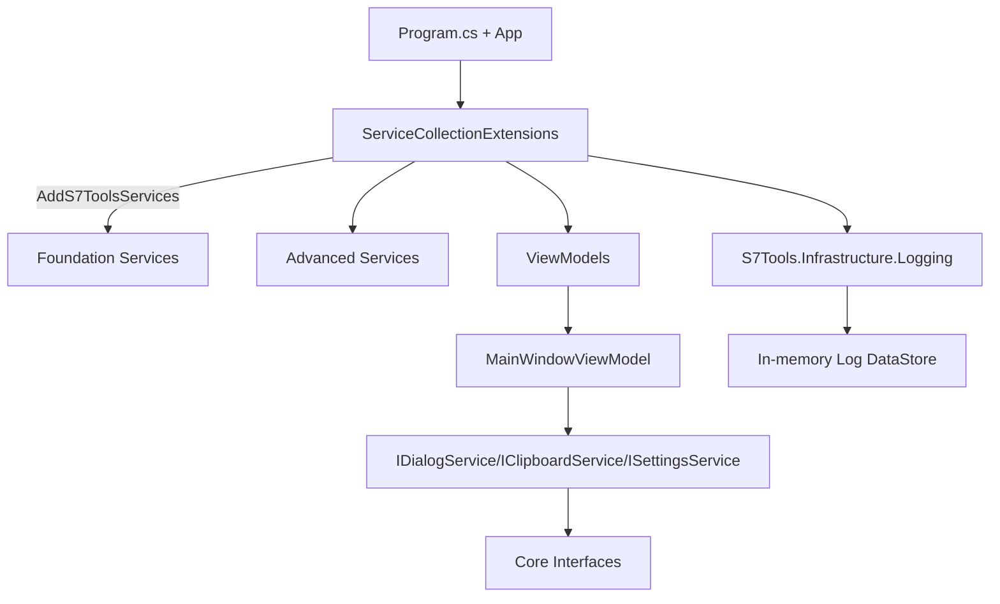
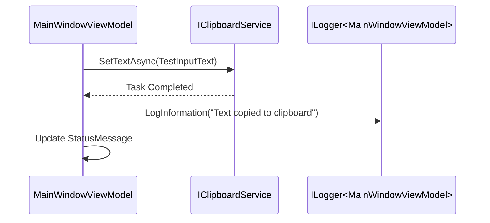

# S7Tools — Project Architecture Blueprint

Generated on: 2025-10-16

This document analyzes and captures the architecture of the S7Tools repository to maintain consistency and guide future development. It reflects the actual implementation observed in the codebase (not an idealized template).

## Architectural Overview

- Project type: .NET 8, Avalonia UI, ReactiveUI, Microsoft.Extensions.* stack
- Primary patterns: Clean Architecture, MVVM, Service-oriented design, DI-first, Command pattern
- Solution layout:
    - UI: `src/S7Tools` (Avalonia app, Views/ViewModels/Services)
    - Core: `src/S7Tools.Core` (domain interfaces, commands, validation, logging abstractions)
    - Infrastructure: `src/S7Tools.Infrastructure.Logging` (custom logging provider and data store)
    - Tests: `tests/*`
- Guiding principles: dependencies flow inward; ViewModels are thin, services encapsulate logic; DI centralization; structured logging; async-first; UI thread isolation via `IUIThreadService`.

## Architecture Visualization

```mermaid
flowchart LR
    subgraph UI [UI (Avalonia)]
      VMs[ViewModels]
      Views[Views]
      UIServices[UI Services]
    end

    subgraph Core [Core]
      Interfaces[Domain Interfaces]
      Commands[Commands]
      Validation[Validation]
      CoreLogging[Logging Abstractions]
    end

    subgraph Infra [Infrastructure]
      LogProvider[Infrastructure.Logging]
      DataStore[Log DataStore]
    end

    Views --> VMs
    VMs --> UIServices
    VMs --> Interfaces
    UIServices --> Interfaces
    LogProvider --> CoreLogging
    UI -. registers .-> Infra
    UI -. registers .-> Core
```

### Component Interaction (C4-Component style)



### ViewModel ↔ Service interaction (example)



### Profile persistence data flow

```mermaid
flowchart TD
  VM[SerialPortProfileViewModel] -->|CreateAsync(profile)| Svc[SerialPortProfileService]
  Svc --> Mgr[StandardProfileManager<SerialPortProfile>]
  Mgr -->|Acquire Semaphore| Lock[Critical Section]
  Lock -->|Validate + Assign ID| Mem[In-memory Collection]
  Mem -->|Serialize| Disk[(profiles.json)]
  Disk --> Mem
  Mem -->|Clone Return| VM
```

## Core Architectural Components

### Program/Avalonia Host

- Responsibility: Bootstrap DI, configure logging, register views/viewmodels, start Avalonia with ReactiveUI.
- Key: Background initialization via `InitializeS7ToolsServicesAsync` is launched without blocking the UI. `--diag` flag runs initialization and exits with diagnostics.

### DI Composition (`ServiceCollectionExtensions`)

- Purpose: Single source of truth for service registration; separates foundation, advanced, logging, and view models.
- Patterns: TryAdd to allow overrides; multiple overloads for `AddS7ToolsServices` including configurable variant; background init helpers.
- Exposes initialization/shutdown helpers to load/save layout/themes and warm up profile services.

### ViewModels (MVVM with ReactiveUI)

- Base: `ViewModelBase : ReactiveObject`.
- Example: `MainWindowViewModel` composes specialized VMs (Navigation, BottomPanel, SettingsManagement), uses `ReactiveCommand`, `Interaction`, and structured logging.
- Practices: No blocking I/O; UI messages via reactive timers; DI for services; logger per-VM via `ILogger<T>`.

### Profile Management (StandardProfileManager<T>)

- Purpose: Unified CRUD for profiles (SerialPort, Socat, PowerSupply), JSON persistence, business rules.
- Patterns: SemaphoreSlim for thread safety; "internal" helpers to avoid nested semaphore deadlocks; ID gap-filling; default profile management; import/export; name uniqueness with core method under lock.
- Error handling: Logs and throws where appropriate; avoids deadlocks per documented pattern.

### Logging Infrastructure

- Custom provider in `S7Tools.Infrastructure.Logging` with DataStore backing for real-time UI log viewing.
- DI usage: `services.AddLogging(...).AddDataStore(...)` in `Program.cs` and `AddS7ToolsLogging` extension.
- Observability: Structured logging with scopes/properties; UI can subscribe to the in-memory store.

## Layers and Dependencies

- UI depends on Core and Infrastructure; Core has no external app dependencies; Infrastructure depends on Core abstractions only.
- Dependency rules are enforced by project references and DI registration centralized in `ServiceCollectionExtensions`.
- No circular dependencies observed in main flow.

## Data Architecture

- Domain interfaces in `S7Tools.Core.Services.Interfaces` define boundaries for PLC, profiles, and services.
- Profiles persisted as JSON files via `StandardProfileManager<T>`; default creation when storage missing; clone-on-return to protect internal state.
- Validation: `S7Tools.Core.Validation` provides `IValidator`, `ValidationService`, and base classes; business rules in profile manager (name uniqueness, immutability of read-only profiles).

## Cross-Cutting Concerns

- Authentication/Authorization: Not present in current codebase (desktop app). If added later, follow DI + service abstraction.
- Error Handling & Resilience: Try/catch with logging; background init with safe fallbacks; semaphore pattern to avoid deadlocks; non-blocking UI.
- Logging & Monitoring: `ILogger<T>` everywhere; custom DataStore provider; export logs service; diagnosability via `--diag` path.
- Configuration Management: Settings service with load/save via file dialogs; theme/layout services persisted by shutdown helpers.

## Service Communication

- In-proc service calls via DI; no external service messaging detected. PLC communication will be via interfaces like `IS7ConnectionProvider`, `ITagRepository` (implementation in `PlcDataService`).

## .NET-Specific Patterns

- Host-less desktop app bootstrap with `ServiceCollection` and Splat integration: `services.UseMicrosoftDependencyResolver()` for Avalonia ecosystem.
- ReactiveUI patterns: `ReactiveCommand`, `Interaction`, `WhenAnyValue`.
- DI lifetimes: Singletons for app-wide stateful services and ViewModels needing persistence, Transients for dialogs and non-stateful helpers.

## Implementation Patterns

- Interface Design: Interfaces live in Core; UI/infrastructure implement them. Favor segregation per service responsibility.
- Services: Encapsulate operations with logging and validation; async methods use `ConfigureAwait(false)` in library-style code where appropriate.
- Command Pattern: `S7Tools.Core.Commands` with `ICommand`, `ICommandHandler<T>`, and a dispatcher.
- Repository-like Profile Managers: CRUD + import/export + default management; JSON file storage; semaphore-safe internal helpers.
- ViewModels: Use `RaiseAndSetIfChanged`; commands wrap async tasks; interactions for UI actions.

## Testing Architecture

- xUnit test projects under `tests/` per layer. Follow AAA pattern. Logging/infrastructure tests separated. Add tests for profile manager edge cases and deadlock prevention.

## Deployment Architecture

- Desktop distribution via Avalonia runtime. No containerization observed. Cross-platform; Linux/Mac/Windows via Avalonia.
- Environment adaptations handled by theme/layout/settings files stored locally.

## Extension and Evolution Patterns

- Feature Addition:
    - Define interfaces in Core for new domains.
    - Implement services in UI or new Infrastructure projects as needed.
    - Register via `ServiceCollectionExtensions` in appropriate section (Foundation/Advanced/Logging/ViewModels).
    - Provide ViewModels with ReactiveUI patterns; add Views; wire navigation.
- Modification:
    - Maintain DI boundaries; avoid UI calling implementations directly—use interfaces.
    - When changing profile rules, update `StandardProfileManager<T>` once; derived managers remain thin.
- Integration:
    - For external systems, introduce adapter services in Infrastructure; expose interfaces in Core; consider anti-corruption layer if protocols differ.

## Architectural Pattern Examples

### Layer Separation (DI example)

```csharp
// Program.cs
services.AddS7ToolsServices(options => { options.MaxEntries = 10000; });
services.UseMicrosoftDependencyResolver();
```

### ViewModel Reactive Commands

```csharp
public ReactiveCommand<Unit, Unit> SaveConfigurationCommand { get; }
SaveConfigurationCommand = ReactiveCommand.CreateFromTask(SaveConfigurationAsync);
```

### Profile Manager Deadlock-safe Name Uniqueness

```csharp
// Inside StandardProfileManager<T>
private string EnsureUniqueNameCore(string baseName, int? excludeId = null) { /* assumes semaphore held */ }
```

## Architectural Decision Records (Extracted)

- Use Avalonia + ReactiveUI for cross-platform desktop MVVM to avoid WPF lock-in.
- Centralize DI in `ServiceCollectionExtensions` to keep `Program.cs` minimal and testable.
- Implement custom logging provider with in-memory store for real-time UI log viewer.
- Standardize profile management with `StandardProfileManager<T>` to remove duplication and prevent semaphore deadlocks.

## Architecture Governance

- Consistency via `AGENTS.md` rules and Memory Bank docs.
- PRs should validate: DI registration location, ReactiveUI patterns, no UI-thread blocking I/O, logging via `ILogger<T>`.
- Run `dotnet format` and tests in CI; add architectural lint rules if needed (e.g., forbid UI->Infrastructure direct deps).

## Blueprint for New Development

- Workflow:
  1. Define/extend interfaces in Core.
  2. Implement services in UI/Infrastructure.
  3. Register in `ServiceCollectionExtensions`.
  4. Create ViewModels (ReactiveUI), then Views; wire navigation.
  5. Add unit tests for services and ViewModels.
- Templates:
    - Service: `IThingService` in Core + `ThingService` implementation with `ILogger<ThingService>`; register via TryAdd.
    - ViewModel: inherit `ViewModelBase`, expose `ReactiveCommand`s; keep I/O off UI thread.
- Pitfalls:
    - Avoid nested semaphore acquisitions (see Memory Bank note).
    - Do not register services in `Program.cs` directly; keep all in extensions.
    - Keep Core free of UI/infrastructure dependencies.
