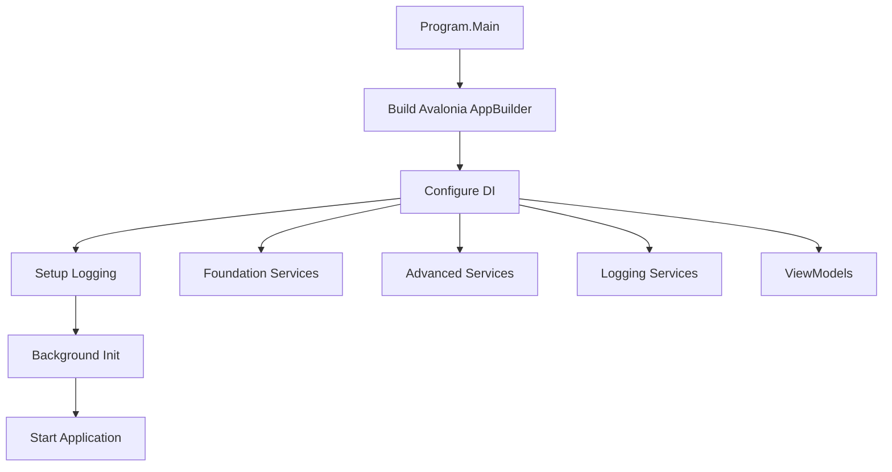
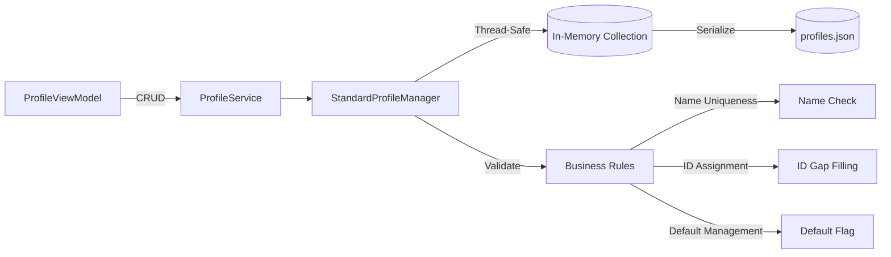
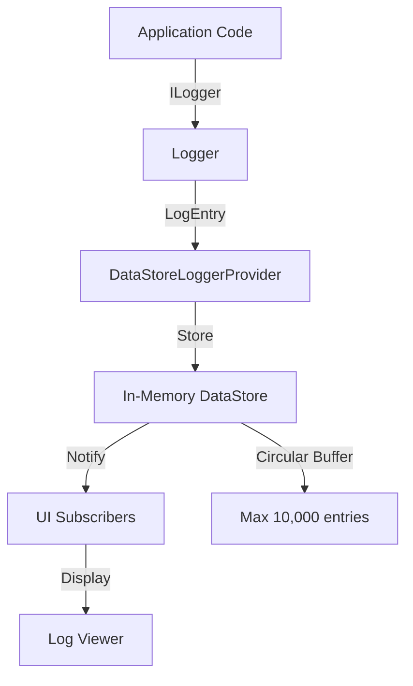
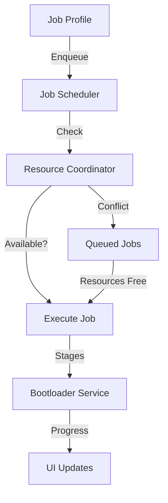
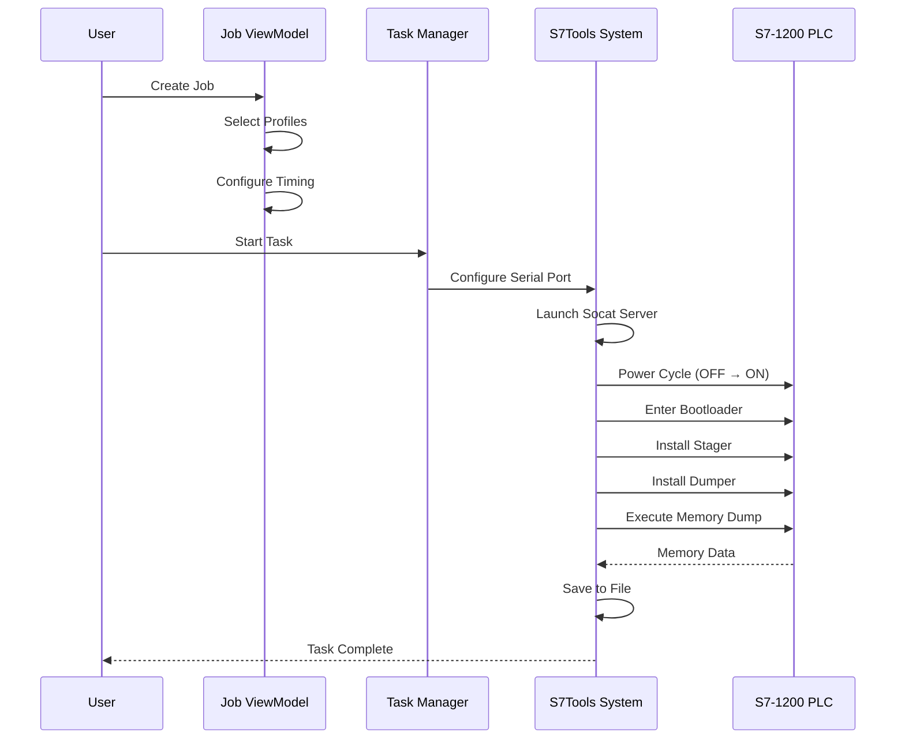

# S7Tools Architecture Overview

## Table of Contents

- [Vision and Purpose](#vision-and-purpose)
- [Architectural Style](#architectural-style)
- [Technology Stack](#technology-stack)
- [Layer Architecture](#layer-architecture)
- [Component Architecture](#component-architecture)
- [Key Design Patterns](#key-design-patterns)
- [User Experience Philosophy](#user-experience-philosophy)
- [Core User Workflows](#core-user-workflows)

## Vision and Purpose

### Problem Statement

S7Tools addresses critical gaps in industrial automation tooling for **Siemens S7-1200 PLC** security research and firmware analysis:

**Market Gaps**:

- **Fragmented tooling** - Proprietary, expensive, or lacking modern UI/UX
- **Limited memory analysis** - No unified systematic PLC memory dumping tools
- **Manual bootloader operations** - Complex manual processes for memory extraction
- **Inefficient workflows** - Cumbersome interfaces slowing down research
- **Cross-platform limitations** - Most tools are Windows-only
- **Poor job management** - No systematic approach to manage/schedule operations
- **Resource conflicts** - Manual coordination for shared hardware resources

### Solution Approach

S7Tools provides:

1. **Modern, intuitive interface** - VSCode-inspired UI for industrial automation
2. **Systematic memory analysis** - Automated PLC firmware and bootloader research tools
3. **Automated job management** - Complex multi-step hardware operations with scheduling
4. **Resource coordination** - Intelligent parallel execution and conflict detection
5. **Cross-platform compatibility** - Windows, Linux, and macOS support
6. **Open, extensible architecture** - Customizable for specific research needs

### Primary Problems Solved

| Problem | Current State | S7Tools Solution | Impact |
|---------|---------------|------------------|--------|
| **Complex PLC Memory Analysis** | Manual, error-prone processes | Automated job management with systematic dumps | Reduced manual effort, improved reliability |
| **Lack of Job Management** | Manual coordination of hardware resources | Task Manager with scheduling/queuing/parallel execution | Efficient resource utilization |
| **Resource Coordination** | Manual tracking of hardware usage | Automated conflict detection and resolution | Parallel operations where possible |
| **Poor Real-Time Monitoring** | Limited visibility into long operations | Advanced logging with real-time progress tracking | Better visibility and control |
| **Outdated User Interfaces** | Command-line tools, outdated interfaces | Modern VSCode-like interface | Reduced learning curve, improved productivity |

## Architectural Style

S7Tools implements **Clean Architecture** with **MVVM** (Model-View-ViewModel) pattern:

### Clean Architecture Principles

```
┌─────────────────────────────────────────────────┐
│                  UI Layer                       │
│  (Views, ViewModels, UI Services)              │
│  Dependencies: → Application, → Infrastructure  │
└─────────────────────────────────────────────────┘
                      ↓ (uses)
┌─────────────────────────────────────────────────┐
│              Application Layer                  │
│     (Application Services, Commands)            │
│     Dependencies: → Domain                      │
└─────────────────────────────────────────────────┘
                      ↓ (uses)
┌─────────────────────────────────────────────────┐
│               Domain Layer                      │
│  (Entities, Interfaces, Business Rules)        │
│  Dependencies: NONE                             │
└─────────────────────────────────────────────────┘
                      ↑ (implements)
┌─────────────────────────────────────────────────┐
│           Infrastructure Layer                  │
│    (Logging, Data Access, External Services)   │
│    Dependencies: → Domain                       │
└─────────────────────────────────────────────────┘
```

**Key Rules**:

1. **Dependencies flow inward** - Outer layers depend on inner layers, never reverse
2. **Domain has no dependencies** - Core business logic is isolated
3. **Interfaces in domain** - Implementations in outer layers
4. **UI isolated from infrastructure** - Communication through abstractions

### MVVM Pattern

```
┌──────────┐         ┌──────────────┐         ┌─────────┐
│   View   │ binds   │  ViewModel   │ uses    │ Service │
│ (XAML)   │────────>│ (ReactiveUI) │────────>│ (Logic) │
└──────────┘         └──────────────┘         └─────────┘
                            │
                            │ implements
                            ↓
                     ┌──────────────┐
                     │ ReactiveObject│
                     │ INotifyPropertyChanged │
                     └──────────────┘
```

**MVVM Responsibilities**:

- **View** - Pure UI presentation (XAML), no business logic
- **ViewModel** - UI state, commands, presentation logic, data binding
- **Model** - Domain entities and business rules (in Core layer)
- **Services** - Application logic, I/O operations, external communication

## Technology Stack

### Primary Technologies

| Component | Technology | Version | Purpose |
|-----------|-----------|---------|---------|
| **Framework** | .NET | 8.0 | Cross-platform runtime |
| **UI Framework** | Avalonia UI | Latest | Cross-platform XAML UI |
| **MVVM Library** | ReactiveUI | Latest | Reactive MVVM implementation |
| **DI Container** | Microsoft.Extensions.DependencyInjection | 8.0 | Dependency injection |
| **Logging** | Microsoft.Extensions.Logging | 8.0 | Structured logging |
| **Testing** | xUnit | Latest | Unit testing framework |

### Supporting Libraries

- **Avalonia.ReactiveUI** - Integration between Avalonia and ReactiveUI
- **Splat** - Service locator integration for Avalonia
- **System.Reactive** - Reactive Extensions (Rx) for .NET
- **System.Text.Json** - JSON serialization for profiles

### Development Tools

- **VS Code** - Primary IDE with Avalonia extensions
- **dotnet CLI** - Build, test, and run commands
- **Git** - Version control
- **EditorConfig** - Code style enforcement

## Layer Architecture

### Solution Structure

```
src/
├── S7Tools/                          # UI Layer (Avalonia app)
│   ├── ViewModels/                   # MVVM ViewModels
│   │   ├── Base/                     # Base ViewModels
│   │   ├── Controls/                 # Control ViewModels
│   │   ├── Dialogs/                  # Dialog ViewModels
│   │   ├── Jobs/                     # Job-related ViewModels
│   │   ├── Layout/                   # Layout ViewModels
│   │   ├── Pages/                    # Page ViewModels
│   │   ├── Profiles/                 # Profile ViewModels
│   │   ├── Settings/                 # Settings ViewModels
│   │   └── Tasks/                    # Task ViewModels
│   ├── Views/                        # XAML Views (mirrors ViewModels)
│   ├── Services/                     # Application services
│   ├── Extensions/                   # DI registration
│   └── Resources/                    # Localization, themes
│
├── S7Tools.Core/                     # Domain Layer
│   ├── Models/                       # Domain entities
│   │   ├── Jobs/                     # Job domain models
│   │   ├── Configuration/            # Configuration models
│   │   └── Profiles/                 # Profile models
│   ├── Services/                     # Service interfaces
│   │   └── Interfaces/               # Domain contracts
│   ├── Commands/                     # Command pattern
│   ├── Validation/                   # Validation logic
│   └── Exceptions/                   # Custom exceptions
│
├── S7Tools.Infrastructure.Logging/   # Infrastructure Layer
│   ├── DataStore/                    # In-memory log storage
│   └── Providers/                    # Custom log providers
│
└── S7Tools.Diagnostics/              # Diagnostics (optional)

tests/
├── S7Tools.Tests/                    # UI layer tests
├── S7Tools.Core.Tests/               # Domain layer tests
└── S7Tools.Infrastructure.Logging.Tests/  # Infrastructure tests
```

### Layer Responsibilities

#### UI Layer (`S7Tools`)

**Purpose**: User interface, presentation logic, user interactions

**Responsibilities**:

- Avalonia Views (XAML) and ViewModels
- User input handling and validation presentation
- UI state management via ReactiveUI
- Navigation and dialog management
- Application services (clipboard, dialogs, UI thread)

**Key Patterns**:

- MVVM with ReactiveUI
- Dependency injection for services
- Command pattern for user actions
- Reactive properties and commands

**Dependencies**: Application layer, Infrastructure layer (for logging)

#### Domain Layer (`S7Tools.Core`)

**Purpose**: Business logic, domain entities, business rules

**Responsibilities**:

- Domain models (Job, Profile, Task)
- Service interfaces and contracts
- Business validation rules
- Custom exception hierarchy
- Command definitions

**Key Patterns**:

- Domain-driven design
- Interface segregation
- Custom exceptions for business errors
- Immutable value objects where appropriate

**Dependencies**: NONE (pure domain logic)

#### Infrastructure Layer (`S7Tools.Infrastructure.Logging`)

**Purpose**: External concerns, data persistence, logging

**Responsibilities**:

- Custom logging provider with DataStore
- In-memory log storage for UI display
- File I/O operations (profile persistence)
- External service integrations

**Key Patterns**:

- Provider pattern for logging
- Repository pattern for data access
- Adapter pattern for external services

**Dependencies**: Domain layer interfaces only

## Component Architecture

### Application Bootstrap (Program.cs)



**Responsibilities**:

1. Configure Avalonia AppBuilder
2. Register all services via `ServiceCollectionExtensions`
3. Setup custom logging with DataStore provider
4. Launch background initialization (`InitializeS7ToolsServicesAsync`)
5. Start Avalonia application loop

**Diagnostic Mode** (`--diag` flag):

- Runs initialization sequence
- Validates all services can be constructed
- Logs diagnostic information
- Exits without starting UI

### Dependency Injection (ServiceCollectionExtensions)

**Central DI Registration** - Single source of truth for all service registrations

```csharp
// Registration structure
public static IServiceCollection AddS7ToolsServices(this IServiceCollection services)
{
    services.AddS7ToolsFoundationServices();    // Core services
    services.AddS7ToolsAdvancedServices();      // Advanced features
    services.AddS7ToolsLogging();               // Logging infrastructure
    services.AddS7ToolsViewModels();            // UI ViewModels
    return services;
}
```

**Service Categories**:

1. **Foundation Services** - Core app services (clipboard, dialogs, UI thread)
2. **Advanced Services** - Profile managers, job services, task scheduling
3. **Logging Services** - Custom logging provider and DataStore
4. **ViewModels** - All MVVM ViewModels as singletons or transients

**Patterns**:

- `TryAddSingleton` to allow test overrides
- Parallel initialization via `ResourceCoordinator`
- Shutdown helpers for clean teardown

### Profile Management System

**Unified Profile Management** - All profile types use `StandardProfileManager<T>`



**Profile Types**:

- **SerialPortProfile** - Serial port configuration (baud, parity, stop bits)
- **SocatProfile** - Socat server configuration (port, protocols)
- **PowerSupplyProfile** - Power supply settings (voltage, current limits)
- **JobProfile** - Job definitions (tasks, schedules, configurations)
- **MemoryRegionProfile** - Memory dump regions (start, end, segment selection)

**Thread Safety Pattern** - Internal Method Pattern prevents semaphore deadlocks:

```csharp
// Public API (acquires semaphore)
public async Task<T> GetByIdAsync(int id)
{
    await _semaphore.WaitAsync();
    try { return await GetByIdInternalAsync(id); }
    finally { _semaphore.Release(); }
}

// Internal (assumes semaphore held)
private Task<T> GetByIdInternalAsync(int id) { /* no semaphore */ }
```

### Logging Infrastructure

**Custom DataStore Provider** - Real-time log viewing in UI



**Features**:

- In-memory circular buffer (configurable max entries)
- Real-time UI updates via subscriptions
- Structured logging with scopes and properties
- Export to file functionality
- Thread-safe concurrent access

**Usage Pattern**:

```csharp
public class MyService
{
    private readonly ILogger<MyService> _logger;

    public MyService(ILogger<MyService> logger)
    {
        _logger = logger;
    }

    public void DoWork()
    {
        _logger.LogInformation("Starting work: {WorkId}", workId);
        // Structured logging with properties
    }
}
```

## Key Design Patterns

### 1. Unified Profile Management Pattern

**Problem**: Duplicate CRUD logic across profile types
**Solution**: Generic `StandardProfileManager<T>` with template method pattern

**Benefits**:

- Single implementation for all CRUD operations
- Consistent validation and business rules
- Thread-safe operations with Internal Method Pattern
- Reduced code duplication

### 2. Internal Method Pattern (Semaphore Safety)

**Problem**: Nested semaphore acquisitions cause deadlocks
**Solution**: Public methods acquire semaphore, internal methods assume held

**Benefits**:

- Prevents deadlocks when methods call each other
- Clear separation of locking responsibility
- Testable internal logic without locking overhead

### 3. Resource Coordination Pattern

**Problem**: Parallel service initialization blocks startup
**Solution**: `ResourceCoordinator` executes independent initializations in parallel

**Benefits**:

- Faster application startup
- Efficient resource utilization
- Clear dependency management

### 4. Custom Exception Hierarchy

**Problem**: Generic exceptions lack context
**Solution**: Domain-specific exceptions with semantic meaning

**Examples**:

- `ProfileNotFoundException` - Profile ID not found
- `DuplicateProfileNameException` - Name uniqueness violation
- `DialogParentNotFoundException` - Parent window required for dialog

**Benefits**:

- Clear error semantics
- Targeted exception handling
- Better error messages to users

### 5. Reusable UI Controls Pattern

**Problem**: Duplicate UI sections across views
**Solution**: Extract into UserControls with proper ViewModels

**Examples**:

- `SerialPortDiscoveryControl` - Shared serial port configuration
- `ProfileSelectorControl` - Shared profile selection logic

**Benefits**:

- DRY principle compliance
- Consistent UI behavior
- Easier maintenance and testing

### 6. Bootloader Integration Architecture

**Problem**: Complex multi-stage PLC memory dumping workflow with resource coordination
**Solution**: Job Scheduler with Resource Coordinator and Adapter Pattern for bootloader integration

#### Job Scheduler Pattern



**Components**:

- **Job Scheduler** (`ITaskScheduler`) - Manages job queue, state transitions, parallel execution
- **Resource Coordinator** (`IResourceCoordinator`) - Prevents resource conflicts (serial ports, TCP ports, modbus connections)
- **Bootloader Service** (`IBootloaderService`) - Orchestrates 7-stage memory dump workflow
- **Job Profile** (`JobProfile`) - Reusable configuration templates for memory dumps

**7-Stage Bootloader Workflow**:

1. **Socat Setup** - Launch TCP/UDP bridge for serial communication
2. **Power Cycle** - Reset PLC via modbus-controlled power supply
3. **Handshake** - Establish bootloader connection during boot window
4. **Stager Install** - Upload first-stage payload
5. **Dumper Install** - Upload memory dump payload
6. **Memory Dump** - Extract firmware/bootloader regions
7. **Teardown** - Clean up resources (socat, power, connections)

**Resource Coordination Pattern**:

```csharp
// Resource acquisition with conflict detection
public bool TryAcquire(IEnumerable<ResourceKey> resources)
{
    // Atomic check-and-acquire across all resources
    var availableResources = resources.Where(r => !_lockedResources.ContainsKey(r));
    if (availableResources.Count() != resources.Count())
        return false; // Conflict detected

    // Acquire all resources atomically
    foreach (var resource in resources)
        _lockedResources[resource] = DateTime.UtcNow;

    return true;
}
```

**Snapshot-Based Parallel Execution**:

```csharp
// Collect ALL jobs that can start
var jobsToStart = new List<Job>();
foreach (var job in queuedJobs)
{
    if (_resourceCoordinator.TryAcquire(job.Resources))
        jobsToStart.Add(job);
}

// Update ALL states synchronously (fires events before async work)
foreach (var job in jobsToStart)
{
    job.State = JobState.Running;
    JobStateChanged?.Invoke(this, new JobStateChangedEventArgs(job));
}

// Launch ALL tasks asynchronously in parallel
foreach (var job in jobsToStart)
{
    Task.Run(() => ExecuteJobAsync(job));
}
```

**Benefits**:

- **Parallel Execution**: Multiple jobs run simultaneously when resources don't conflict
- **Resource Safety**: Prevents serial port/TCP port conflicts automatically
- **Progress Tracking**: Real-time progress updates for all 7 bootloader stages
- **Error Recovery**: Automatic resource cleanup on failure/cancellation
- **Reusable Profiles**: Job templates for common memory dump scenarios

#### Adapter Pattern for Reference Code Integration

**Problem**: Integrate existing bootloader reference code (C/Python) without rewriting
**Solution**: Adapter services wrap serial, socat, power supply, and PLC client operations

**Adapter Services**:

- `ISerialPortService` - Wraps stty configuration and serial port management
- `ISocatService` - Wraps socat process lifecycle (start, stop, status)
- `IPowerSupplyService` - Wraps modbus communication for power control
- `IPlcClient` - Wraps bootloader protocol (handshake, payload upload, memory dump)

**Example Adapter Implementation**:

```csharp
public class SocatService : ISocatService
{
    public async Task<SocatProcessInfo> StartSocatAsync(
        SocatConfiguration config,
        string serialDevice,
        CancellationToken ct)
    {
        // Build socat command from configuration
        string command = BuildSocatCommand(config, serialDevice);

        // Launch process via adapter
        var process = Process.Start(new ProcessStartInfo
        {
            FileName = "/usr/bin/socat",
            Arguments = command,
            RedirectStandardOutput = true
        });

        // Return process info for tracking
        return new SocatProcessInfo
        {
            ProcessId = process.Id,
            TcpPort = config.Port,
            SerialDevice = serialDevice,
            IsRunning = true
        };
    }
}
```

**Benefits**:

- **Code Reuse**: Leverage existing bootloader reference implementation
- **Testability**: Mock adapters for unit testing without hardware
- **Flexibility**: Easy to swap implementations (e.g., native .NET serial instead of stty)
- **Cross-Platform**: Adapter handles OS-specific differences

## User Experience Philosophy

### VSCode-Inspired Design

S7Tools adopts the VSCode interface paradigm familiar to developers:

```
┌─────────────────────────────────────────────────────────┐
│  Title Bar                                    [_][□][X] │
├──┬──────────────────────────────────────────────────────┤
│A │  Sidebar                   Main Content Area         │
│c │  ┌─────────────────┐      ┌────────────────────────┐│
│t │  │ Created Jobs    │      │ Job Configuration      ││
│i │  │ Scheduled Tasks │      │                        ││
│v │  │ Queued Tasks    │      │ [Profile Selection]    ││
│i │  │ Active Tasks    │      │ [Timing Parameters]    ││
│t │  │ Finished Tasks  │      │ [Output Settings]      ││
│y │  └─────────────────┘      └────────────────────────┘│
│  │                                                       │
│B │  ┌───────────────────────────────────────────────┐  │
│a │  │ Bottom Panel (Logs, Operation Details)        │  │
│r │  └───────────────────────────────────────────────┘  │
├──┴──────────────────────────────────────────────────────┤
│  Status Bar: Connected | 2 Active Tasks | System Ready  │
└─────────────────────────────────────────────────────────┘
```

**UI Components**:

1. **Activity Bar** - Primary navigation (Task Manager, Jobs, Settings, Logs)
2. **Sidebar** - Context-sensitive content with collapsible groups
3. **Main Content Area** - Job configuration, task details, execution progress
4. **Bottom Panel** - Real-time logging, operation details, system status
5. **Status Bar** - Hardware connection status, active task count, system health

### Design Principles

| Principle | Implementation |
|-----------|----------------|
| **Familiarity** | Leverage VSCode patterns developers know |
| **Efficiency** | Minimize clicks and context switching |
| **Visibility** | Important information always accessible |
| **Consistency** | Consistent behavior and visual design |
| **Responsiveness** | Immediate feedback for all actions |

### UX Goals

**Primary Goals**:

- **Intuitive Navigation** - Any function within 3 clicks
- **Real-Time Responsiveness** - All UI operations < 100ms
- **Professional Appearance** - Modern tool aesthetics
- **Comprehensive Feedback** - Clear status and error messages

**Secondary Goals**:

- Customization and personalization options
- Accessibility and keyboard navigation
- Built-in help and discovery features

## Core User Workflows

### Primary Workflow: Automated PLC Memory Dumping



**Steps**:

1. **Job Configuration**
   - Navigate to Jobs activity
   - Create new job with name/description
   - Select required profiles (Serial, Socat, Power, Memory Region)
   - Configure timing parameters and output path

2. **Task Execution**
   - Switch to Task Manager activity
   - Review job configuration
   - Start task execution
   - Monitor real-time progress logs

3. **Automated Sequence**
   - Configure serial port (stty + profile settings)
   - Launch socat server (with conflict detection)
   - Establish modbus connection to power supply
   - Execute power cycle sequence
   - Enter bootloader mode
   - Perform bootloader handshaking
   - Install stager payload (optional confirmation)
   - Install dumper payload
   - Execute memory dump
   - Save dump to configured path

4. **Resource Management**
   - System detects resource conflicts
   - Executes parallel jobs when using different resources
   - Queues conflicting jobs for sequential execution

### Key User Scenarios

#### Scenario 1: Security Researcher - Firmware Analysis

**User**: Security researcher analyzing S7-1200 firmware
**Goal**: Extract complete memory dumps for offline analysis
**Experience**: Create job template, configure multiple regions, schedule batch operations
**Success**: Complete memory dumps with consistent methodology and detailed logs

#### Scenario 2: Automation Engineer - Bootloader Development

**User**: Engineer developing custom bootloader functionality
**Goal**: Test bootloader operations and validate memory access
**Experience**: Use job templates for iterative testing, monitor real-time progress
**Success**: Validated bootloader functionality with systematic testing

#### Scenario 3: Research Team - Parallel Memory Analysis

**User**: Research team with multiple S7-1200 devices
**Goal**: Efficiently analyze multiple devices in parallel
**Experience**: Configure multiple jobs, system coordinates parallel execution
**Success**: Maximized hardware utilization without resource conflicts

## Success Metrics

### Performance Metrics

- **Application Startup**: Target < 3 seconds
- **UI Response Time**: Target < 100ms for all operations
- **Memory Usage**: Stable during extended operation
- **Connection Reliability**: >99% successful PLC connections

### Quality Metrics

- **Test Pass Rate**: 99.7% (361 tests: 360 passing, 1 intentionally skipped)
- **Code Quality Grade**: A+ (98/100)
- **Build Status**: Zero errors, zero warnings
- **Bug Report Rate**: Tracked per release

### User Experience Metrics

- **Time to First Success**: How quickly new users complete basic tasks
- **Task Completion Rate**: Percentage completing common workflows
- **User Satisfaction**: Qualitative feedback on interface
- **Feature Adoption**: How quickly users discover new features

## Related Documentation

- [Index](../INDEX.md)
- [Project_Architecture_Blueprint](../Project_Architecture_Blueprint.md)
- [Project_Folders_Structure_Blueprint](../Project_Folders_Structure_Blueprint.md)
- [Settings_Schema](../SETTINGS_SCHEMA.md)
- [_Index](_index.md)
- [Clean Architecture](clean-architecture.md)
- [0001 Ui Framework](decisions/0001-ui-framework.md)
- [0002 Logging Provider](decisions/0002-logging-provider.md)
- [_Index](decisions/_index.md)
- [Diagrams](diagrams.md)
- [Mvvm Patterns](mvvm-patterns.md)
- [Project_Architecture_Blueprint](../archive/Project_Architecture_Blueprint.md)
- [Project_Folders_Structure_Blueprint](../archive/Project_Folders_Structure_Blueprint.md)
- [Ai Agent Guide](../guides/ai-agent-guide.md)
- [Code Style](../guides/code-style.md)
- [Development Workflow](../guides/development-workflow.md)
- [Memory Bank Usage](../guides/memory-bank-usage.md)
- [Onboarding](../guides/onboarding.md)
- [_Index](../patterns/_index.md)
- [Reusable Controls](../patterns/reusable-controls.md)
- [System Patterns](../patterns/system-patterns.md)
- [2025 11 07 Comprehensive Review](../reviews/2025-11-07-comprehensive-review.md)
- [2025 11 10 Quality Improvements](../reviews/2025-11-10-quality-improvements.md)
- [Latest](../reviews/LATEST.md)
- [Pattern Template](../templates/pattern-template.md)

---
*This section is auto-generated. Do not edit manually. Last updated: 2025-11-10*
