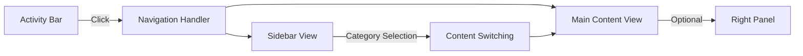
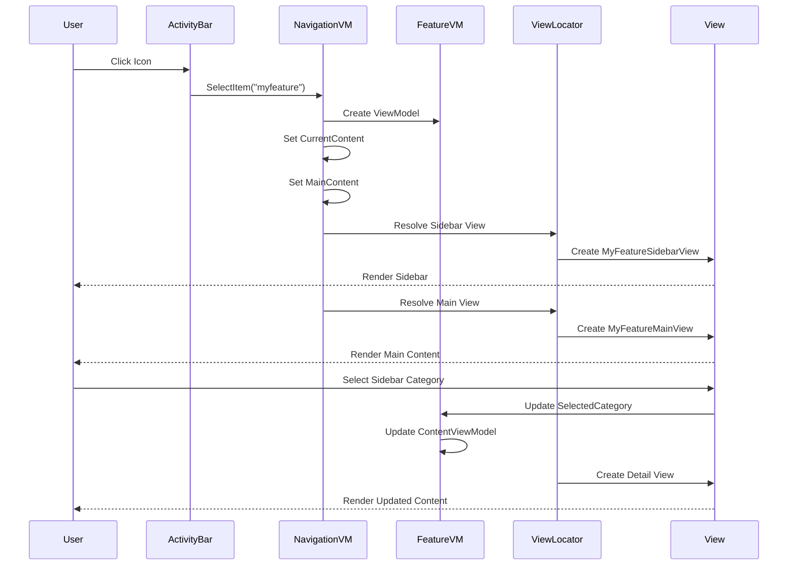
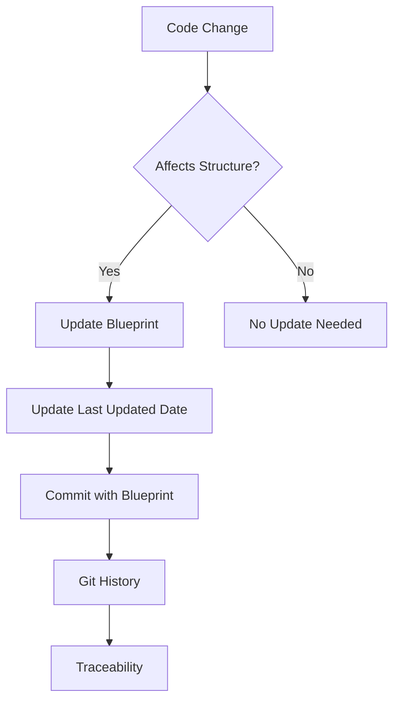
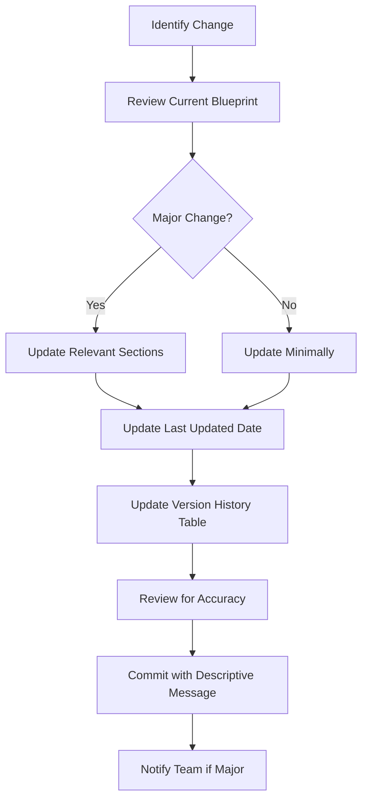

# ⚠️ DEPRECATED: S7Tools Project Folder Structure Blueprint

**This document is deprecated as of 2025-11-10.**

**Use instead**: [Architecture Overview](../architecture/overview.md)

**Removal Date**: 2027-11-10 (2-year retention policy)

**Reason**: Content has been consolidated into Architecture Overview with better organization and current project structure.

---

## Original Content (For Reference)

**Generated**: 2025-10-15
**Project Type**: .NET 8.0 Avalonia Desktop Application
**Architecture**: Clean Architecture with MVVM Pattern
**Version**: 1.4
**Last Updated**: 2025-11-07

---

## 1. Structural Overview

### Project Type Detection Results

**Primary Technology**: **.NET 8.0** with Avalonia UI Framework
**Architecture Pattern**: **Clean Architecture** with **MVVM (Model-View-ViewModel)**
**UI Framework**: **Avalonia UI 11.3.6** with ReactiveUI 20.1.1
**Logging Framework**: **Microsoft.Extensions.Logging 8.0.0** with custom DataStore provider
**Dependency Injection**: **Microsoft.Extensions.DependencyInjection 8.0.0**
**Testing Frameworks**: xUnit, Moq, FluentAssertions
**Language Version**: C# (latest) targeting .NET 8.0

### Monorepo Detection

This is **NOT a monorepo**. It is a single-solution, multi-project .NET application with:
- 1 main solution (`S7Tools.sln`)
- 4 main projects (3 application + 1 diagnostics tool)
- 3 test projects
- Clear dependency boundaries between projects

### Microservices Detection

This is **NOT a microservices architecture**. It is a **monolithic desktop application** with:
- Single-process execution model
- Clean Architecture layer separation within a single application
- No service-to-service communication
- No distributed deployment

### Frontend Detection

This application **includes frontend components**:
- Avalonia UI-based desktop interface
- XAML-based view definitions (`.axaml` files)
- Code-behind files (`.axaml.cs`)
- MVVM pattern with ViewModels
- Custom converters for data binding
- Styles and themes
- Assets (icons, fonts)

### Organizational Principles

The S7Tools project follows these organizational principles:

1. **Layer Separation (Clean Architecture)**:
   - **Core Layer** (`S7Tools.Core`): Domain models, interfaces, and business rules with no external dependencies
   - **Infrastructure Layer** (`S7Tools.Infrastructure.Logging`): Technical concerns like logging
   - **Application/Presentation Layer** (`S7Tools`): UI, ViewModels, application services, and orchestration

2. **Dependency Flow**:
   - Dependencies flow inward: UI → Application → Core
   - Core has no dependencies on outer layers
   - Infrastructure depends only on Core + Microsoft.Extensions abstractions

3. **Feature-Based Organization**:
   - Within each project, code is organized by functional areas (Services, ViewModels, Views)
   - Related components are grouped together (e.g., `PowerSupplyService`, `PowerSupplyProfileService`, `PowerSupplySettingsViewModel`)

4. **MVVM Pattern**:
   - Strict separation between UI (Views), presentation logic (ViewModels), and business logic (Services/Models)
   - Views are data-bound to ViewModels
   - ViewModels orchestrate services and prepare data for display

5. **Testing Organization**:
   - Test projects mirror the structure of the projects they test
   - Separate test projects for each main project
   - AAA (Arrange-Act-Assert) pattern throughout

### Structural Rationale

- **S7Tools.Core**: Contains domain models and service interfaces (dependency-free core). This ensures business logic is independent of UI and infrastructure concerns.
- **S7Tools.Infrastructure.Logging**: Specialized infrastructure for logging concerns, keeping it separate from the main application.
- **S7Tools**: Main application project containing UI, ViewModels, and application services. This is the composition root where everything comes together.
- **S7Tools.Diagnostics**: Developer tooling for diagnostics and troubleshooting.

---

## 2. Directory Visualization

### Solution Structure (ASCII Tree)

```
S7Tools/
├── .copilot-tracking/                    # AI-assisted development tracking and memory
│   ├── bugs/                             # Bug reports and issue tracking
│   ├── memory-bank/                      # Structured memory bank documentation
│   │   ├── archive/                      # Archived/deprecated documentation
│   │   ├── examples/                     # Example implementations
│   │   ├── tasks/                        # Individual task tracking files
│   │   ├── activeContext.md              # Current development context
│   │   ├── productContext.md             # Product vision and goals
│   │   ├── progress.md                   # Development progress tracking
│   │   ├── projectbrief.md               # Project overview
│   │   ├── systemPatterns.md             # Architecture patterns and rules
│   │   ├── techContext.md                # Technical environment
│   │   └── threading-and-synchronization-patterns.md
│   ├── prompts/                          # Implementation prompt templates
│   ├── research/                         # Research findings and analysis
│   └── reviews/                          # Code and design reviews
│
├── .github/                              # GitHub-specific configurations
│   ├── agents/                           # AI agent workspace and references
│   │   └── workspace/                    # Agent working directory
│   ├── copilot/                          # GitHub Copilot instructions
│   │   └── copilot-instructions.md       # Copilot coding guidelines
│   ├── instructions/                     # Development instructions
│   │   ├── dotnet-architecture-good-practices.instructions.md
│   │   └── memory-bank.instructions.md
│   └── prompts/                          # Reusable prompt templates
│       ├── copilot-instructions-blueprint-generator.prompt.md
│       └── folder-structure-blueprint-generator.prompt.md
│
├── .vscode/                              # VS Code workspace settings
│   ├── launch.json                       # Debug configurations
│   └── settings.json                     # Workspace settings
│
├── bootloader-payloads/                  # PLC bootloader payload resources
│   ├── docker-scripts/                   # Docker utilities
│   ├── payloads/                         # ARM assembly payloads
│   └── README.md
│
├── src/                                  # Source code root
│   ├── resources/                        # Shared application resources
│   │   └── SerialProfiles/               # Serial port profile configurations
│   │
│   ├── S7Tools/                          # Main application project (UI + Application Layer)
│   │   ├── Assets/                       # Application assets (icons, images)
│   │   │   └── avalonia-logo.ico
│   │   │
│   │   ├── Constants/                    # Application-wide constants
│   │   │   └── StatusMessages.cs         # UI status message constants
│   │   │
│   │   ├── Converters/                   # XAML value converters
│   │   │   ├── BooleanToColorConverter.cs
│   │   │   ├── BooleanToInverseBooleanConverter.cs
│   │   │   ├── BooleanToStringConverter.cs
│   │   │   ├── BooleanToVisibilityConverter.cs
│   │   │   ├── DateTimeOffsetToDateTimeConverter.cs
│   │   │   ├── GridLengthToDoubleConverter.cs
│   │   │   ├── ModbusAddressingModeConverter.cs
│   │   │   ├── ModbusTcpPropertyConverter.cs
│   │   │   ├── ObjectConverters.cs
│   │   │   └── StringEqualsConverter.cs
│   │   │
│   │   ├── Extensions/                   # Extension methods and DI configuration
│   │   │   └── ServiceCollectionExtensions.cs  # Service registration
│   │   │
│   │   ├── Helpers/                      # Helper classes and utilities
│   │   │   └── PlatformHelper.cs         # Platform-specific utilities
│   │   │
│   │   ├── Models/                       # Application-specific models/DTOs
│   │   │   ├── ApplicationSettings.cs    # App settings model
│   │   │   ├── ConfirmationRequest.cs    # Dialog request models
│   │   │   ├── InputRequest.cs
│   │   │   ├── LoggingSettings.cs
│   │   │   ├── PanelTabItem.cs           # UI panel models
│   │   │   └── ProfileEditRequest.cs
│   │   │
│   │   ├── Resources/                    # Localization and string resources
│   │   │   ├── Strings/                  # Localized string files
│   │   │   ├── ResourceManager.cs        # Resource access
│   │   │   └── UIStrings.cs              # UI string constants
│   │   │
│   │   ├── Services/                     # Application services (implementations)
│   │   │   ├── Bootloader/               # PLC bootloader services
│   │   │   ├── Interfaces/               # Service interface definitions
│   │   │   ├── Tasking/                  # Background task management
│   │   │   ├── ActivityBarService.cs     # UI activity bar management
│   │   │   ├── AvaloniaFileDialogService.cs
│   │   │   ├── AvaloniaUIThreadService.cs
│   │   │   ├── ClipboardService.cs
│   │   │   ├── CommandDispatcher.cs      # Command pattern dispatcher
│   │   │   ├── DesignTimeViewModelFactory.cs
│   │   │   ├── DialogService.cs
│   │   │   ├── EnhancedViewModelFactory.cs
│   │   │   ├── FileLogWriter.cs          # File logging service
│   │   │   ├── GreetingService.cs
│   │   │   ├── LayoutService.cs          # UI layout management
│   │   │   ├── LocalizationService.cs    # Localization management
│   │   │   ├── LogExportService.cs       # Log export functionality
│   │   │   ├── PlcDataService.cs         # PLC data access
│   │   │   ├── PowerSupplyProfileService.cs
│   │   │   ├── PowerSupplyService.cs     # Power supply control
│   │   │   ├── ProfileEditDialogService.cs
│   │   │   ├── SerialPortProfileService.cs
│   │   │   ├── SerialPortService.cs      # Serial port communication
│   │   │   ├── SettingsService.cs        # Settings persistence
│   │   │   ├── SocatProfileService.cs
│   │   │   ├── SocatService.cs           # Socat service management
│   │   │   ├── StandardProfileManager.cs
│   │   │   ├── StructuredLogger.cs       # Structured logging wrapper
│   │   │   ├── ThemeService.cs           # Theme management
│   │   │   ├── UnifiedProfileDialogService.cs
│   │   │   ├── ValidationService.cs      # Validation orchestration
│   │   │   └── ViewModelFactory.cs       # ViewModel creation
│   │   │
│   │   ├── Styles/                       # Application-wide styles
│   │   │   └── Styles.axaml              # XAML styles
│   │   │
│   │   ├── ViewModels/                   # Presentation logic (MVVM - Categorized)
│   │   │   ├── Base/                     # Base ViewModels
│   │   │   │   ├── TabViewModel.cs
│   │   │   │   └── ViewModelBase.cs      # Base class for all ViewModels
│   │   │   ├── Controls/                 # Control ViewModels
│   │   │   │   ├── PropertyDisplayItem.cs
│   │   │   │   └── SidebarSection.cs
│   │   │   ├── Dialogs/                  # Dialog ViewModels
│   │   │   │   ├── ConfirmationDialogViewModel.cs
│   │   │   │   └── InputDialogViewModel.cs
│   │   │   ├── Jobs/                     # Job management ViewModels
│   │   │   │   ├── JobsManagementViewModel.cs
│   │   │   │   ├── JobWizardViewModel.cs
│   │   │   │   └── JobWizardPlaceholderViewModel.cs
│   │   │   ├── Layout/                   # Layout & navigation ViewModels
│   │   │   │   ├── BottomPanelViewModel.cs
│   │   │   │   ├── MainWindowViewModel.cs # Root ViewModel
│   │   │   │   ├── NavigationItemViewModel.cs
│   │   │   │   ├── NavigationViewModel.cs
│   │   │   │   ├── SettingsManagementViewModel.cs
│   │   │   │   └── TaskManagerShellViewModel.cs
│   │   │   ├── Pages/                    # Page ViewModels
│   │   │   │   ├── AboutViewModel.cs
│   │   │   │   ├── ConnectionsViewModel.cs
│   │   │   │   ├── HomeViewModel.cs
│   │   │   │   ├── LogViewerViewModel.cs
│   │   │   │   └── PlcInputViewModel.cs
│   │   │   ├── Profiles/                 # Profile management ViewModels
│   │   │   │   ├── PowerSupplyProfileViewModel.cs
│   │   │   │   ├── SerialPortProfileViewModel.cs
│   │   │   │   └── SocatProfileViewModel.cs
│   │   │   ├── Settings/                 # Settings ViewModels
│   │   │   │   ├── AdvancedSettingsViewModel.cs
│   │   │   │   ├── AppearanceSettingsViewModel.cs
│   │   │   │   ├── GeneralSettingsViewModel.cs
│   │   │   │   ├── LoggingSettingsViewModel.cs
│   │   │   │   ├── PowerSupplySettingsViewModel.cs
│   │   │   │   ├── SerialPortScannerViewModel.cs
│   │   │   │   ├── SerialPortsSettingsViewModel.cs
│   │   │   │   ├── SettingsViewModel.cs
│   │   │   │   └── SocatSettingsViewModel.cs
│   │   │   └── Tasks/                    # Task management ViewModels
│   │   │       ├── TaskManagerViewModel.cs
│   │   │       ├── TaskQueueViewModel.cs
│   │   │       └── TaskViewModel.cs
│   │   │
│   │   ├── Views/                        # UI components (XAML + code-behind - Categorized)
│   │   │   ├── Base/                     # Base views
│   │   │   │   ├── MainWindow.axaml      # Main application window
│   │   │   │   └── MainWindow.axaml.cs
│   │   │   ├── Controls/                 # Reusable UI controls
│   │   │   │   ├── CloseApplicationBehavior.cs
│   │   │   │   ├── PropertyDisplayItem.axaml
│   │   │   │   ├── PropertyDisplayItem.axaml.cs
│   │   │   │   ├── SerialPortDiscoveryControl.axaml
│   │   │   │   ├── SerialPortDiscoveryControl.axaml.cs
│   │   │   │   ├── SidebarSection.axaml
│   │   │   │   └── SidebarSection.axaml.cs
│   │   │   ├── Dialogs/                  # Dialog views
│   │   │   │   ├── ConfirmationDialog.axaml
│   │   │   │   ├── ConfirmationDialog.axaml.cs
│   │   │   │   ├── InputDialog.axaml
│   │   │   │   └── InputDialog.axaml.cs
│   │   │   ├── Jobs/                     # Job management views
│   │   │   │   ├── JobsMainView.axaml
│   │   │   │   ├── JobsMainView.axaml.cs
│   │   │   │   ├── JobsSidebarView.axaml
│   │   │   │   ├── JobsSidebarView.axaml.cs
│   │   │   │   ├── JobWizardView.axaml
│   │   │   │   └── JobWizardView.axaml.cs
│   │   │   ├── Layout/                   # Layout views
│   │   │   │   ├── LoggingTestView.axaml
│   │   │   │   ├── LoggingTestView.axaml.cs
│   │   │   │   ├── TaskManagerShellView.axaml
│   │   │   │   └── TaskManagerShellView.axaml.cs
│   │   │   ├── Pages/                    # Page views
│   │   │   │   ├── AboutView.axaml
│   │   │   │   ├── AboutView.axaml.cs
│   │   │   │   ├── ConnectionsView.axaml
│   │   │   │   ├── ConnectionsView.axaml.cs
│   │   │   │   ├── HomeView.axaml
│   │   │   │   ├── HomeView.axaml.cs
│   │   │   │   ├── LogViewerView.axaml
│   │   │   │   ├── LogViewerView.axaml.cs
│   │   │   │   ├── PlcInputView.axaml
│   │   │   │   └── PlcInputView.axaml.cs
│   │   │   ├── Profiles/                 # Profile edit views
│   │   │   │   ├── PowerSupplyProfileEditContentView.axaml
│   │   │   │   ├── PowerSupplyProfileEditContentView.axaml.cs
│   │   │   │   ├── SerialPortProfileEditContentView.axaml
│   │   │   │   ├── SerialPortProfileEditContentView.axaml.cs
│   │   │   │   ├── SocatProfileEditContentView.axaml
│   │   │   │   └── SocatProfileEditContentView.axaml.cs
│   │   │   ├── Settings/                 # Settings views
│   │   │   │   ├── AdvancedSettingsView.axaml
│   │   │   │   ├── AdvancedSettingsView.axaml.cs
│   │   │   │   ├── AppearanceSettingsView.axaml
│   │   │   │   ├── AppearanceSettingsView.axaml.cs
│   │   │   │   ├── GeneralSettingsView.axaml
│   │   │   │   ├── GeneralSettingsView.axaml.cs
│   │   │   │   ├── LoggingSettingsView.axaml
│   │   │   │   ├── LoggingSettingsView.axaml.cs
│   │   │   │   ├── PowerSupplySettingsView.axaml
│   │   │   │   ├── PowerSupplySettingsView.axaml.cs
│   │   │   │   ├── SerialPortsSettingsView.axaml
│   │   │   │   ├── SerialPortsSettingsView.axaml.cs
│   │   │   │   ├── SettingsCategoriesView.axaml
│   │   │   │   ├── SettingsCategoriesView.axaml.cs
│   │   │   │   ├── SettingsView.axaml
│   │   │   │   ├── SettingsView.axaml.cs
│   │   │   │   ├── SocatSettingsView.axaml
│   │   │   │   └── SocatSettingsView.axaml.cs
│   │   │   └── Tasks/                    # Task management views
│   │   │       ├── TaskManagerSidebarView.axaml
│   │   │       ├── TaskManagerSidebarView.axaml.cs
│   │   │       ├── TaskManagerView.axaml
│   │   │       ├── TaskManagerView.axaml.cs
│   │   │       ├── TaskQueueView.axaml
│   │   │       └── TaskQueueView.axaml.cs
│   │   │
│   │   ├── App.axaml                     # Application definition (XAML)
│   │   ├── App.axaml.cs                  # Application startup logic
│   │   ├── app.manifest                  # Windows application manifest
│   │   ├── Program.cs                    # Application entry point
│   │   ├── S7Tools.csproj                # Project file
│   │   └── ViewLocator.cs                # ViewModel-View resolution
│   │
│   ├── S7Tools.Core/                     # Core domain layer (no external dependencies)
│   │   ├── Commands/                     # Command pattern implementations
│   │   │   ├── BaseCommandHandler.cs     # Base handler
│   │   │   ├── ClearLogsCommand.cs
│   │   │   ├── DeleteLogEntryCommand.cs
│   │   │   ├── ExportLogsCommand.cs
│   │   │   ├── FilterLogsCommand.cs
│   │   │   ├── ICommand.cs               # Command interface
│   │   │   ├── ICommandDispatcher.cs
│   │   │   ├── ICommandHandler.cs
│   │   │   └── ImportLogsCommand.cs
│   │   │
│   │   ├── Factories/                    # Factory pattern implementations
│   │   │   ├── BaseFactory.cs
│   │   │   └── IFactory.cs
│   │   │
│   │   ├── Logging/                      # Logging abstractions
│   │   │   └── IStructuredLogger.cs
│   │   │
│   │   ├── Models/                       # Domain models and entities
│   │   │   ├── Common/                   # Shared models (Result, etc.)
│   │   │   ├── Jobs/                     # Background job models
│   │   │   ├── Validators/               # Model validators
│   │   │   ├── ValueObjects/             # Value objects (PlcAddress, etc.)
│   │   │   ├── ModbusAddressingMode.cs
│   │   │   ├── ModbusTcpConfiguration.cs
│   │   │   ├── PowerSupplyConfiguration.cs
│   │   │   ├── PowerSupplyProfile.cs
│   │   │   ├── PowerSupplySettings.cs
│   │   │   ├── PowerSupplyType.cs
│   │   │   ├── SerialPortConfiguration.cs
│   │   │   ├── SerialPortProfile.cs
│   │   │   ├── SerialPortSettings.cs
│   │   │   ├── SocatConfiguration.cs
│   │   │   ├── SocatProfile.cs
│   │   │   ├── SocatSettings.cs
│   │   │   └── Tag.cs
│   │   │
│   │   ├── Resources/                    # Resource abstractions
│   │   │   ├── InMemoryResourceManager.cs
│   │   │   ├── IResourceManager.cs
│   │   │   └── ResourceManager.cs
│   │   │
│   │   ├── Services/                     # Service interfaces
│   │   │   └── Interfaces/               # Core service contracts
│   │   │
│   │   ├── Validation/                   # Validation framework
│   │   │   ├── BaseValidator.cs
│   │   │   └── IValidator.cs
│   │   │
│   │   └── S7Tools.Core.csproj           # Project file (minimal dependencies)
│   │
│   ├── S7Tools.Infrastructure.Logging/   # Logging infrastructure
│   │   ├── Core/                         # Core logging components
│   │   │   ├── Models/                   # Log models
│   │   │   ├── Storage/                  # Log storage (DataStore)
│   │   │   └── Configuration/            # Logging configuration
│   │   │
│   │   ├── Providers/                    # Logging providers
│   │   │   ├── DataStoreLoggerProvider.cs
│   │   │   └── Extensions/               # Provider extensions
│   │   │
│   │   └── S7Tools.Infrastructure.Logging.csproj
│   │
│   ├── S7Tools.Diagnostics/              # Developer diagnostics tool
│   │   ├── Program.cs
│   │   └── S7Tools.Diagnostics.csproj
│   │
│   └── S7Tools.sln                       # Solution file
│
├── tests/                                # Test projects
│   ├── S7Tools.Tests/                    # UI and ViewModel tests
│   │   ├── Converters/                   # Converter tests
│   │   ├── Services/                     # Service tests
│   │   ├── ViewModels/                   # ViewModel tests
│   │   ├── GlobalUsings.cs               # Global using directives
│   │   └── S7Tools.Tests.csproj
│   │
│   ├── S7Tools.Core.Tests/               # Core domain tests
│   │   ├── Models/                       # Model tests
│   │   ├── Resources/                    # Resource tests
│   │   ├── Validation/                   # Validation tests
│   │   ├── GlobalUsings.cs
│   │   └── S7Tools.Core.Tests.csproj
│   │
│   ├── S7Tools.Infrastructure.Logging.Tests/  # Logging tests
│   │   ├── Core/                         # Core logging tests
│   │   ├── GlobalUsings.cs
│   │   └── S7Tools.Infrastructure.Logging.Tests.csproj
│   │
│   └── xunit.runner.json                 # xUnit configuration
│
├── .editorconfig                         # Code style and formatting rules
├── .gitattributes                        # Git attributes
├── .gitignore                            # Git ignore patterns
├── AGENTS.md                             # Agent onboarding guide
├── Directory.Build.props                 # Shared MSBuild properties
├── Project_Folders_Structure_Blueprint.md  # This file
└── README.md                             # Project README
```

---

## 3. Key Directory Analysis

### S7Tools (Main Application Project)

**Purpose**: Main desktop application containing UI, ViewModels, application services, and composition root.

**Key Characteristics**:
- Entry point for the application (`Program.cs`)
- MVVM pattern implementation
- Service composition and DI container setup
- Avalonia UI components

**Folder Purposes**:

- **Assets/**: Static application resources (icons, images, fonts)
- **Constants/**: Application-wide constant values (status messages, magic strings)
- **Converters/**: XAML data binding converters (Boolean to Visibility, String conversions, etc.)
- **Extensions/**: Extension methods and DI configuration (`ServiceCollectionExtensions.cs` is the single point of service registration)
- **Helpers/**: Utility classes (platform detection, common operations)
- **Models/**: Application-specific models and DTOs (settings, dialog requests, UI state)
- **Resources/**: Localization and string resources (multi-language support)
- **Services/**: Application service implementations
  - **Bootloader/**: PLC bootloader-specific services
  - **Interfaces/**: Service interface definitions (some may be in Core)
  - **Tasking/**: Background task management
  - Main services: UI services, communication services, profile management
- **Styles/**: XAML styles and themes
- **ViewModels/**: Presentation logic (MVVM pattern)
  - **Base/**: Base ViewModel classes and shared ViewModels
  - Feature-specific ViewModels (Settings, Connections, Log Viewer, etc.)
- **Views/**: UI components (XAML + code-behind)
  - `.axaml` files: XAML markup
  - `.axaml.cs` files: Code-behind (minimal, mostly for initialization)
  - Dialogs, settings views, feature views

**Naming Conventions**:
- ViewModels: `{Feature}ViewModel.cs` (e.g., `MainWindowViewModel.cs`)
- Views: `{Feature}View.axaml` + `{Feature}View.axaml.cs` (e.g., `HomeView.axaml`)
- Services: `{Feature}Service.cs` (e.g., `SerialPortService.cs`)
- Converters: `{Type}To{Type}Converter.cs` (e.g., `BooleanToVisibilityConverter.cs`)

**Project Dependencies**:
- S7Tools.Core (domain models and interfaces)
- S7Tools.Infrastructure.Logging (logging infrastructure)
- Avalonia UI packages
- ReactiveUI
- Microsoft.Extensions packages

### S7Tools.Core (Core Domain Layer)

**Purpose**: Core domain layer containing business models, interfaces, and business rules with no external dependencies (except Microsoft.Extensions.Logging.Abstractions).

**Key Characteristics**:
- Dependency-free core (Clean Architecture principle)
- Domain models and value objects
- Service interfaces (contracts)
- Business logic abstractions
- No UI concerns, no infrastructure concerns

**Folder Purposes**:

- **Commands/**: Command pattern implementations
  - `ICommand.cs`, `ICommandHandler.cs`: Command interfaces
  - `BaseCommandHandler.cs`: Base implementation
  - Specific commands: `ClearLogsCommand`, `ExportLogsCommand`, etc.
- **Factories/**: Factory pattern interfaces and base implementations
- **Logging/**: Logging abstractions (`IStructuredLogger`)
- **Models/**: Domain models and entities
  - **Common/**: Shared models (Result pattern, common value objects)
  - **Jobs/**: Background job models
  - **Validators/**: Model-level validators
  - **ValueObjects/**: Value objects (PlcAddress, etc.)
  - Configuration models: `PowerSupplyConfiguration`, `SerialPortConfiguration`, etc.
  - Profile models: `PowerSupplyProfile`, `SerialPortProfile`, etc.
  - Settings models: `PowerSupplySettings`, `SerialPortSettings`, etc.
- **Resources/**: Resource management abstractions
- **Services/Interfaces/**: Core service contracts (no implementations)
- **Validation/**: Validation framework interfaces and base classes

**Naming Conventions**:
- Models: PascalCase, descriptive names (e.g., `PowerSupplyConfiguration.cs`)
- Interfaces: `I{Name}` (e.g., `IValidator.cs`)
- Value Objects: Named after the concept (e.g., `PlcAddress`)
- Validators: `{Model}Validator.cs`

**Project Dependencies**:
- Microsoft.Extensions.Logging.Abstractions (only for `ILogger<T>` interface)
- No other external dependencies

### S7Tools.Infrastructure.Logging (Logging Infrastructure)

**Purpose**: Specialized infrastructure for logging concerns, providing a custom DataStore-based logging provider for real-time UI log display.

**Key Characteristics**:
- Infrastructure layer for logging
- Custom logging provider for in-memory log storage
- Integration with Microsoft.Extensions.Logging
- Depends only on Core + Microsoft.Extensions packages

**Folder Purposes**:

- **Core/**: Core logging components
  - **Models/**: Log entry models
  - **Storage/**: In-memory log data store
  - **Configuration/**: Logging configuration options
- **Providers/**: Custom logging providers
  - `DataStoreLoggerProvider.cs`: Custom provider
  - **Extensions/**: Provider registration extensions

**Naming Conventions**:
- Providers: `{Name}LoggerProvider.cs`
- Models: `LogEntry.cs`, `LogLevel.cs`, etc.
- Extensions: `{Purpose}Extensions.cs`

**Project Dependencies**:
- Microsoft.Extensions.Logging
- Microsoft.Extensions.Logging.Abstractions
- Microsoft.Extensions.DependencyInjection.Abstractions
- Microsoft.Extensions.Options

### S7Tools.Diagnostics (Developer Tool)

**Purpose**: Developer diagnostics and troubleshooting tool.

**Key Characteristics**:
- Console application
- Diagnostic utilities
- Separate from main application

### Test Projects

**Purpose**: Unit and integration tests for all application layers.

**Test Project Structure**:

1. **S7Tools.Tests**: Tests for UI, ViewModels, and application services
   - **Converters/**: Converter tests
   - **Services/**: Service implementation tests
   - **ViewModels/**: ViewModel tests

2. **S7Tools.Core.Tests**: Tests for core domain models and validators
   - **Models/**: Domain model tests
   - **Resources/**: Resource management tests
   - **Validation/**: Validation tests

3. **S7Tools.Infrastructure.Logging.Tests**: Tests for logging infrastructure
   - **Core/**: Core logging component tests

**Test Naming Conventions**:
- Test classes: `{ClassName}Tests.cs` (e.g., `PlcDataServiceTests.cs`)
- Test methods: `{MethodName}_{Scenario}_{ExpectedBehavior}` (e.g., `ReadTagAsync_WhenNotConnected_ReturnsFailure`)

**Test Pattern**: AAA (Arrange-Act-Assert)

**Test Dependencies**:
- xUnit (test framework)
- Moq (mocking framework)
- FluentAssertions (assertion library)

---

## 4. File Placement Patterns

### Configuration Files

| File Type | Location | Purpose |
|-----------|----------|---------|
| `Directory.Build.props` | Root | Shared MSBuild properties for all projects |
| `.editorconfig` | Root | Code style and formatting rules |
| `xunit.runner.json` | `tests/` | xUnit test runner configuration |
| `app.manifest` | `src/S7Tools/` | Windows application manifest |
| `*.csproj` | Project root | Project configuration |
| `*.sln` | `src/` | Solution file |

### Model/Entity Definitions

| Model Type | Location | Purpose |
|------------|----------|---------|
| Domain models | `S7Tools.Core/Models/` | Core business entities |
| Value objects | `S7Tools.Core/Models/ValueObjects/` | Immutable value objects |
| Configuration models | `S7Tools.Core/Models/` | Configuration DTOs |
| Application models | `S7Tools/Models/` | UI-specific models |
| Validators | `S7Tools.Core/Models/Validators/` | Model validation |

### Business Logic

| Logic Type | Location | Purpose |
|------------|----------|---------|
| Service interfaces | `S7Tools.Core/Services/Interfaces/` | Service contracts |
| Service implementations | `S7Tools/Services/` | Concrete implementations |
| Commands | `S7Tools.Core/Commands/` | Command pattern |
| Validators | `S7Tools.Core/Validation/` | Validation logic |
| ViewModels | `S7Tools/ViewModels/` | Presentation logic |

### Interface Definitions

| Interface Type | Location | Purpose |
|----------------|----------|---------|
| Core service interfaces | `S7Tools.Core/Services/Interfaces/` | Domain service contracts |
| Application service interfaces | `S7Tools/Services/Interfaces/` | Application service contracts |
| Factory interfaces | `S7Tools.Core/Factories/` | Factory contracts |
| Validator interfaces | `S7Tools.Core/Validation/` | Validation contracts |

### Test Files

| Test Type | Location | Purpose |
|-----------|----------|---------|
| ViewModel tests | `S7Tools.Tests/ViewModels/{Category}/` | ViewModel unit tests (categorized) |
| Service tests | `S7Tools.Tests/Services/` | Service unit tests |
| Converter tests | `S7Tools.Tests/Converters/` | Converter tests |
| Core model tests | `S7Tools.Core.Tests/Models/` | Domain model tests |
| Validation tests | `S7Tools.Core.Tests/Validation/` | Validator tests |
| Logging tests | `S7Tools.Infrastructure.Logging.Tests/Core/` | Logging tests |

### Documentation Files

| Doc Type | Location | Purpose |
|----------|----------|---------|
| Project README | Root | Project overview |
| Memory Bank | `.copilot-tracking/memory-bank/` | AI-assisted development docs |
| Architecture docs | `.copilot-tracking/memory-bank/systemPatterns.md` | Architecture patterns |
| Agent guide | `AGENTS.md` | Agent onboarding |
| Folder structure | `Project_Folders_Structure_Blueprint.md` | This file |
| Copilot instructions | `.github/copilot/copilot-instructions.md` | Copilot coding guidelines |

---

## 5. Naming and Organization Conventions

### File Naming Patterns

**C# Files**:
- **Case**: PascalCase for all C# files
- **Type Indicators**: Suffix indicates type
  - `{Feature}ViewModel.cs`: ViewModels
  - `{Feature}View.axaml.cs`: View code-behind
  - `{Feature}Service.cs`: Services
  - `I{Name}.cs`: Interfaces
  - `{Type}Converter.cs`: Converters
  - `{Model}Validator.cs`: Validators
  - `{Action}Command.cs`: Commands
  - `{Feature}Tests.cs`: Test classes

**XAML Files**:
- **Case**: PascalCase
- **Extensions**: `.axaml` (Avalonia XAML)
- **Pattern**: `{Feature}View.axaml`, `{Feature}Dialog.axaml`

**Configuration Files**:
- **Case**: PascalCase for .NET files (`.csproj`, `.props`)
- **Case**: lowercase for tooling files (`.editorconfig`, `.gitignore`)

### Folder Naming Patterns

- **Case**: PascalCase for all folders
- **Plural vs. Singular**:
  - Plural for collections: `Models/`, `Services/`, `Views/`, `ViewModels/`
  - Singular for single-purpose: `Validation/`, `Logging/`
- **Hierarchical**: Feature-based subfolders (e.g., `Services/Bootloader/`)

### Namespace/Module Patterns

**Namespace Structure**:
```csharp
S7Tools                              // Main application
S7Tools.ViewModels.{Category}        // ViewModels (categorized)
S7Tools.Views.{Category}             // Views (categorized)
S7Tools.Services                     // Services
S7Tools.Services.Interfaces          // Service interfaces
S7Tools.Core                         // Core domain
S7Tools.Core.Models                  // Domain models
S7Tools.Core.Services.Interfaces     // Core service contracts
S7Tools.Infrastructure.Logging       // Logging infrastructure
```

**Namespace Mapping**:
- Namespaces directly map to folder structure
- Root namespace matches project name
- Subfolders become sub-namespaces

**Using Statement Organization** (enforced by `.editorconfig`):
1. System usings first
2. External library usings
3. Project usings
4. Blank line separates groups

### Organizational Patterns

**Code Co-location**:
- Related files are placed in the same folder
- Example: `PowerSupplyService.cs`, `PowerSupplyProfileService.cs`, `PowerSupplySettingsViewModel.cs` are all related to power supply feature

**Feature Encapsulation**:
- Features are encapsulated across layers
- Example: Power Supply feature has:
  - Models in `S7Tools.Core/Models/`
  - Services in `S7Tools/Services/`
  - ViewModels in `S7Tools/ViewModels/`
  - Views in `S7Tools/Views/`

**Cross-Cutting Concerns**:
- Logging: Separate infrastructure project
- Validation: Core `Validation/` folder with base classes
- Commands: Core `Commands/` folder
- Resources: `Resources/` folders in both Core and UI projects

---

## 6. Navigation and Development Workflow

### Entry Points

**Application Entry**:
1. `src/S7Tools/Program.cs`: Application entry point
2. `src/S7Tools/App.axaml.cs`: Avalonia application startup
3. `src/S7Tools/Extensions/ServiceCollectionExtensions.cs`: Service registration (DI container setup)
4. `src/S7Tools/ViewModels/MainWindowViewModel.cs`: Root ViewModel

**Configuration Starting Points**:
1. `Directory.Build.props`: Shared MSBuild properties
2. `.editorconfig`: Code style rules
3. `src/S7Tools/S7Tools.csproj`: Main project configuration
4. `.copilot-tracking/memory-bank/systemPatterns.md`: Architecture patterns

**Understanding the Project**:
1. Start with `README.md` for project overview
2. Read `AGENTS.md` for agent onboarding
3. Review `.copilot-tracking/memory-bank/systemPatterns.md` for architecture
4. Examine `Program.cs` and `ServiceCollectionExtensions.cs` for DI setup
5. Study `MainWindowViewModel.cs` for application structure

### Common Development Tasks

#### Adding a New Feature

1. **Define domain models** in `S7Tools.Core/Models/`
2. **Create service interface** in `S7Tools.Core/Services/Interfaces/`
3. **Implement service** in `S7Tools/Services/`
4. **Register service** in `ServiceCollectionExtensions.cs`
5. **Create ViewModel** in `S7Tools/ViewModels/`
6. **Create View** in `S7Tools/Views/`
7. **Add tests** in appropriate test projects

#### Extending Existing Functionality

1. **Locate the service** in `S7Tools/Services/`
2. **Update the interface** in `S7Tools.Core/Services/Interfaces/` (if needed)
3. **Implement the extension** in the service
4. **Update ViewModel** to use new functionality
5. **Update View** if UI changes are needed
6. **Add or update tests**

#### Adding New Tests

1. **Identify the project** to test (Core, Main, Infrastructure)
2. **Navigate to corresponding test project**
3. **Create test class** in the appropriate folder (mirrors source structure)
4. **Follow AAA pattern** (Arrange-Act-Assert)
5. **Use naming convention**: `{MethodName}_{Scenario}_{ExpectedBehavior}`

#### Modifying Configuration

- **Code style**: Edit `.editorconfig`
- **Build properties**: Edit `Directory.Build.props`
- **Project dependencies**: Edit `*.csproj` files
- **Service registration**: Edit `ServiceCollectionExtensions.cs`
- **Logging configuration**: Edit logging setup in `Program.cs` or settings

### Dependency Patterns

**Dependency Flow**:
```
S7Tools (UI)
    ↓ depends on
S7Tools.Core (Domain) ← S7Tools.Infrastructure.Logging (Infrastructure)
```

**Import/Reference Patterns**:
- UI project references Core and Infrastructure projects
- Infrastructure projects reference Core only
- Core has minimal external dependencies (only Microsoft.Extensions.Logging.Abstractions)
- Test projects reference the project they test

**Dependency Injection Registration**:
- All services registered in `ServiceCollectionExtensions.cs`
- Registration methods:
  - `TryAddSingleton<TInterface, TImplementation>()`: Singleton lifetime
  - `TryAddTransient<TInterface, TImplementation>()`: Transient lifetime
  - `TryAddScoped<TInterface, TImplementation>()`: Scoped lifetime (rare in desktop apps)

### Content Statistics

**Source Files** (as of 2025-10-15):
- S7Tools: 129 C# files
- S7Tools.Core: 67 C# files
- S7Tools.Infrastructure.Logging: 12 C# files
- Tests: 22 C# files
- Total: ~230 C# source files

**File Distribution**:
- ViewModels: ~30 files
- Views: ~60 files (30 XAML + 30 code-behind)
- Services: ~30 files
- Models: ~20 files
- Converters: ~10 files
- Tests: ~22 files

---

## 7. Build and Output Organization

### Build Configuration

> [!IMPORTANT]
> **Constitutional Requirement**: ALL .NET operations MUST use terminal commands. VS Code tasks are FORBIDDEN.

**Build Commands** (Terminal Only):
```bash
# Essential commands (MANDATORY)
dotnet clean src/S7Tools.sln
dotnet restore src/S7Tools.sln
dotnet build src/S7Tools.sln --configuration Debug
dotnet test src/S7Tools.sln --configuration Debug
dotnet format src/S7Tools.sln
dotnet run --project src/S7Tools --configuration Debug
```

**Build Process**:
1. Restore NuGet packages (`dotnet restore`)
2. Compile C# code (`dotnet build`)
3. Compile XAML (Avalonia)
4. Generate XML documentation
5. Copy assets and resources
6. Output to `bin/` folder

**Build Configuration Options**:
- `Debug`: Development build with full debugging symbols
- `Release`: Optimized build for distribution

### Output Structure

**Build Output** (`bin/{Configuration}/net8.0/`):
- Executable: `S7Tools.exe` (Windows) or `S7Tools` (Linux/macOS)
- Dependencies: All NuGet package DLLs
- Assets: Icons, resources
- Configuration: `appsettings.json` (if used)

**Intermediate Output** (`obj/{Configuration}/net8.0/`):
- Compiled assemblies
- XAML intermediate files
- Build cache

**Test Output** (`tests/{Project}/bin/{Configuration}/net8.0/`):
- Test assemblies
- Test dependencies

### Environment-Specific Builds

**Development**:
- Debug configuration
- Avalonia DevTools included
- Full debugging symbols
- Console logging enabled

**Production**:
- Release configuration
- Optimized code
- Avalonia DevTools excluded
- Minimal logging

---

## 8. .NET-Specific Organization

### Project File Organization

**Common PropertyGroup** (from `Directory.Build.props`):
```xml
<TargetFramework>net8.0</TargetFramework>
<Nullable>enable</Nullable>
<ImplicitUsings>enable</ImplicitUsings>
<TreatWarningsAsErrors>false</TreatWarningsAsErrors>
<GenerateDocumentationFile>true</GenerateDocumentationFile>
```

**Project-Specific PropertyGroup** (example from `S7Tools.csproj`):
```xml
<OutputType>WinExe</OutputType>
<LangVersion>latest</LangVersion>
<BuiltInComInteropSupport>true</BuiltInComInteropSupport>
<ApplicationManifest>app.manifest</ApplicationManifest>
<AvaloniaUseCompiledBindingsByDefault>true</AvaloniaUseCompiledBindingsByDefault>
```

**ItemGroup Patterns**:
- `<PackageReference>`: NuGet packages
- `<ProjectReference>`: Project dependencies
- `<AvaloniaResource>`: Avalonia resources
- `<EmbeddedResource>`: Embedded resources

### Assembly Organization

**Assembly Naming**:
- Main assembly: `S7Tools.dll` (and `S7Tools.exe`)
- Core assembly: `S7Tools.Core.dll`
- Infrastructure assembly: `S7Tools.Infrastructure.Logging.dll`

**Assembly References**:
- S7Tools.exe references:
  - S7Tools.Core.dll
  - S7Tools.Infrastructure.Logging.dll
  - Avalonia and ReactiveUI assemblies
  - Microsoft.Extensions assemblies

### Resource Organization

**Embedded Resources**:
- Icons: `src/S7Tools/Assets/avalonia-logo.ico`
- XAML resources: `src/S7Tools/Styles/Styles.axaml`

**Localization**:
- String resources: `src/S7Tools/Resources/Strings/`
- Resource manager: `src/S7Tools/Resources/ResourceManager.cs`
- UI strings: `src/S7Tools/Resources/UIStrings.cs`

**Static Assets**:
- Avalonia assets: `src/S7Tools/Assets/`

### Package Management

**NuGet Configuration**:
- Package references in `.csproj` files
- Shared version management via `Directory.Build.props`

**Key Packages**:
- Avalonia: 11.3.6
- ReactiveUI: 20.1.1
- Microsoft.Extensions.DependencyInjection: 8.0.0
- Microsoft.Extensions.Logging: 8.0.0
- NModbus: 3.0.72
- xUnit, Moq, FluentAssertions (test projects)

**Package Version Management**:
- Explicit versions in project files
- Consistent versions across projects for shared packages

---

## 9. Extension and Evolution

### Extension Points

#### Adding a New Feature Module

**Template Structure**:
```
S7Tools.Core/Models/
    └── {Feature}Configuration.cs
    └── {Feature}Settings.cs
    └── {Feature}Profile.cs (if applicable)

S7Tools.Core/Services/Interfaces/
    └── I{Feature}Service.cs

S7Tools/Services/
    └── {Feature}Service.cs

S7Tools/ViewModels/
    └── {Feature}ViewModel.cs

S7Tools/Views/
    └── {Feature}View.axaml
    └── {Feature}View.axaml.cs

tests/S7Tools.Core.Tests/Models/
    └── {Feature}ConfigurationTests.cs

tests/S7Tools.Tests/Services/
    └── {Feature}ServiceTests.cs

tests/S7Tools.Tests/ViewModels/
    └── {Feature}ViewModelTests.cs
```

**Registration** (in `ServiceCollectionExtensions.cs`):
```csharp
services.TryAddSingleton<I{Feature}Service, {Feature}Service>();
```

#### Adding a Plugin/Extension

**Extension Pattern**:
1. Define plugin interface in Core
2. Implement plugin in separate assembly (if external)
3. Register plugin in DI container
4. Load plugins at startup

### Scalability Patterns

**Handling Large Features**:
- Break down into sub-features with dedicated folders
- Example: `Services/Bootloader/` for bootloader-related services
- Use feature folders within ViewModels and Views

**Code Splitting**:
- Keep ViewModels focused on single responsibility
- Extract shared logic into services
- Use base classes for common functionality

**Modularization**:
- Consider creating additional Core projects for large domains (e.g., `S7Tools.Core.Communication`)
- Keep infrastructure concerns in separate projects

### Refactoring Patterns

**Structural Refactoring**:
- When moving files, update namespaces accordingly
- Update project references if moving between projects
- Run all tests after structural changes

**Service Extraction**:
1. Identify service responsibilities
2. Define interface in Core
3. Implement service in appropriate layer
4. Register in DI container
5. Update consumers to use interface

**ViewModel Refactoring**:
1. Extract shared logic into services
2. Use composition over inheritance
3. Keep ViewModels focused on presentation logic
4. Delegate business logic to services

---

## 10. New Feature Template

### Complete Feature Template

When adding a new feature called `{Feature}`:

#### Step 1: Define Domain Model (Core Layer)

**File**: `src/S7Tools.Core/Models/{Feature}Configuration.cs`
```csharp
namespace S7Tools.Core.Models;

/// <summary>
/// Configuration for {Feature}.
/// </summary>
public class {Feature}Configuration
{
    // Properties
}
```

**File**: `src/S7Tools.Core/Models/{Feature}Settings.cs`
```csharp
namespace S7Tools.Core.Models;

/// <summary>
/// Settings for {Feature}.
/// </summary>
public class {Feature}Settings
{
    // Properties
}
```

#### Step 2: Define Service Interface (Core Layer)

**File**: `src/S7Tools.Core/Services/Interfaces/I{Feature}Service.cs`
```csharp
namespace S7Tools.Core.Services.Interfaces;

/// <summary>
/// Service for managing {Feature}.
/// </summary>
public interface I{Feature}Service
{
    // Method signatures
}
```

#### Step 3: Implement Service (Application Layer)

**File**: `src/S7Tools/Services/{Feature}Service.cs`
```csharp
using Microsoft.Extensions.Logging;
using S7Tools.Core.Services.Interfaces;

namespace S7Tools.Services;

/// <summary>
/// Implementation of {Feature} service.
/// </summary>
public class {Feature}Service : I{Feature}Service
{
    private readonly ILogger<{Feature}Service> _logger;

    public {Feature}Service(ILogger<{Feature}Service> logger)
    {
        _logger = logger ?? throw new ArgumentNullException(nameof(logger));
    }

    // Implementation
}
```

#### Step 4: Register Service (DI Configuration)

**File**: `src/S7Tools/Extensions/ServiceCollectionExtensions.cs`
```csharp
services.TryAddSingleton<I{Feature}Service, {Feature}Service>();
```

#### Step 5: Create ViewModel

**File**: `src/S7Tools/ViewModels/{Category}/{Feature}ViewModel.cs`
```csharp
using ReactiveUI;
using S7Tools.Core.Services.Interfaces;

namespace S7Tools.ViewModels.{Category};

/// <summary>
/// ViewModel for {Feature} view.
/// </summary>
public class {Feature}ViewModel : ViewModelBase
{
    private readonly I{Feature}Service _{feature}Service;

    public {Feature}ViewModel(I{Feature}Service {feature}Service)
    {
        _{feature}Service = {feature}Service ?? throw new ArgumentNullException(nameof({feature}Service));
    }

    // Properties and commands
}
```

#### Step 6: Create View

**File**: `src/S7Tools/Views/{Category}/{Feature}View.axaml`
```xml
<UserControl xmlns="https://github.com/avaloniaui"
             xmlns:x="http://schemas.microsoft.com/winfx/2006/xaml"
             xmlns:vm="using:S7Tools.ViewModels.{Category}"
             x:Class="S7Tools.Views.{Category}.{Feature}View"
             x:DataType="vm:{Feature}ViewModel">
    <Design.DataContext>
        <vm:{Feature}ViewModel/>
    </Design.DataContext>

    <!-- UI content -->
</UserControl>
```

**File**: `src/S7Tools/Views/{Category}/{Feature}View.axaml.cs`
```csharp
using Avalonia.Controls;

namespace S7Tools.Views.{Category};

/// <summary>
/// View for {Feature}.
/// </summary>
public partial class {Feature}View : UserControl
{
    public {Feature}View()
    {
        InitializeComponent();
    }
}
```

#### Step 7: Add Tests

**File**: `tests/S7Tools.Core.Tests/Models/{Feature}ConfigurationTests.cs`
```csharp
namespace S7Tools.Core.Tests.Models;

public class {Feature}ConfigurationTests
{
    [Fact]
    public void Constructor_WithValidParameters_ShouldCreateInstance()
    {
        // Arrange & Act
        var config = new {Feature}Configuration();

        // Assert
        config.Should().NotBeNull();
    }
}
```

**File**: `tests/S7Tools.Tests/Services/{Feature}ServiceTests.cs`
```csharp
using Moq;
using Microsoft.Extensions.Logging;

namespace S7Tools.Tests.Services;

public class {Feature}ServiceTests
{
    private readonly Mock<ILogger<{Feature}Service>> _mockLogger;
    private readonly {Feature}Service _service;

    public {Feature}ServiceTests()
    {
        _mockLogger = new Mock<ILogger<{Feature}Service>>();
        _service = new {Feature}Service(_mockLogger.Object);
    }

    [Fact]
    public void {Feature}Service_CanBeInstantiated()
    {
        // Arrange & Act
        var service = new {Feature}Service(_mockLogger.Object);

        // Assert
        service.Should().NotBeNull();
    }
}
```

---

## 11. Structure Enforcement

### Structure Validation

**Code Style Enforcement**:
- `.editorconfig` enforces code style rules
- `dotnet format` command formats code according to `.editorconfig`
- Run before committing: `dotnet format src/S7Tools.sln`

**Build Checks**:
- Project references validated at build time
- Missing dependencies cause build errors
- XML documentation generation enforced for public APIs

**Linting Rules**:
- EditorConfig rules for:
  - Indentation (4 spaces for C#, 2 spaces for XAML/JSON)
  - Naming conventions (PascalCase, camelCase)
  - Code organization (using directives, accessibility modifiers)
  - Null-checking preferences

### Documentation Practices

**Structural Changes**:
- Update this blueprint when adding new folders
- Document new patterns in `.copilot-tracking/memory-bank/systemPatterns.md`
- Update `AGENTS.md` if onboarding process changes

**Architectural Decisions**:
- Record in `.copilot-tracking/memory-bank/systemPatterns.md`
- Include rationale, alternatives considered, and consequences
- Link to related code examples

**Structure Evolution History**:
- Major structural changes tracked in git history
- This blueprint updated with each significant change
- Version history visible in git commits

---

## 12. UI Integration Workflow

### Architecture Pattern

S7Tools implements a VSCode-style UI with three main interaction layers:



### Component Structure

```
Activity Bar (48px)
  ├─ Icon-based navigation
  ├─ VSCode-style selection
  └─ Keyboard shortcuts (Ctrl+Shift+X)

Side Panel (240-300px, collapsible)
  ├─ Category navigation
  ├─ Filters and search
  └─ Context-specific actions

Main Content (Flexible)
  ├─ Primary feature UI
  ├─ Dynamic content switching
  └─ Managed by ViewLocator

Right Panel (Optional)
  ├─ Detail views
  ├─ Properties
  └─ Contextual information
```

### ViewLocator Pattern

The ViewLocator automatically maps ViewModels to Views using naming conventions, including support for categorized namespaces:

```mermaid
graph TB
    A[ViewModel Instance] --> B{ViewLocator}
    B --> C[Extract Type Name]
    C --> D[Transform Name]
    D --> E[S7Tools.ViewModels.Pages.MyFeatureViewModel]
    E --> F[Replace Namespace:<br/>ViewModels.{Category} → Views.{Category}]
    F --> G[Replace Suffix:<br/>ViewModel → View]
    G --> H[S7Tools.Views.Pages.MyFeatureView]
    H --> I{Type Found?}
    I -->|Yes| J[Create Instance]
    I -->|No| K[Show Error]
    J --> L[Bind DataContext]
    L --> M[Return View]
```

**Key Rules**:
1. ViewModel namespace: `S7Tools.ViewModels.{Category}` (e.g., `S7Tools.ViewModels.Pages`)
2. View namespace: `S7Tools.Views.{Category}` (e.g., `S7Tools.Views.Pages`)
3. ViewModel suffix: `ViewModel`
4. View suffix: `View`
5. Categories mirrored between ViewModels and Views
6. Result cached in `ConcurrentDictionary`

**Example Transformations**:
- `S7Tools.ViewModels.Pages.HomeViewModel` → `S7Tools.Views.Pages.HomeView`
- `S7Tools.ViewModels.Dialogs.ConfirmationDialogViewModel` → `S7Tools.Views.Dialogs.ConfirmationDialog`
- `S7Tools.ViewModels.Settings.GeneralSettingsViewModel` → `S7Tools.Views.Settings.GeneralSettingsView`

### Integration Files

#### Required Files per Feature

```
src/S7Tools/
  ├─ ViewModels/{Category}/
  │   └─ MyFeatureViewModel.cs          # Main ViewModel (in appropriate category)
  │
  ├─ Views/{Category}/
  │   ├─ MyFeatureSidebarView.axaml     # Sidebar UI (in appropriate category)
  │   ├─ MyFeatureSidebarView.axaml.cs  # Code-behind
  │   ├─ MyFeatureMainView.axaml        # Main content UI
  │   └─ MyFeatureMainView.axaml.cs     # Code-behind
  │
  └─ Services/
      └─ ActivityBarService.cs           # Register activity bar item
```

#### Navigation Integration

```csharp
// In NavigationViewModel.cs
case "myfeature":
    SidebarTitle = "My Feature";
    MainContentTitle = "My Feature Management";
    MyFeatureViewModel? vm = CreateViewModel<MyFeatureViewModel>();
    CurrentContent = vm;  // Sidebar
    MainContent = vm;     // Main content
    break;
```

### Data Flow Pattern



### Templates and Scaffolding

**Location**: `docs/templates/ui-integration/`

Available templates:
- `FeatureViewModel.template.cs` - Complete ViewModel scaffold
- `FeatureSidebarView.template.axaml` - Sidebar XAML template
- `FeatureMainView.template.axaml` - Main content XAML template
- `INTEGRATION_CHECKLIST.md` - Step-by-step implementation guide
- `README.md` - Template usage guide

**Usage**:
```bash
# Copy templates
cp docs/templates/ui-integration/FeatureViewModel.template.cs \
   src/S7Tools/ViewModels/MyFeatureViewModel.cs

# Replace [FEATURE_NAME] placeholder with your feature name
sed -i 's/\[FEATURE_NAME\]/MyFeature/g' src/S7Tools/ViewModels/MyFeatureViewModel.cs
```

### Documentation

**Primary**: `docs/UI_INTEGRATION_WORKFLOW.md`
- Complete workflow documentation
- ViewLocator pattern explanation
- Implementation guide with examples
- Troubleshooting common issues

**Reference**:
- `docs/templates/ui-integration/README.md` - Template usage
- `docs/templates/ui-integration/INTEGRATION_CHECKLIST.md` - Implementation steps
- `src/S7Tools/ViewLocator.cs` - ViewLocator implementation
- `src/S7Tools/ViewModels/NavigationViewModel.cs` - Navigation logic

---

## 13. Version Control and Blueprint Maintenance

### Version Control Strategy

#### Blueprint Versioning

This blueprint is version-controlled alongside the codebase:



**Version Format**: Date-based (YYYY-MM-DD)
- **Current Version**: 2025-10-24
- **Previous Version**: 2025-10-15
- **Version History**: Tracked in git commits

#### Git Integration

**File Location**: `docs/Project_Folders_Structure_Blueprint.md`

**Commit Message Format**:
```
docs: [blueprint] <description>

Examples:
- docs: [blueprint] Add UI integration workflow section
- docs: [blueprint] Update folder structure for Reports feature
- docs: [blueprint] Add version control guidelines
```

**Review Changes**:
```bash
# View blueprint history
git log --follow docs/Project_Folders_Structure_Blueprint.md

# Compare versions
git diff HEAD~1 docs/Project_Folders_Structure_Blueprint.md

# View specific version
git show <commit-hash>:docs/Project_Folders_Structure_Blueprint.md
```

### When to Update Blueprint

#### Always Update When:

1. **New Projects Added**
   - New `.csproj` files in solution
   - New test projects
   - Infrastructure projects

2. **Structural Changes**
   - New top-level folders
   - Reorganization of existing folders
   - New feature folders following patterns

3. **Pattern Changes**
   - New architectural patterns introduced
   - File organization rules modified
   - Naming conventions updated

4. **UI Integration Changes**
   - New UI workflow patterns
   - ViewLocator changes
   - Navigation pattern updates

5. **Build/Deploy Changes**
   - New build targets
   - Deployment process modifications
   - CI/CD pipeline updates

#### Consider Updating When:

1. **Minor Additions**
   - New services in existing folders
   - New views/viewmodels following patterns
   - Additional utility classes

2. **Clarifications**
   - Ambiguous sections need clarity
   - Examples need updates
   - Documentation improvements

### Update Process

#### Step-by-Step Update



1. **Open Blueprint**: `docs/Project_Folders_Structure_Blueprint.md`
2. **Update Date**: Change "Last Updated" at top
3. **Modify Sections**: Update affected sections
4. **Update Version Table**: Add entry to version history
5. **Review**: Ensure consistency
6. **Commit**: Use standard commit message format
7. **Notify**: Inform team of significant changes

#### Version History Table

| Version | Date | Changes | Commit |
|---------|------|---------|--------|
| 1.3 | 2025-10-24 | Added UI Integration Workflow section with ViewLocator pattern, Mermaid diagrams, templates, and version control guidelines | [current] |
| 1.2 | 2025-10-15 | Updated folder structure, added patterns section | 53a70c4 |
| 1.1 | 2025-10-10 | Initial comprehensive structure | - |
| 1.0 | 2025-10-01 | Initial blueprint creation | - |

### Automation Opportunities

#### Auto-Detection Scripts

Consider creating scripts to detect structure changes:

```bash
# Detect new projects
scripts/detect-structure-changes.sh --check-projects

# Find orphaned files
scripts/detect-structure-changes.sh --check-orphans

# Validate naming conventions
scripts/detect-structure-changes.sh --validate-names
```

#### CI/CD Integration

Add blueprint validation to CI pipeline:

```yaml
# .github/workflows/validate-structure.yml
- name: Validate Blueprint Currency
  run: |
    # Check if blueprint date matches recent structure changes
    scripts/validate-blueprint-date.sh
```

### Update Triggers
1. New projects are added to the solution
2. New folders are added at the top level or significant feature folders
3. Organizational principles change
4. New patterns are established
5. File placement rules are modified
6. Testing structure changes
7. Build or deployment processes change

### Update Process

1. Modify this file (`Project_Folders_Structure_Blueprint.md`)
2. Update the "Last Updated" date at the top
3. Update relevant sections with changes
4. Commit with descriptive message (e.g., "docs: Add new Reporting feature to folder structure")
5. Notify team of significant structural changes

### Related Documentation

This blueprint works in conjunction with:
- `.copilot-tracking/memory-bank/systemPatterns.md`: Architecture patterns and rules
- `.github/copilot/copilot-instructions.md`: Copilot coding guidelines
- `AGENTS.md`: Agent onboarding and best practices
- `.editorconfig`: Code style enforcement

---

## Related Documentation

- [Project_Folders_Structure_Blueprint](../Project_Folders_Structure_Blueprint.md)
- [Clean Architecture](../architecture/clean-architecture.md)
- [Overview](../architecture/overview.md)
- [_Index](_index.md)

---
*This section is auto-generated. Do not edit manually. Last updated: 2026-01-17*
