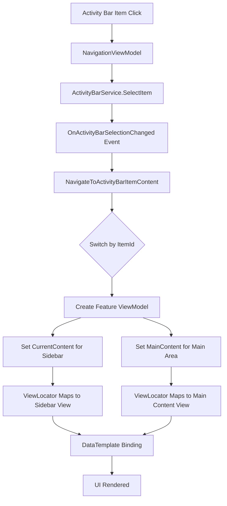

# UI Integration Workflow

**Last Updated**: 2025-11-20
**Version**: 1.2

This document explains the S7Tools UI integration pattern: how components connect from the Activity Bar through Side Panels to Main Content Views.

## Table of Contents

1. [Overview](#overview)
2. [Architecture Pattern](#architecture-pattern)
3. [Component Flow](#component-flow)
4. [ViewLocator Pattern](#viewlocator-pattern)
5. [Implementation Guide](#implementation-guide)
6. [Code Templates](#code-templates)

## Overview

S7Tools uses a VSCode-style UI architecture with three main areas:

```
┌─────────────────────────────────────────────────────────┐
│  ┌──────┬──────────┬────────────────────────────────┐   │
│  │      │          │                                │   │
│  │  A   │    S     │             M                  │   │
│  │  c   │    i     │             a                  │   │
│  │  t   │    d     │             i                  │   │
│  │  i   │    e     │             n                  │   │
│  │  v   │          │                                │   │
│  │  i   │    P     │             C                  │   │
│  │  t   │    a     │             o                  │   │
│  │  y   │    n     │             n                  │   │
│  │      │    e     │             t                  │   │
│  │  B   │    l     │             e                  │   │
│  │  a   │          │             n                  │   │
│  │  r   │          │             t                  │   │
│  │      │          │                                │   │
│  └──────┴──────────┴────────────────────────────────┘   │
└─────────────────────────────────────────────────────────┘
```

### Key Components

1. **Activity Bar** (Left, 48px): Icon-based navigation
2. **Side Panel** (240-300px, collapsible): Category navigation or filters
3. **Main Content** (Flexible): Primary feature interface
4. **Right Panel** (Optional): Contextual details or properties

## Architecture Pattern

### Data Flow Diagram



### ViewModel Hierarchy

```
NavigationViewModel (MainWindow)
  ├─ CurrentContent → Sidebar View
  │   └─ Via ViewLocator: FeatureViewModel → FeatureSidebarView
  │
  └─ MainContent → Main Area View
      └─ Via ViewLocator: FeatureViewModel → FeatureMainView
```

## Component Flow

### 1. Activity Bar Selection

**Location**: `MainWindow.axaml` Grid.Column="0"

```xaml
<ItemsControl ItemsSource="{Binding Navigation.ActivityBarItems}">
  <ItemsControl.ItemTemplate>
    <DataTemplate>
      <Button Command="{Binding $parent[Window].DataContext.Navigation.SelectActivityBarItemCommand}"
              CommandParameter="{Binding Id}">
        <icons:Icon Value="{Binding IconPath}" />
      </Button>
    </DataTemplate>
  </ItemsControl.ItemTemplate>
</ItemsControl>
```

**Handler**: `NavigationViewModel.SelectActivityBarItem(string itemId)`

### 2. Navigation Logic

**Location**: `NavigationViewModel.cs`

```csharp
private void NavigateToActivityBarItemContent(string itemId)
{
    switch (itemId)
    {
        case "myfeature":
            SidebarTitle = "My Feature";
            MainContentTitle = "My Feature Management";

            // Create ViewModel
            MyFeatureViewModel? viewModel = CreateViewModel<MyFeatureViewModel>();

            // Set for sidebar and main content
            CurrentContent = viewModel;  // Sidebar
            MainContent = viewModel;      // Main area
            break;
    }
}
```

### 3. ViewLocator Resolution

**Location**: `ViewLocator.cs`

The ViewLocator automatically maps ViewModels to Views using a cached naming convention:

```
S7Tools.ViewModels.Pages.MyFeatureViewModel
  ↓ (Transforms to)
S7Tools.Views.Pages.MyFeatureView
```

**Rules**:
1. Replace `.ViewModels.` with `.Views.`
2. Replace `ViewModel` suffix with `View`
3. Fallback: Search for type in same assembly if direct resolution fails
4. Cache result for performance

### 4. Data Template Binding

**Location**: `MainWindow.axaml`

```xaml
<!-- Sidebar Content -->
<ContentControl Grid.Row="1" Content="{Binding Navigation.CurrentContent}">
  <ContentControl.DataTemplates>
    <!-- Specific template for sidebar -->
    <DataTemplate DataType="vm:MyFeatureViewModel">
      <views:MyFeatureSidebarView />
    </DataTemplate>
  </ContentControl.DataTemplates>
</ContentControl>

<!-- Main Content -->
<ContentControl Content="{Binding Navigation.MainContent}">
  <!-- ViewLocator handles default mapping -->
</ContentControl>
```

## Implementation Guide

### Step-by-Step: Adding a New Feature

#### Step 1: Register Activity Bar Item

**File**: `Services/ActivityBarService.cs`

```csharp
public IEnumerable<ActivityBarItem> GetDefaultItems()
{
    return
    [
        // ... existing items ...
        new ActivityBarItem("myfeature", "My Feature", "My Feature Description", "fa-solid fa-icon")
        {
            Order = 6
        }
    ];
}
```

#### Step 2: Create ViewModels

**File**: `ViewModels/Pages/MyFeatureViewModel.cs`

```csharp
namespace S7Tools.ViewModels.Pages;

public class MyFeatureViewModel : ViewModelBase
{
    // Sidebar categories
    public ObservableCollection<string> Categories { get; } = new();
    private string? _selectedCategory;

    public string? SelectedCategory
    {
        get => _selectedCategory;
        set
        {
            this.RaiseAndSetIfChanged(ref _selectedCategory, value);
            UpdateMainContent();
        }
    }

    // Main content ViewModel
    private object? _selectedContentViewModel;
    public object? SelectedContentViewModel
    {
        get => _selectedContentViewModel;
        set => this.RaiseAndSetIfChanged(ref _selectedContentViewModel, value);
    }
}
```

#### Step 3: Create Views

**Sidebar View**: `Views/Pages/MyFeatureSidebarView.axaml`

```xaml
<UserControl xmlns="https://github.com/avaloniaui"
             xmlns:x="http://schemas.microsoft.com/winfx/2006/xaml"
             xmlns:vm="using:S7Tools.ViewModels.Pages"
             x:Class="S7Tools.Views.Pages.MyFeatureSidebarView"
             x:DataType="vm:MyFeatureViewModel">
    <!-- Sidebar content -->
</UserControl>
```

**Main Content View**: `Views/Pages/MyFeatureView.axaml`

```xaml
<UserControl xmlns="https://github.com/avaloniaui"
             xmlns:vm="using:S7Tools.ViewModels.Pages"
             x:Class="S7Tools.Views.Pages.MyFeatureView"
             x:DataType="vm:MyFeatureViewModel">
    <!-- Main content -->
</UserControl>
```

#### Step 4: Register Navigation

**File**: `ViewModels/Layout/NavigationViewModel.cs`

```csharp
private void NavigateToActivityBarItemContent(string itemId)
{
    switch (itemId)
    {
        case "myfeature":
            SidebarTitle = "My Feature";
            MainContentTitle = "My Feature Management";
            ShowMainContentHeader = true;

            MyFeatureViewModel? featureViewModel = CreateViewModel<MyFeatureViewModel>();
            CurrentContent = featureViewModel;  // Sidebar
            MainContent = featureViewModel;      // Main content
            break;
    }
}
```

#### Step 5: Add Sidebar Data Template (Mandatory)

**File**: `Views/Layout/MainWindow.axaml`

Since `ViewLocator` maps `MyFeatureViewModel` to `MyFeatureView` (main content), you must manually map it to `MyFeatureSidebarView` for the sidebar `ContentControl`.

```xaml
<ContentControl Grid.Row="1" Content="{Binding Navigation.CurrentContent}">
  <ContentControl.DataTemplates>
    <DataTemplate DataType="vm:MyFeatureViewModel">
      <views:MyFeatureSidebarView />
    </DataTemplate>
  </ContentControl.DataTemplates>
</ContentControl>
```

## Reusable UI Controls

S7Tools provides reusable controls in the `Controls` category for common UI patterns:

### SerialPortDiscoveryControl

**Location**: `Views/Controls/SerialPortDiscoveryControl.axaml`
**ViewModel**: `ViewModels/Controls/SerialPortDiscoveryViewModel.cs`

A self-contained control for serial port discovery and selection.

### SidebarSection

**Location**: `Views/Controls/SidebarSection.axaml`

A collapsible section control for organizing sidebar content.

## Best Practices

### 1. ViewModel Design

- **Single ViewModel**: Use one ViewModel for both sidebar and main content
- **Content Switching**: Use `SelectedContentViewModel` property for dynamic content
- **State Management**: Keep state in the parent ViewModel, not child content VMs

### 2. View Naming

- **Consistency**: Follow `{Feature}SidebarView` and `{Feature}View` patterns
- **Namespace**: Keep ViewModels and Views in matching namespace structures
- **DataType**: Always specify `x:DataType` for compiled bindings

### 3. Performance

- **ViewLocator Cache**: Automatic caching prevents repeated reflection
- **Lazy Loading**: Create child ViewModels only when needed
- **Disposal**: Implement `IDisposable` for ViewModels with subscriptions

### 4. Navigation

- **Activity Bar IDs**: Use lowercase, hyphenated strings (`"my-feature"`)
- **Sidebar Title**: Use proper case strings from `UIStrings`
- **Content Null Checks**: Always check for null before setting content

## Troubleshooting

### View Not Found

**Error**: `Not Found: S7Tools.Views.Pages.MyFeatureView`

**Solution**:
- Check ViewModel namespace matches `S7Tools.ViewModels.{Category}`
- Check View namespace matches `S7Tools.Views.{Category}`
- Verify View class name follows convention: `MyFeatureViewModel` → `MyFeatureView`
- Ensure View has code-behind file (`.axaml.cs`)

### Sidebar Not Updating

**Problem**: Sidebar doesn't reflect selection changes

**Solution**:
- Ensure `RaiseAndSetIfChanged` is called on property changes
- Verify `TwoWay` binding mode on `SelectedItem`
- Check `ObservableCollection` is used for dynamic lists

### Main Content Empty

**Problem**: Main content area is blank

**Solution**:
- Verify `MainContent` is set in `NavigateToActivityBarItemContent`
- Check ViewLocator can resolve the ViewModel → View mapping
- Ensure `ContentControl.Content` binding is correct

## Related Documentation

- [Mvvm Patterns](architecture/mvvm-patterns.md)
- [Reusable Controls](patterns/reusable-controls.md)
- [Readme](templates/ui-integration/README.md)
