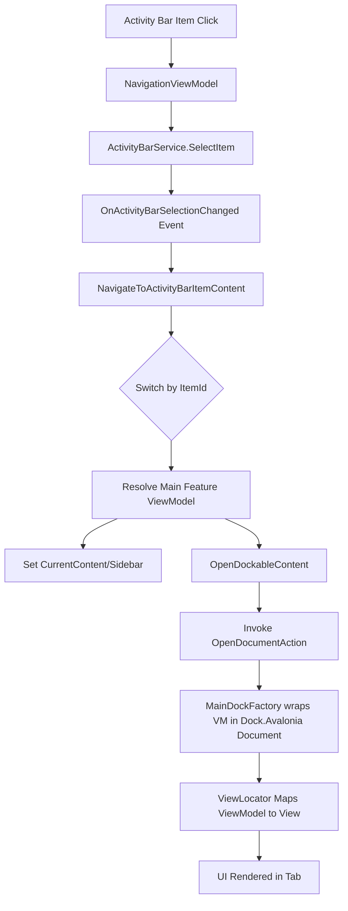

# UI Integration Workflow

**Last Updated**: 2026-03-17
**Version**: 1.2.0

This document explains the S7Tools UI integration pattern, specifically detailing how components connect from the Activity Bar through Side Panels to the **Dock.Avalonia**-powered Main Content Views.

## Table of Contents

1. [Overview](#overview)
2. [Architecture Pattern](#architecture-pattern)
3. [Component Flow](#component-flow)
4. [Dock System Integration](#dock-system-integration)
5. [Implementation Guide](#implementation-guide)
6. [Code Templates](#code-templates)

## Overview

S7Tools uses a multi-panel, VSCode-style UI architecture powered by a professional docking system (`Dock.Avalonia`):

```
┌─────────────────────────────────────────────────────────┐
│  ┌──────┬──────────┬────────────────────────────────┐   │
│  │      │          │                                │   │
│  │  A   │    S     │   ┌────────┐┌────────┐         │   │
│  │  c   │    i     │   │ Tab 1  ││ Tab 2  │         │   │
│  │  t   │    d     │   ├────────┴┴────────┴─────┐   │   │
│  │  i   │    e     │   │                        │   │   │
│  │  v   │          │   │      D o c k           │   │   │
│  │  i   │    P     │   │      A r e a           │   │   │
│  │  t   │    a     │   │                        │   │   │
│  │  y   │    n     │   │                        │   │   │
│  │      │    e     │   │                        │   │   │
│  │  B   │    l     │   └────────────────────────┘   │   │
│  │  a   │          │                                │   │
│  │  r   │          │                                │   │
│  └──────┴──────────┴────────────────────────────────┘   │
└─────────────────────────────────────────────────────────┘
```

### Key Components

1. **Activity Bar** (Left, 48px): Icon-based feature navigation.
2. **Side Panel** (Flexible width, collapsible): Category navigation, filters, or feature-specific secondary navigation.
3. **Main Content (Dock Area)**: A tabbed and dockable workspace area managed by `DockControl` and `MainDockFactory`. Tab items implement `IDockableViewModel`.

## Architecture Pattern

### Data Flow Diagram



### ViewModel Hierarchy

```text
NavigationViewModel (MainWindow)
  ├─ CurrentContent → Sidebar View (ContentControl DataTemplate)
  │
  └─ OpenDockableContent() → MainDockFactory (Dock System)
      └─ Via ViewLocator: IDockableViewModel → FeatureMainView
```

## Component Flow

### 1. Activity Bar Selection

**Location**: `MainWindow.axaml` Grid.Column="0"

Provides visual icons leveraging `ActivityBarItems`. Selecting one triggers `NavigationViewModel.SelectActivityBarItem(string itemId)`.

### 2. Navigation Logic

**Location**: `NavigationViewModel.cs`

```csharp
private void NavigateToActivityBarItemContent(string itemId)
{
    switch (itemId)
    {
        case "myfeature":
            SidebarTitle = "My Feature";
            MyFeatureViewModel? viewModel = CreateViewModel<MyFeatureViewModel>();
            
            // Set Sidebar Content
            CurrentContent = viewModel;  
            
            // Send to Docking System
            OpenDockableContent(viewModel);
            break;
    }
}
```

### 3. Dock System & ViewLocator Resolution

When `OpenDockableContent()` is called, the ViewModel (which implements `IDockableViewModel`) is forwarded to the `MainDockFactory`.

**Location**: `MainDockFactory.cs` and `ViewLocator.cs`

`Dock.Avalonia` asks the standard `ViewLocator` to generate the matching View. 
For example:
```text
S7Tools.ViewModels.Pages.MyFeatureViewModel → S7Tools.Views.Pages.MyFeatureView
```

## Dock System Integration

To place a ViewModel seamlessly into the main content tab area, it **must** implement `IDockableViewModel` located in `S7Tools.Core.Interfaces.ViewModels`.

```csharp
public interface IDockableViewModel
{
    string DockId { get; }
    string DockTitle { get; }
    bool CanClose { get; }
    bool CanFloat { get; }
}
```

The `MainDockFactory` checks the `DockId` value to prevent duplicate tabs from opening. If a tab with the same `DockId` already exists, it is simply brought to the foreground and activated.

## Implementation Guide

### Step-by-Step: Adding a New Feature

#### Step 1: Register Activity Bar Item

**File**: `Services/ActivityBarService.cs`

```csharp
public IEnumerable<ActivityBarItem> GetDefaultItems()
{
    return
    [
        // ... existing items ...
        new ActivityBarItem("myfeature", "My Feature", "My Feature Description", "fa-solid fa-icon")
        {
            Order = 6
        }
    ];
}
```

#### Step 2: Create Main (Dockable) ViewModel

**File**: `ViewModels/MyFeatureViewModel.cs`

Ensure the class implements `IDockableViewModel` and extends `ViewModelBase`:

```csharp
using S7Tools.Core.Interfaces.ViewModels;

namespace S7Tools.ViewModels.Pages;

public class MyFeatureViewModel : ViewModelBase, IDockableViewModel
{
    // IDockableViewModel properties
    public string DockId => "MyFeatureWorkspace";
    
    // Binding the DockTitle enables live-updates via INotifyPropertyChanged
    private string _dockTitle = "My Feature";
    public string DockTitle 
    {
        get => _dockTitle;
        set => this.RaiseAndSetIfChanged(ref _dockTitle, value);
    }
    
    public bool CanClose => true;
    public bool CanFloat => true;

    // Feature specific content...
}
```

#### Step 3: Create Views

**Sidebar View**: `Views/{Category}/MyFeatureSidebarView.axaml`

```xml
<UserControl xmlns="https://github.com/avaloniaui"
             xmlns:x="http://schemas.microsoft.com/winfx/2006/xaml"
             xmlns:vm="using:S7Tools.ViewModels.{Category}"
             x:Class="S7Tools.Views.{Category}.MyFeatureSidebarView"
             x:DataType="vm:MyFeatureViewModel">
    <!-- Sidebar Filters, Categories, Trees -->
</UserControl>
```

**Main Content View**: `Views/{Category}/MyFeatureView.axaml` (Resolved by ViewLocator for the Dock tab)

```xml
<UserControl xmlns="https://github.com/avaloniaui"
             xmlns:vm="using:S7Tools.ViewModels.{Category}"
             x:Class="S7Tools.Views.{Category}.MyFeatureView"
             x:DataType="vm:MyFeatureViewModel">
    <!-- Primary Workspace Content -->
</UserControl>
```

#### Step 4: Add Data Template for Sidebar Resolution

**File**: `Views/Layout/MainWindow.axaml`

To ensure `MainWindow` knows how to render the sidebar specifically without ViewLocator (since ViewLocator is targeting the MainView for the Dock tab), define an explicit DataTemplate inside the Sidebar area:

```xml
<ContentControl Grid.Row="1" Content="{Binding Navigation.CurrentContent}">
    <ContentControl.DataTemplates>
        <!-- The sidebar specific template -->
        <DataTemplate DataType="vm:MyFeatureViewModel">
            <views:MyFeatureSidebarView />
        </DataTemplate>
    </ContentControl.DataTemplates>
</ContentControl>
```

#### Step 5: Register Navigation

**File**: `ViewModels/Layout/NavigationViewModel.cs`

```csharp
private void NavigateToActivityBarItemContent(string itemId)
{
    switch (itemId)
    {
        // ... existing cases ...
        case "myfeature":
            SidebarTitle = "My Feature Navigation";
            MyFeatureViewModel? featureViewModel = CreateViewModel<MyFeatureViewModel>();
            
            // Set Sidebar
            CurrentContent = featureViewModel;  
            
            // Direct to Dock System
            OpenDockableContent(featureViewModel);
            
            _logger.LogDebug("Navigated to My Feature");
            break;
    }
}
```

## Reusable UI Controls

S7Tools provides reusable controls in the `Controls` category for common UI patterns:

### SidebarSection

**Location**: `Views/Controls/SidebarSection.axaml`

A collapsible section control for organizing sidebar content.

**Usage Example**:
```xml
<UserControl xmlns:controls="using:S7Tools.Views.Controls">
  <StackPanel>
    <controls:SidebarSection Header="Settings" Icon="fa-solid fa-cog" IsExpanded="True">
        <TextBlock Text="Option 1" />
    </controls:SidebarSection>
  </StackPanel>
</UserControl>
```

## Troubleshooting

### Tab Does Not Open In Dock

**Problem**: Clicking the Activity Bar item causes the sidebar to open, but the main viewing area is empty.
**Solution**:
- Ensure the injected main ViewModel implements `IDockableViewModel`.
- Ensure `OpenDockableContent(myViewModel)` is called in `NavigationViewModel.NavigateToActivityBarItemContent`.
- Verify the `DockId` is unique (if it's not unique, the application might think it's already open).

### "Not Found: S7Tools.Views.MyFeatureView" In Tab Window

**Problem**: The tab opens with the view name and says "Not Found".
**Solution**:
- Check that your View class physically resides at `S7Tools.Views.{Category}.MyFeatureView`.
- Make sure namespaces perfectly align between View and ViewModel: `S7Tools.ViewModels.Pages` pairs strictly with `S7Tools.Views.Pages`.

## Version History

| Version | Date | Changes |
|---------|------|---------|
| 1.2.0 | 2026-03-17 | Updated framework mapping to match `Dock.Avalonia` multi-tab system via `MainDockFactory`. |
| 1.1.0 | 2025-11-10 | Added component flow diagram formatting and minor cleanup. |
| 1.0.0 | 2025-10-24 | Initial documentation with ViewLocator standard pattern |

---
*This section is auto-generated. Do not edit manually. Last updated: 2026-03-17*
