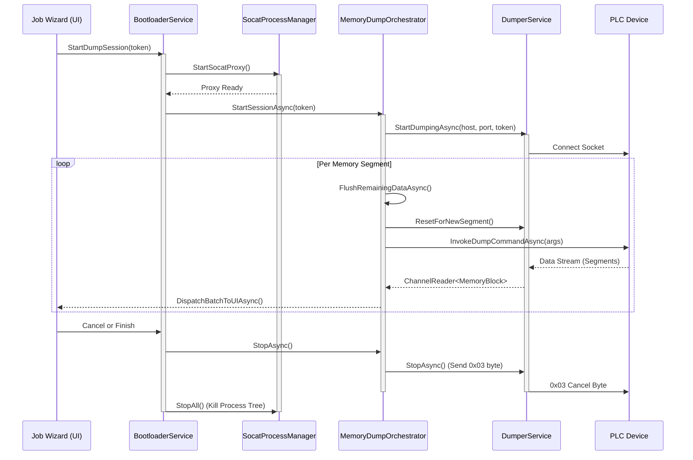

# Application Task Execution Workflow

This document details the complete end-to-end task execution workflow for the PLC Memory Dump process, focusing on task cancellation propagation and connection lifecycle management.

## Components Involved
- **Job Wizard (UI)**: Initiates and manages the UX of the workflow.
- **BootloaderService**: Handles connection proxying and starts the orchestration.
- **SocatProcessManager**: Manages the underlying `socat` proxy processes mapping TCP/IP to serial over SSH/Telnet.
- **MemoryDumpOrchestrator**: Orchestrates the multi-segment memory dump process, tracking memory blocks and dispatching them to the UI thread.
- **DumperService**: Handles the low-level data packet framing and parsing from the PLC.

## Workflow Execution Sequence

1. **Initialization (`StartDumpSession`)**
   The JobWizard triggers `BootloaderService.StartDumpSessionAsync()`. This call invokes the `SocatProcessManager` to spawn the necessary `socat` proxies to bridge the connection to the PLC.
2. **Session Pipeline Creation (`StartSessionAsync`)**
   The `BootloaderService` passes the `CancellationToken` to `MemoryDumpOrchestrator.StartSessionAsync()`. It creates a linked `CancellationTokenSource` and spawns the `DumperService` loop (`_dumpTask`) and the Consumer loop (`_consumptionTask`).
3. **Data Acquisition Loop (`InvokeDumpCommandAsync`)**
   For each memory segment:
   - Leftover data is flushed and parser is reset to prevent state corruption.
   - The orchestrator frames and sends the dump hook payload.
   - It awaits the segment completion via `WaitForSegmentAsync`.
   - The `DS` parses bytes, dispatching `MemoryBlock` elements to the orchestrator via a `Channel<MemoryBlock>`.
4. **Graceful Teardown and Cancellation (`StopAsync`)**
   When the task completes or is canceled:
   - `BootloaderService` triggers `MemoryDumpOrchestrator.StopAsync()`.
   - The orchestrator commands `DumperService.StopAsync()` which writes the cancellation byte `0x03` to the stream to pause PLC transmission.
   - Pending reads are aborted.
   - `SocatProcessManager.StopAll()` executes complete process tree termination to avoid orphan `socat` processes.

## Sequence Diagram

