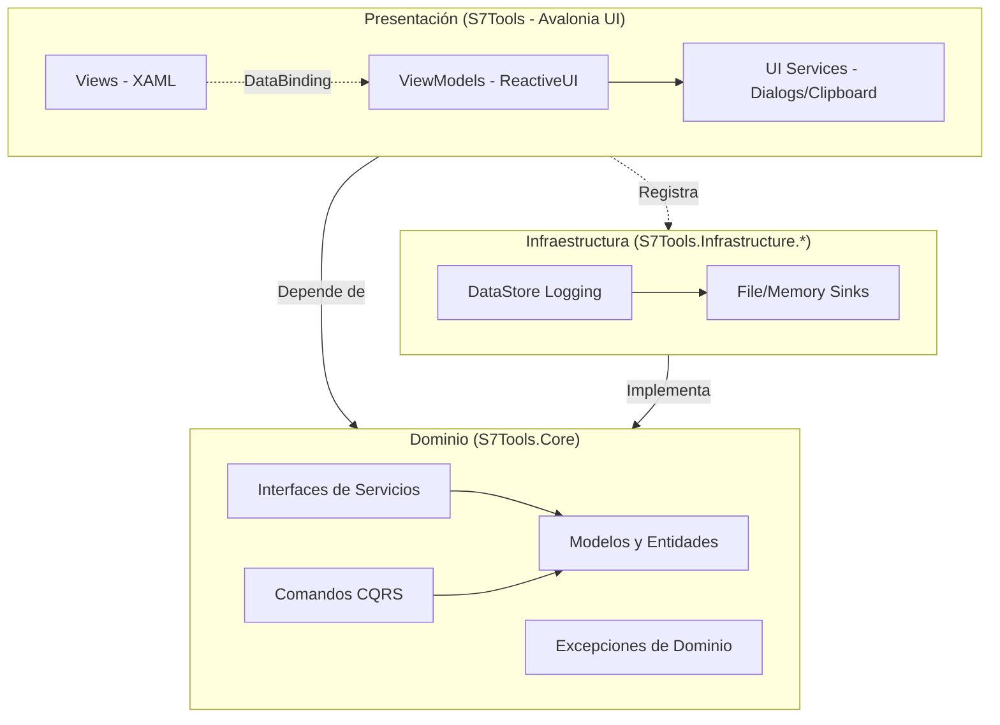
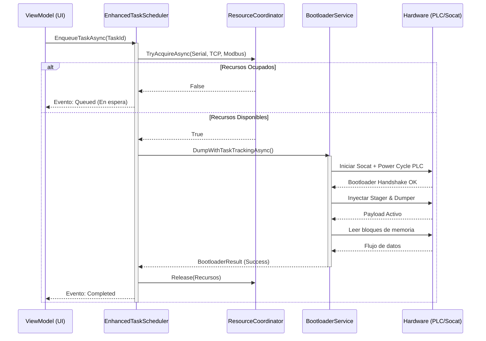

# S7Tools Project Architecture and Structure Blueprint

## 1. Visión General

S7Tools es una aplicación de escritorio multiplataforma avanzada diseñada para el análisis de seguridad, comunicación y volcado de memoria (firmware extraction) de los PLC Siemens S7-1200 mediante acceso por bootloader. Está construida utilizando **.NET 10.0**, el framework de interfaz gráfica **Avalonia UI** y el patrón MVVM funcional-reactivo provisto por **ReactiveUI**. 

El proyecto se adhiere estrictamente a los principios de **Clean Architecture**, asegurando que el Dominio (Core) esté completamente aislado de la Infraestructura (I/O, Logging) y la Presentación (UI). Además, implementa un procesamiento altamente concurrente y seguro mediante la orquestación coordinada de recursos de hardware.

## 2. Análisis Técnico Detallado

### Entorno y SDKs
* **.NET SDK**: 10.0 como target principal.
* **Lenguajes**: C# 12/13 (features modernas: Primary Constructors, Records, Nullable Reference Types), C/ARM Assembly (para payloads del PLC), TypeScript/JavaScript (Documentación y scripts de scraping).

### Dependencias y Paquetes Clave
* **Avalonia UI (v11.3.12)**: Framework principal para la interfaz de usuario multiplataforma (Windows, Linux, macOS).
* **ReactiveUI (v20.1.1)**: Motor MVVM principal, gestión de estado reactivo y comandos asíncronos (`ReactiveCommand`).
* **Microsoft.Extensions.* (v8.0.0)**: Abstracciones estándar para Inyección de Dependencias (DI), Logging y Options.
* **CommunityToolkit.Mvvm (v8.4.0)**: Utilizado como soporte complementario para observabilidad y Source Generators en escenarios específicos.
* **Dock.Avalonia**: Sistema de docking estilo VSCode (pestañas, paneles anclables) para gestionar el área de trabajo.
* **AvaloniaHex**: Visor/Editor hexadecimal de alto rendimiento para el análisis de volcados de memoria.
* **Testing**: xUnit, Moq, NSubstitute, FluentAssertions.
* **Docusaurus (v3.9.2)**: Generador estático para la documentación del sitio web (`docs/website/`).

## 3. Preparación del Entorno

> [!WARNING]
> **MANDATORY**: Utiliza exclusivamente comandos de terminal (CLI) para las operaciones de .NET. El uso de tareas de VS Code para compilación y pruebas está **ESTRICTAMENTE PROHIBIDO** por la constitución del proyecto.

### Pasos para Configurar y Ejecutar

1. **Requisitos Previos**:
   * Instalar .NET 10.0 SDK (o superior compatible).
   * Instalar Git.
   * (Opcional) Docker y GCC ARM toolchain para compilar payloads.

2. **Clonar y Preparar el Repositorio**:
   ```bash
   git clone https://github.com/S7Tools/S7Tools.git
   cd S7Tools
   git pull origin main
   ```

3. **Restaurar y Compilar**:
   ```bash
   dotnet clean src/S7Tools.sln
   dotnet restore src/S7Tools.sln
   dotnet build src/S7Tools.sln --configuration Debug
   ```

4. **Ejecutar Pruebas (TDD)**:
   ```bash
   # Se requiere un Pass Rate de 99.7%+ para cualquier PR
   dotnet test src/S7Tools.sln --configuration Debug
   ```

5. **Ejecutar la Aplicación**:
   ```bash
   # Ejecución normal
   dotnet run --project src/S7Tools/S7Tools.csproj --configuration Debug
   
   # Ejecución en modo diagnóstico (valida servicios de startup)
   dotnet run --project src/S7Tools/S7Tools.csproj --configuration Debug -- --diag
   ```

6. **Verificación de Estilo (Pre-Commit)**:
   ```bash
   dotnet format src/S7Tools.sln
   ```

## 4. Estructura del Proyecto

La base de código está segmentada para garantizar el flujo de dependencias hacia el Dominio (Core).

```text
S7-Tools/
├── benchmarks/
│   └── S7Tools.Benchmarks/           # Pruebas de rendimiento (Logging, Dumper, Profile CRUD)
├── bootloader-payloads/              # Código nativo C/ARM para ejecución en PLC
│   ├── docker-scripts/               # Scripts para compilar payloads vía Docker
│   └── payloads/                     # Payloads: dump_mem, stager, hello_loop
├── docs/                             # Documentación Centralizada
│   └── website/                      # Proyecto Docusaurus
│       ├── docs/architecture/        # Decisiones (ADRs), Diagramas, Contexto
│       ├── docs/guides/              # Guías (Onboarding, Workflow, AI Agents)
│       ├── docs/patterns/            # Catálogo de patrones de arquitectura y código
│       └── docs/templates/           # Templates (ViewModels, Services, XAML, Tests)
├── src/
│   ├── S7Tools.Core/                 # DOMINIO (Reglas de Negocio, Modelos, Excepciones)
│   │   ├── Commands/                 # Dispatcher y Handlers para CQRS
│   │   ├── Constants/                # Constantes (Memoria, Red, Colores, Formatting)
│   │   ├── Exceptions/               # Jerarquía de excepciones de dominio (S7ToolsException)
│   │   ├── Models/                   # Entidades principales (Job, Profiles, Tag, PlcAddress)
│   │   ├── Protocol/                 # Parseo eficiente (System.Buffers, ProtocolParser)
│   │   └── Validation/               # Framework de validación base
│   ├── S7Tools.Infrastructure.Logging/ # INFRAESTRUCTURA (I/O Logging)
│   │   ├── Core/Storage/             # LogDataStore (Búfer circular y persistencia)
│   │   └── Sinks/                    # Implementaciones para escribir a disco / memoria
│   ├── S7Tools/                      # APLICACIÓN Y PRESENTACIÓN (Avalonia + ReactiveUI)
│   │   ├── Services/                 # Implementaciones: Adaptadores PLC, Tareas, Perfiles
│   │   ├── ViewModels/               # Lógica UI categorizada (Base, Controls, Dialogs, Jobs, Layout, Pages, Profiles, Settings, Tasks)
│   │   └── Views/                    # UI en XAML (espejo de ViewModels) con soporte Dock.Avalonia
│   └── S7Tools.Diagnostics/          # Herramienta CLI de diagnóstico de servicios
├── tests/
│   ├── S7Tools.Core.Tests/           # Unit tests del Core (TDD estricto)
│   ├── S7Tools.Infrastructure.Logging.Tests/
│   └── S7Tools.Tests/                # Pruebas de integración, ViewModels, UI y Servicios
└── tools/                            # Scripts Node.js/Python (Scraping, Docs QA)
```

## 5. Descripción del Funcionamiento

### Arquitectura de Capas (Clean Architecture)
S7Tools fuerza un diseño unidireccional. **La regla de oro (Artículo II de la Constitución)** dicta que `S7Tools.Core` no tiene dependencias de UI ni de infraestructura. Las dependencias fluyen hacia adentro:
* **Views**: Interfaz XAML puramente declarativa que usa bindings para conectarse al ViewModel. Sin lógica de negocio en el _code-behind_.
* **ViewModels**: Centralizan la lógica de presentación utilizando ReactiveUI (`ReactiveObject`, `ReactiveCommand`). Transmiten intenciones a los Servicios.
* **Services**: Orquestadores lógicos (e.g., `StandardProfileManager<T>`, `ResourceCoordinator`, `JobScheduler`) que operan sobre las abstracciones del Dominio.
* **Infrastructure**: Implementaciones concretas inyectadas por DI (Inyección de Dependencias) para accesos a red, archivos y base de datos de logs.

### Flujo del Volcado de Memoria (Bootloader Operation)
1. **Configuración**: El usuario agrupa configuraciones en un `JobProfileSet` (Serial, Socat, Energía, Regiones de Memoria, Payloads).
2. **Planificación y Orquestación**: 
   * El `JobScheduler` encola la tarea.
   * El `ResourceCoordinator` asegura acceso exclusivo a recursos concurrentes (ej. puerto Serie).
3. **Secuencia de Ejecución**:
   * **Preparación**: Se levanta el puente Serie-TCP (`SocatService`).
   * **Power Cycle**: `PowerSupplyService` (vía Modbus) reinicia el PLC.
   * **Handshake**: Se captura la comunicación del bootloader del S7-1200 al iniciar.
   * **Stager & Payload**: El `PlcStagerManager` inyecta código ARM compilado directamente en la memoria ejecutable del PLC.
   * **Streaming/Extracción**: `MemoryDumpOrchestrator` maneja el flujo de lectura continua de la memoria, depositándolo tanto en la UI para inspección visual como en disco (`FileStream`).

## 6. Diagramas de Jerarquía y Dependencia

### Arquitectura de Capas y Dependencias


### Flujo de Coordinación y Ejecución de Tareas (Job Execution)


## 7. Instrucciones para Agentes de IA

Como agente de inteligencia artificial modificando esta base de código, debes adherirte a las normativas de la Constitución del Proyecto (Documentadas en el contexto del código y `docs/patterns/system-patterns.md`):

1. **Onboarding Rápido**: Lee `docs/architecture/overview.md` y `docs/patterns/_index.md` antes de implementar features extensas.
2. **Uso Exclusivo de CLI**: NUNCA generes ni utilices tareas (`tasks.json`) de VS Code. Las compilaciones y pruebas se hacen exclusivamente con los comandos `dotnet build`, `dotnet test` de la terminal.
3. **Rigurosidad de Clean Architecture**: 
   * Prohibido incluir referencias de Avalonia, XAML o Infrastructure dentro de `S7Tools.Core`.
   * Los ViewModels deben inyectar abstracciones, nunca implementaciones concretas de la capa de Infraestructura.
4. **Inyección de Dependencias Centralizada**: Agrega nuevos servicios, fábricas o ViewModels en `src/S7Tools/Extensions/ServiceCollectionExtensions.cs`. Prohibido registrar componentes en `Program.cs`.
5. **Hilos y Bloqueos (Deadlocks)**: 
   * Si usas `SemaphoreSlim`, aplica siempre el **Internal Method Pattern** (métodos públicos adquieren el lock y llaman a métodos privados `InternalAsync` sin lock) para evitar deadlocks.
   * Usa `IUIThreadService` para cualquier manipulación originada fuera de los eventos de UI.
6. **Test-Driven Development (TDD)**: 
   * Cualquier Feature nueva exige pruebas Unitarias (o de Integración) escritas **antes** o simultáneamente. 
   * Mantén el Pass Rate por encima de 99.7%.
7. **Mantenimiento Documental**: Al introducir nuevos patrones, componentes arquitectónicos o cambios rompedores (Breaking Changes), actualiza el _frontmatter_ y el contenido de este Blueprint y añade la entrada correspondiente al Changelog.

## 8. Control de Versiones

* **v1.6.0 (2026-03-17)**: Creación de un Blueprint consolidado, detallado y reformateado que integra versiones recientes de SDKs (.NET 8/10), actualizaciones en categorización de ViewModels y revisión arquitectónica rigurosa de flujos de I/O e inicialización paralela.
* **v1.5.0 (2025-10-15)**: Blueprint inicial de Arquitectura e Infraestructura tras la refactorización a Clean Architecture estricta.
* **v1.4.7 (2025-11-10)**: Deprecación de antiguos documentos de estructura y planchas arquitectónicas separadas, redirigiendo su contenido hacia la base documental en `docs/website/`.

---

