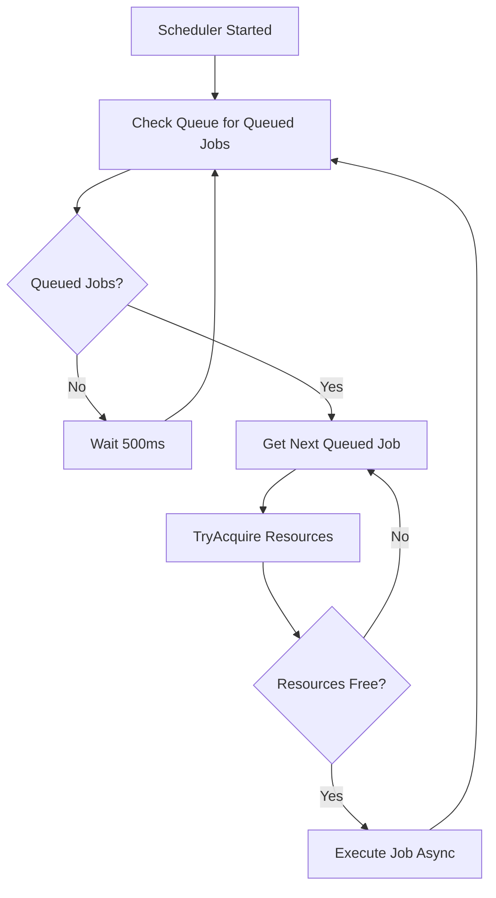

# IJobScheduler Contract

**Interface**: IJobScheduler
**Location**: `src/S7Tools.Core/Services/Interfaces/IJobScheduler.cs`
**Purpose**: Job queue management and execution coordination for bootloader tasks
**Layer**: Core (contract) → Application (implementation)

## Contract Definition

```csharp
namespace S7Tools.Core.Services.Interfaces;

/// <summary>
/// Manages job queue and execution for bootloader operations.
/// Coordinates parallel execution on independent hardware while preventing resource conflicts.
/// </summary>
public interface IJobScheduler
{
    /// <summary>
    /// Enqueues a job for execution. Job transitions from Created → Queued.
    /// </summary>
    /// <param name="job">Job to enqueue (must be in Created state)</param>
    /// <param name="cancellationToken">Cancellation token</param>
    /// <returns>Queued job with updated state and QueuedAt timestamp</returns>
    /// <exception cref="InvalidOperationException">Job not in Created state</exception>
    /// <exception cref="ValidationException">Job validation failed</exception>
    Task<Job> EnqueueAsync(Job job, CancellationToken cancellationToken = default);

    /// <summary>
    /// Cancels a queued or running job. Job transitions to Canceled state.
    /// </summary>
    /// <param name="jobId">Job identifier</param>
    /// <param name="cancellationToken">Cancellation token</param>
    /// <returns>True if job was canceled, false if already terminal (Completed/Failed/Canceled)</returns>
    Task<bool> CancelJobAsync(int jobId, CancellationToken cancellationToken = default);

    /// <summary>
    /// Retrieves all jobs matching the specified states.
    /// </summary>
    /// <param name="states">Job states to filter by (null = all states)</param>
    /// <param name="cancellationToken">Cancellation token</param>
    /// <returns>Collection of jobs in specified states</returns>
    Task<IReadOnlyList<Job>> GetJobsByStateAsync(
        JobState[]? states = null,
        CancellationToken cancellationToken = default);

    /// <summary>
    /// Retrieves a specific job by identifier.
    /// </summary>
    /// <param name="jobId">Job identifier</param>
    /// <param name="cancellationToken">Cancellation token</param>
    /// <returns>Job if found, null otherwise</returns>
    Task<Job?> GetJobByIdAsync(int jobId, CancellationToken cancellationToken = default);

    /// <summary>
    /// Event raised when job state changes (Queued, Running, Completed, Failed, Canceled).
    /// Subscribe to this event for real-time UI updates.
    /// </summary>
    event EventHandler<JobStateChangedEventArgs>? JobStateChanged;

    /// <summary>
    /// Event raised when job progress updates (percentage, current operation).
    /// Subscribe to this event for progress bar updates.
    /// </summary>
    event EventHandler<JobProgressChangedEventArgs>? JobProgressChanged;

    /// <summary>
    /// Starts the scheduler background processing loop.
    /// Monitors queue and executes jobs when resources available.
    /// </summary>
    /// <param name="cancellationToken">Cancellation token to stop scheduler</param>
    Task StartAsync(CancellationToken cancellationToken);

    /// <summary>
    /// Stops the scheduler and waits for all running jobs to complete or cancel.
    /// </summary>
    /// <param name="gracefulTimeout">Maximum time to wait for graceful shutdown</param>
    /// <param name="cancellationToken">Cancellation token</param>
    Task StopAsync(TimeSpan gracefulTimeout, CancellationToken cancellationToken = default);
}
```

## Event Argument Types

```csharp
/// <summary>
/// Event arguments for job state changes.
/// </summary>
public class JobStateChangedEventArgs : EventArgs
{
    public int JobId { get; init; }
    public JobState PreviousState { get; init; }
    public JobState NewState { get; init; }
    public DateTime Timestamp { get; init; }
    public string? ErrorMessage { get; init; } // Populated if NewState = Failed
}

/// <summary>
/// Event arguments for job progress updates.
/// </summary>
public class JobProgressChangedEventArgs : EventArgs
{
    public int JobId { get; init; }
    public double ProgressPercentage { get; init; }  // 0.0-100.0
    public string CurrentOperation { get; init; }
    public DateTime Timestamp { get; init; }
}
```

## Scheduler Behavior

### Queue Processing Logic



### Parallel Execution

The scheduler enables **concurrent job execution** when resources don't conflict (SC-002: "4+ concurrent jobs"):

| Scenario | Job A Resources | Job B Resources | Execution |
|----------|----------------|----------------|-----------|
| Independent hardware | Serial: /dev/ttyUSB0<br>TCP: 10102<br>Modbus: 192.168.1.10:502 | Serial: /dev/ttyUSB1<br>TCP: 10103<br>Modbus: 192.168.1.11:502 | ✅ **Parallel** (no conflicts) |
| Serial conflict | Serial: /dev/ttyUSB0 | Serial: /dev/ttyUSB0 | ❌ **Sequential** (Serial conflict) |
| TCP conflict | TCP: 10102 | TCP: 10102 | ❌ **Sequential** (TCP conflict) |
| Modbus conflict | Modbus: 192.168.1.10:502 | Modbus: 192.168.1.10:502 | ❌ **Sequential** (Modbus conflict) |

### State Transition Enforcement

```csharp
// Allowed transitions per data-model.md
private bool IsValidStateTransition(JobState from, JobState to)
{
    return (from, to) switch
    {
        (JobState.Created, JobState.Queued) => true,
        (JobState.Created, JobState.Canceled) => true,
        (JobState.Queued, JobState.Running) => true,
        (JobState.Queued, JobState.Canceled) => true,
        (JobState.Running, JobState.Completed) => true,
        (JobState.Running, JobState.Failed) => true,
        (JobState.Running, JobState.Canceled) => true,
        _ => false // All other transitions invalid
    };
}
```

## Implementation Requirements

### 1. Event-Driven Architecture (Article IV Thread Safety)

```csharp
public class JobScheduler : IJobScheduler, IDisposable
{
    private readonly ConcurrentQueue<Job> _queue = new();
    private readonly IBootloaderService _bootloaderService;
    private readonly IResourceCoordinator _resourceCoordinator;
    private readonly ILogger<JobScheduler> _logger;
    private Task? _processingTask;
    private CancellationTokenSource? _processingCts;

    public event EventHandler<JobStateChangedEventArgs>? JobStateChanged;
    public event EventHandler<JobProgressChangedEventArgs>? JobProgressChanged;

    public async Task StartAsync(CancellationToken cancellationToken)
    {
        _processingCts = CancellationTokenSource.CreateLinkedTokenSource(cancellationToken);
        _processingTask = Task.Run(() => ProcessQueueAsync(_processingCts.Token));
    }

    private async Task ProcessQueueAsync(CancellationToken ct)
    {
        while (!ct.IsCancellationRequested)
        {
            if (_queue.TryPeek(out var job) && job.State == JobState.Queued)
            {
                var resources = ExtractResources(job.ProfileSet);
                if (_resourceCoordinator.TryAcquire(resources))
                {
                    _queue.TryDequeue(out _); // Remove from queue
                    _ = Task.Run(() => ExecuteJobAsync(job, resources, ct), ct); // Fire and forget with tracking
                }
            }
            await Task.Delay(500, ct); // Check queue every 500ms
        }
    }
}
```

### 2. Progress Propagation

```csharp
private async Task ExecuteJobAsync(Job job, ResourceKey[] resources, CancellationToken ct)
{
    try
    {
        // Transition to Running
        job.State = JobState.Running;
        job.StartedAt = DateTime.UtcNow;
        OnJobStateChanged(new JobStateChangedEventArgs { JobId = job.Id, NewState = JobState.Running, ... });

        // Create progress reporter that fires events
        var progress = new Progress<BootloaderProgress>(p =>
        {
            job.Progress = p.Percentage;
            job.CurrentOperation = p.CurrentOperation;
            OnJobProgressChanged(new JobProgressChangedEventArgs
            {
                JobId = job.Id,
                ProgressPercentage = p.Percentage,
                CurrentOperation = p.CurrentOperation,
                Timestamp = DateTime.UtcNow
            });
        });

        // Execute bootloader workflow
        var dump = await _bootloaderService.DumpMemoryAsync(job.ProfileSet, progress, ct);

        // Save dump to output path
        await File.WriteAllBytesAsync(job.OutputPath, dump, ct);

        // Transition to Completed
        job.State = JobState.Completed;
        job.CompletedAt = DateTime.UtcNow;
        job.Progress = 100.0;
        OnJobStateChanged(new JobStateChangedEventArgs { JobId = job.Id, NewState = JobState.Completed, ... });
    }
    catch (OperationCanceledException)
    {
        job.State = JobState.Canceled;
        job.CompletedAt = DateTime.UtcNow;
        OnJobStateChanged(new JobStateChangedEventArgs { JobId = job.Id, NewState = JobState.Canceled, ... });
    }
    catch (Exception ex)
    {
        job.State = JobState.Failed;
        job.CompletedAt = DateTime.UtcNow;
        job.ErrorMessage = ex.Message;
        OnJobStateChanged(new JobStateChangedEventArgs
        {
            JobId = job.Id,
            NewState = JobState.Failed,
            ErrorMessage = ex.Message,
            ...
        });
        _logger.LogError(ex, "Job {JobId} failed: {JobName}", job.Id, job.Name);
    }
    finally
    {
        // ALWAYS release resources
        _resourceCoordinator.Release(resources);
    }
}
```

### 3. Thread-Safe Event Raising

```csharp
private void OnJobStateChanged(JobStateChangedEventArgs args)
{
    JobStateChanged?.Invoke(this, args);
}

private void OnJobProgressChanged(JobProgressChangedEventArgs args)
{
    JobProgressChanged?.Invoke(this, args);
}
```

## Usage Example

```csharp
// In TaskManagerViewModel
public class TaskManagerViewModel : ReactiveObject, IDisposable
{
    private readonly IJobScheduler _jobScheduler;
    private readonly IUIThreadService _uiThreadService;
    private readonly CompositeDisposable _disposables = new();

    public ObservableCollection<Job> ActiveJobs { get; } = new();
    public ObservableCollection<Job> QueuedJobs { get; } = new();
    public ObservableCollection<Job> CompletedJobs { get; } = new();

    public TaskManagerViewModel(IJobScheduler jobScheduler, IUIThreadService uiThreadService)
    {
        _jobScheduler = jobScheduler;
        _uiThreadService = uiThreadService;

        // Subscribe to job events
        _jobScheduler.JobStateChanged += OnJobStateChanged;
        _jobScheduler.JobProgressChanged += OnJobProgressChanged;

        // Start scheduler
        _ = _jobScheduler.StartAsync(CancellationToken.None);
    }

    private void OnJobStateChanged(object? sender, JobStateChangedEventArgs e)
    {
        // Marshal to UI thread
        _ = _uiThreadService.InvokeAsync(() =>
        {
            var job = ActiveJobs.FirstOrDefault(j => j.Id == e.JobId)
                ?? QueuedJobs.FirstOrDefault(j => j.Id == e.JobId);

            if (job == null) return;

            // Move job to appropriate collection
            if (e.NewState == JobState.Running)
            {
                QueuedJobs.Remove(job);
                ActiveJobs.Add(job);
            }
            else if (e.NewState == JobState.Completed || e.NewState == JobState.Failed || e.NewState == JobState.Canceled)
            {
                ActiveJobs.Remove(job);
                CompletedJobs.Add(job);
            }
        });
    }

    private void OnJobProgressChanged(object? sender, JobProgressChangedEventArgs e)
    {
        // Update progress bar in UI
        _ = _uiThreadService.InvokeAsync(() =>
        {
            var job = ActiveJobs.FirstOrDefault(j => j.Id == e.JobId);
            if (job != null)
            {
                job.Progress = e.ProgressPercentage;
                job.CurrentOperation = e.CurrentOperation;
            }
        });
    }

    public async Task EnqueueJobAsync(Job job)
    {
        await _jobScheduler.EnqueueAsync(job);
        await _uiThreadService.InvokeAsync(() => QueuedJobs.Add(job));
    }

    public async Task CancelJobAsync(int jobId)
    {
        await _jobScheduler.CancelJobAsync(jobId);
    }

    public void Dispose()
    {
        _jobScheduler.JobStateChanged -= OnJobStateChanged;
        _jobScheduler.JobProgressChanged -= OnJobProgressChanged;
        _ = _jobScheduler.StopAsync(TimeSpan.FromSeconds(10));
        _disposables.Dispose();
    }
}
```

## Testing Strategy

```csharp
[Fact]
public async Task EnqueueAsync_ValidJob_TransitionsToQueued()
{
    // Arrange
    var job = new Job { Id = 1, Name = "Test Job", State = JobState.Created };

    // Act
    var queued = await _scheduler.EnqueueAsync(job);

    // Assert
    queued.State.Should().Be(JobState.Queued);
    queued.QueuedAt.Should().NotBeNull();
}

[Fact]
public async Task ExecuteJob_IndependentResources_RunsParallel()
{
    // Arrange
    var job1 = CreateJob(serialPort: "/dev/ttyUSB0", tcpPort: 10102);
    var job2 = CreateJob(serialPort: "/dev/ttyUSB1", tcpPort: 10103);

    var startTimes = new ConcurrentBag<DateTime>();

    // Act
    await _scheduler.EnqueueAsync(job1);
    await _scheduler.EnqueueAsync(job2);
    await _scheduler.StartAsync(CancellationToken.None);

    // Wait for both to start
    await Task.Delay(2000);

    // Assert - both jobs should start within 1 second of each other (parallel)
    startTimes.Should().HaveCount(2);
    var timeDiff = (startTimes.Max() - startTimes.Min()).TotalSeconds;
    timeDiff.Should().BeLessThan(1.0); // Parallel execution
}

[Fact]
public async Task CancelJobAsync_RunningJob_TransitionsToCanceled()
{
    // Arrange
    var job = new Job { Id = 1, State = JobState.Running };
    var stateChanges = new List<JobState>();
    _scheduler.JobStateChanged += (s, e) => stateChanges.Add(e.NewState);

    // Act
    var canceled = await _scheduler.CancelJobAsync(job.Id);

    // Assert
    canceled.Should().BeTrue();
    stateChanges.Should().Contain(JobState.Canceled);
}
```

## Performance Requirements

| Metric | Target | Source |
|--------|--------|--------|
| Queue check interval | 500ms | Balance responsiveness vs CPU usage |
| Concurrent jobs | 4+ simultaneous | SC-002 (independent hardware) |
| Event latency | <100ms | UI responsiveness (ReactiveUI throttle handles rest) |
| Resource cleanup | <3s | SC-010 (teardown after failure/cancellation) |

## Dependencies

- IBootloaderService (workflow execution)
- IResourceCoordinator (resource locking)
- ILogger<JobScheduler> (structured logging)
- StandardProfileManager<Job> (job persistence - optional)

## References

- **Specification**: FR-003, FR-004, FR-011 (job queuing, parallel execution, state tracking)
- **Success Criteria**: SC-002 (concurrent jobs), SC-006 (conflict prevention), SC-008 (UI responsiveness)
- **Constitution**: Article IV (Thread Safety - event-driven, no nested semaphores)
- **Research**: RQ2 (Event-Driven Scheduler architecture decision)
